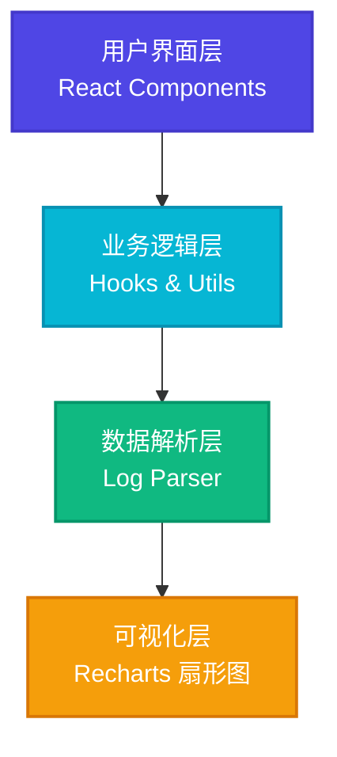

## 1. 架构设计

纯前端应用架构，所有解析和渲染逻辑在浏览器端完成，无需后端服务。



## 2. 技术描述

- **前端**：React@18 + TypeScript + Vite
- **样式**：TailwindCSS@3
- **状态管理**：Zustand
- **图表库**：Recharts（用于扇形图）
- **图标**：Lucide React
- **初始化工具**：vite-init

## 3. 目录结构

```
p185/
├── src/
│   ├── components/
│   │   ├── FileUpload.tsx      # 文件上传组件
│   │   ├── StatsCards.tsx      # 统计卡片组件
│   │   ├── PieChartView.tsx    # 扇形图组件
│   │   ├── DataTable.tsx       # 数据表格组件
│   │   └── Header.tsx          # 头部组件
│   ├── hooks/
│   │   └── useLogParser.ts     # 日志解析hook
│   ├── utils/
│   │   └── parser.ts           # 日志解析工具函数
│   ├── types/
│   │   └── index.ts            # TypeScript类型定义
│   ├── store/
│   │   └── useLogStore.ts      # 状态管理
│   ├── data/
│   │   └── sampleData.ts       # 示例数据
│   ├── pages/
│   │   └── Analyzer.tsx        # 主页面
│   ├── App.tsx
│   ├── main.tsx
│   └── index.css
├── api/                        # 无后端
├── package.json
├── vite.config.ts
├── tsconfig.json
└── tailwind.config.js
```

## 4. 类型定义

```typescript
// 单条AVC拒绝记录
interface AvcRecord {
  id: string;
  timestamp: string;
  pid: string;
  comm: string;
  scontext: string;       // 主体安全上下文
  tcontext: string;       // 客体安全上下文
  tclass: string;         // 策略类型（客体类别）
  permissions: string[];  // 被拒绝的权限列表
  raw: string;            // 原始日志行
}

// 策略类型统计
interface TclassStats {
  tclass: string;
  count: number;
  percentage: number;
}

// 解析结果
interface ParseResult {
  records: AvcRecord[];
  stats: {
    totalRecords: number;
    uniqueSubjects: number;
    uniqueObjects: number;
    uniqueTclasses: number;
  };
  tclassDistribution: TclassStats[];
}
```

## 5. 解析算法

### 5.1 正则表达式匹配
使用正则表达式从avc: denied行中提取关键字段：

```typescript
const AVC_REGEX = /avc:\s+denied\s+\{([^}]+)\}\s+for\s+pid=(\d+)\s+comm="([^"]+)"(?:\s+name="([^"]*)")?.*scontext=(\S+)\s+tcontext=(\S+)\s+tclass=(\S+)/;
```

### 5.2 解析流程
1. 按行分割日志内容
2. 筛选包含"avc: denied"的行
3. 对每行应用正则表达式提取字段
4. 解析权限列表（按空格分割）
5. 按tclass分组统计
6. 计算各类型的百分比

## 6. 核心组件设计

### 6.1 FileUpload 组件
- 支持拖拽上传和点击选择
- 支持 `.log` 和 `.txt` 文件
- 显示上传进度和状态
- 提供"加载示例数据"按钮

### 6.2 PieChartView 组件
- 使用 Recharts PieChart
- 按tclass展示分布
- 交互式图例
- 悬停显示详情（名称、数量、百分比）
- 自定义配色方案

### 6.3 DataTable 组件
- 分页展示所有解析记录
- 可按tclass筛选
- 列：时间戳、主体、客体、权限、策略类型
- 支持展开查看原始日志

## 7. 配色方案

| 策略类型 | 颜色 |
|---------|------|
| file | #3b82f6 |
| dir | #10b981 |
| socket | #f59e0b |
| process | #ef4444 |
| chr_file | #8b5cf6 |
| ln_file | #ec4899 |
| other | #6b7280 |

## 8. 性能考量

- 日志解析使用惰性处理，避免阻塞UI
- 大文件使用流式读取（FileReader）
- 表格使用虚拟滚动优化大数据量展示
- 状态变更使用浅比较避免不必要重渲染
