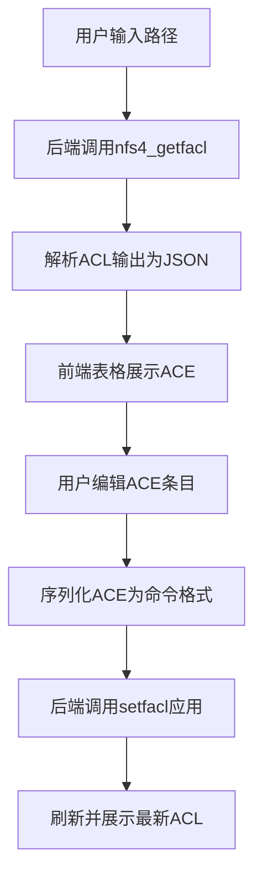

## 1. 产品概述

NFSv4 ACL 管理工具，提供可视化界面来管理NFSv4文件系统的访问控制列表。后端通过调用 `nfs4_getfacl` 和 `setfacl` 命令实现ACL的读取和设置，前端以表格形式展示和编辑ACE（访问控制条目）。

- 主要用途：简化NFSv4 ACL的管理操作，避免手动编写复杂的命令行参数
- 解决问题：命令行操作繁琐、容易出错，缺乏直观的可视化编辑界面
- 目标用户：系统管理员、存储运维人员
- 产品价值：提高ACL配置效率，减少配置错误，提供更好的可审计性

## 2. 核心功能

### 2.1 用户角色

| 角色 | 注册方式 | 核心权限 |
|------|----------|----------|
| 管理员 | 本地认证 | 读取和修改任意路径的ACL配置 |

### 2.2 功能模块

1. **首页/ACL管理页**：路径输入、ACL表格展示、ACE编辑面板
2. **ACE编辑模块**：类型选择、权限掩码配置、主体设置、标志位设置

### 2.3 页面详情

| 页面名称 | 模块名称 | 功能描述 |
|----------|----------|----------|
| ACL管理页 | 路径选择 | 输入文件/目录路径，支持浏览和历史记录 |
| ACL管理页 | ACL表格 | 展示所有ACE条目，支持排序、筛选、编辑、删除 |
| ACL管理页 | 新增ACE | 弹出表单，配置新ACE的类型、主体、权限、标志位 |
| ACL管理页 | 保存应用 | 将修改后的ACL应用到文件系统 |

## 3. 核心流程

用户输入文件路径 → 后端调用 `nfs4_getfacl` 获取ACL → 解析ACL为结构化数据 → 前端表格展示 → 用户编辑ACE（增删改）→ 序列化ACE为命令格式 → 后端调用 `setfacl` 应用更改 → 刷新展示最新ACL

## 4. 用户界面设计

### 4.1 设计风格

- **主色调**：深海军蓝 (#0F3460) 作为主色，代表专业和可靠
- **辅助色**：科技蓝 (#1A5276) 用于按钮和交互元素
- **强调色**：琥珀橙 (#E94560) 用于警告和删除操作
- **背景**：深空灰渐变背景，营造专业运维工具氛围
- **字体**：JetBrains Mono 作为等宽字体展示权限代码，搭配 Inter 作为界面字体
- **布局**：顶部导航 + 主内容区卡片式布局，表格使用斑马纹提升可读性
- **图标**：线性简约图标，使用 Lucide 图标库

### 4.2 页面设计概述

| 页面名称 | 模块名称 | UI元素 |
|----------|----------|--------|
| ACL管理页 | 路径输入 | 深色输入框，带历史下拉，加载状态动画 |
| ACL管理页 | ACL表格 | 固定表头，可滚动内容，行悬停高亮，操作按钮组 |
| ACL管理页 | ACE编辑表单 | 模态框表单，权限复选框分组，类型下拉选择 |
| ACL管理页 | 操作栏 | 新增按钮、保存按钮、重置按钮，带图标和微交互 |

### 4.3 响应式设计

- 桌面端优先（1280px+）：完整表格展示，所有操作按钮可见
- 平板端（768px-1279px）：表格可横向滚动，操作按钮折叠为下拉菜单
- 移动端（<768px）：卡片式展示每个ACE，表单全屏模态框

### 4.4 交互细节

- 表格行悬停时背景微变，操作按钮淡入
- 权限复选框点击有缩放动效
- 保存成功/失败有顶部通知条动画
- 模态框出现有缩放+淡入动效
