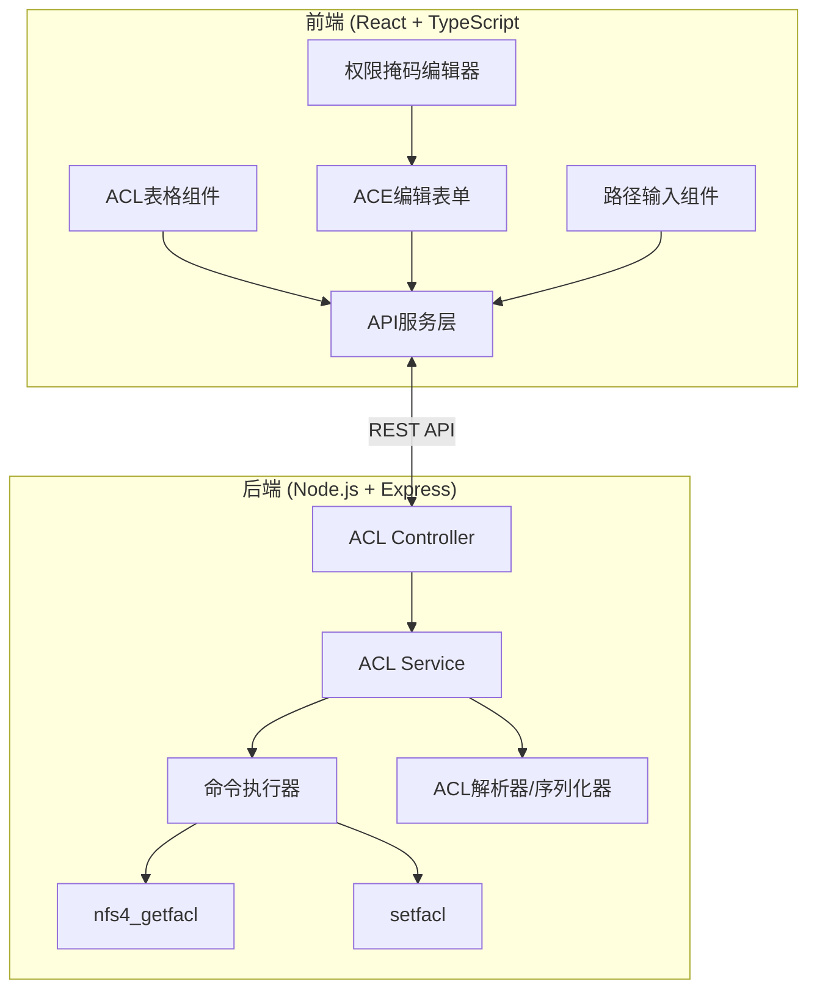
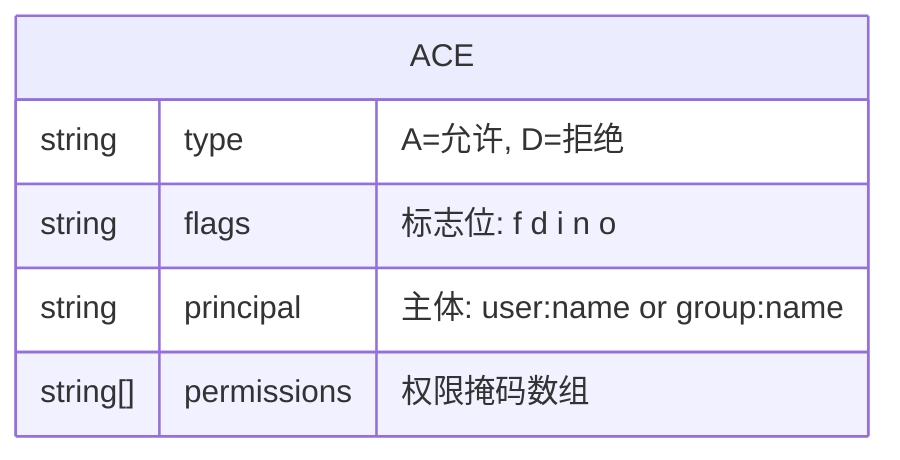
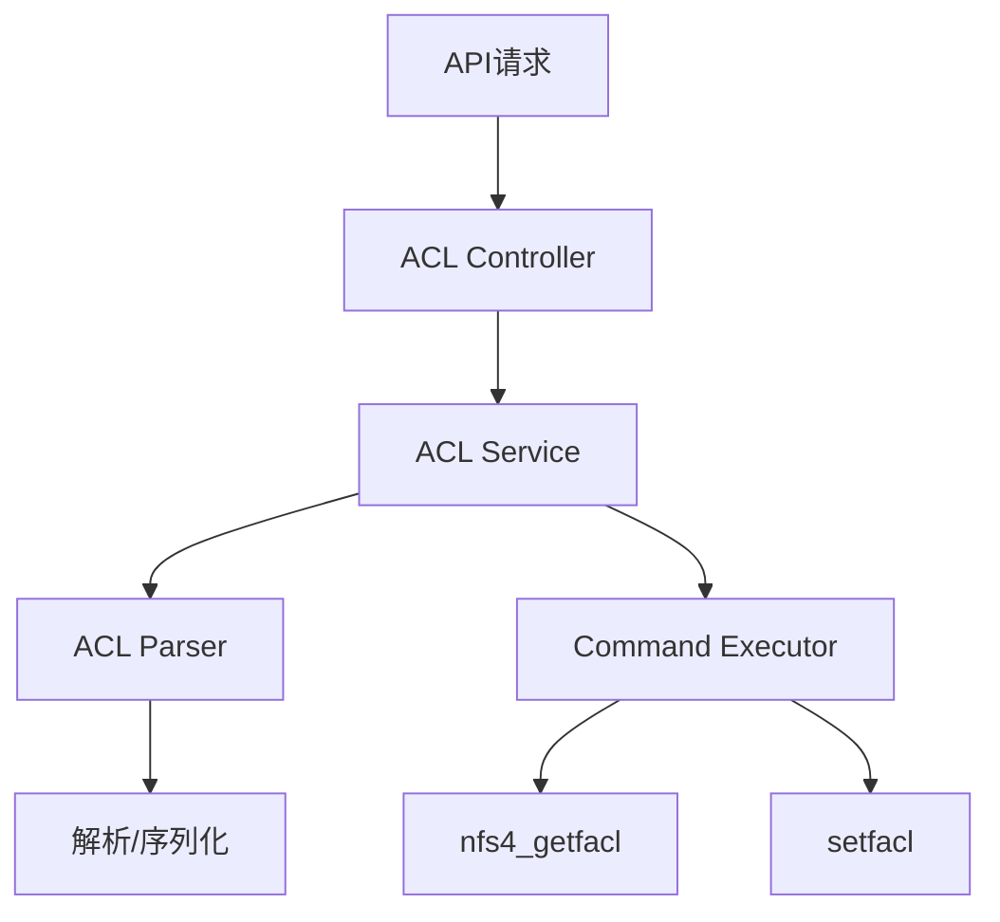

## 1. 架构设计



## 2. 技术描述

- **前端**：React@18 + TypeScript + Vite + TailwindCSS@3
- **状态管理**：React Hooks (useState, useEffect)
- **HTTP客户端**：Axios
- **图标**：Lucide React
- **后端**：Node.js + Express@4
- **后端工具**：child_process 执行系统命令
- **初始化工具**：Vite 脚手架
- **代码规范**：ESLint + Prettier

## 3. 目录结构

```
p186/
├── frontend/
│   ├── src/
│   │   ├── components/
│   │   │   ├── ACLTable.tsx
│   │   │   ├── ACEditor.tsx
│   │   │   ├── PathInput.tsx
│   │   │   └── PermissionEditor.tsx
│   │   ├── services/
│   │   │   └── api.ts
│   │   ├── types/
│   │   │   └── index.ts
│   │   ├── App.tsx
│   │   └── main.tsx
│   ├── index.html
│   └── package.json
└── backend/
│   ├── src/
│   │   ├── controllers/
│   │   │   └── aclController.ts
│   │   ├── services/
│   │   │   ├── aclService.ts
│   │   │   └── commandExecutor.ts
│   │   ├── utils/
│   │   │   └── aclParser.ts
│   │   ├── types/
│   │   │   └── index.ts
│   │   └── server.ts
│   └── package.json
└── package.json
```

## 4. 路由定义

| 路由 | 用途 |
|------|------|
| / | 首页 - ACL管理主页面 |

## 5. API 定义

### 5.1 获取文件ACL
- **GET /api/acl**
- **描述**: 获取指定路径的NFSv4 ACL
- **请求参数**: 
  ```typescript
  interface GetACLRequest {
    path: string;
  }
  ```
- **响应**:
  ```typescript
  interface ACLResponse {
    success: boolean;
    data: {
      path: string;
      aces: ACE[];
    };
    error?: string;
  }
  
  interface ACE {
    type: 'A' | 'D';
    flags: string;
    principal: string;
    permissions: string;
  }
  ```

### 5.2 设置文件ACL
- **POST /api/acl**
- **描述**: 设置指定路径的NFSv4 ACL
- **请求参数**:
  ```typescript
  interface SetACLRequest {
    path: string;
    aces: ACE[];
  }
  ```
- **响应**:
  ```typescript
  interface SetACLResponse {
    success: boolean;
    message?: string;
    error?: string;
  }
  ```

### 5.3 ACE 数据结构
```typescript
interface ACE {
  type: 'A' | 'D';
  flags: string;
  principal: string;
  permissions: string[];
}
```

## 6. 数据模型

### 6.1 NFSv4 ACE 结构



### 6.2 NFSv4 权限说明

| 权限 | 说明 |
|------|------|
| r | 读取文件/列出目录 |
| w | 写入文件/创建文件 |
| x | 执行文件/进入目录 |
| a | 追加数据/创建子目录 |
| d | 删除 |
| D | 删除子项 |
| t | 读取属性 |
| T | 写入属性 |
| n | 读取命名属性 |
| N | 写入命名属性 |
| c | 读取ACL |
| C | 写入ACL |
| o | 改变所有者 |
| y | 同步 |

## 7. 后端架构


