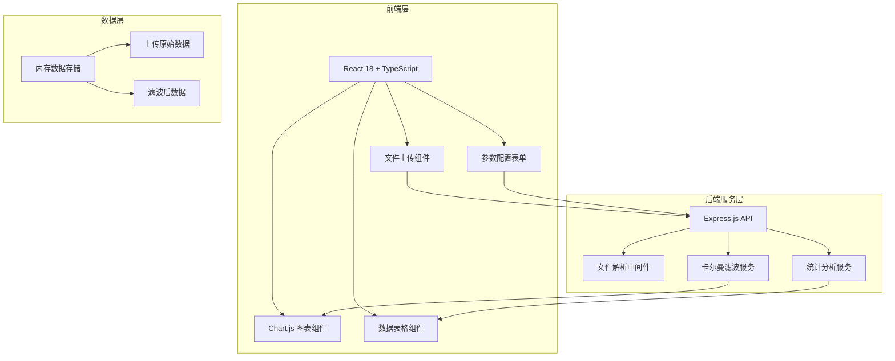

## 1. 架构设计



## 2. 技术描述

- **前端框架**：React@18 + TypeScript + Vite
- **样式方案**：Tailwind CSS@3
- **状态管理**：Zustand
- **图表库**：Chart.js + react-chartjs-2
- **UI组件**：lucide-react（图标）
- **后端框架**：Express@4 + TypeScript
- **文件处理**：Multer（文件上传）、csv-parse（CSV解析）
- **数据格式**：支持 CSV、JSON 格式上传
- **初始化工具**：vite-init

## 3. 项目结构

```
p187/
├── src/                          # 前端代码
│   ├── components/               # React组件
│   │   ├── FileUpload.tsx        # 文件上传组件
│   │   ├── KalmanParams.tsx      # 卡尔曼参数配置
│   │   ├── DataPreview.tsx       # 数据预览表格
│   │   ├── ComparisonChart.tsx   # 对比图表
│   │   ├── StatsCards.tsx        # 统计指标卡片
│   │   └── Header.tsx            # 顶部导航
│   ├── hooks/                    # 自定义Hooks
│   │   └── useKalmanFilter.ts    # 卡尔曼滤波Hook
│   ├── store/                    # Zustand状态管理
│   │   └── useDataStore.ts       # 数据存储
│   ├── pages/                    # 页面
│   │   └── Home.tsx              # 主页
│   ├── utils/                    # 工具函数
│   │   ├── fileParser.ts         # 文件解析
│   │   └── statistics.ts         # 统计计算
│   ├── types/                    # TypeScript类型定义
│   │   └── index.ts              # 类型定义
│   ├── App.tsx                   # 应用入口
│   ├── main.tsx                  # React挂载点
│   └── index.css                 # 全局样式
├── api/                          # 后端代码
│   ├── index.ts                  # Express入口
│   ├── routes/                   # API路由
│   │   └── filter.ts             # 滤波相关路由
│   ├── services/                 # 业务逻辑
│   │   ├── kalmanFilter.ts       # 卡尔曼滤波算法
│   │   └── statistics.ts         # 统计分析服务
│   ├── middleware/               # 中间件
│   │   └── fileUpload.ts         # 文件上传中间件
│   └── types/                    # 后端类型
│       └── index.ts
├── shared/                       # 共享类型
│   └── types.ts                  # 前后端共享类型
├── public/                       # 静态资源
│   └── sample-data.csv           # 示例数据
├── vite.config.ts                # Vite配置
├── tailwind.config.js            # Tailwind配置
├── tsconfig.json                 # TypeScript配置
└── package.json                  # 项目依赖
```

## 4. 路由定义

| 路由 | 页面/接口 | 用途 |
|------|----------|------|
| / | 主页 | 数据上传、滤波处理、结果展示 |
| /api/filter/upload | POST接口 | 上传UWB数据文件 |
| /api/filter/process | POST接口 | 执行卡尔曼滤波处理 |
| /api/filter/sample | GET接口 | 获取示例数据 |

## 5. API定义

### 5.1 数据类型定义

```typescript
// 共享类型定义
interface UWBDataPoint {
  timestamp: number;      // 时间戳 (ms)
  distance: number;       // 原始测距值 (m)
}

interface KalmanParams {
  processNoise: number;       // 过程噪声协方差 Q
  measurementNoise: number;   // 测量噪声协方差 R
  estimationError: number;    // 初始估计误差 P0
}

interface FilterResult {
  originalData: UWBDataPoint[];
  filteredData: UWBDataPoint[];
  statistics: {
    originalMean: number;
    originalVariance: number;
    originalMaxNoise: number;
    filteredMean: number;
    filteredVariance: number;
    filteredMaxNoise: number;
    noiseReductionRatio: number;
  };
}

interface ApiResponse<T> {
  success: boolean;
  data?: T;
  error?: string;
}
```

### 5.2 接口详情

#### POST /api/filter/upload
- 请求：multipart/form-data，包含文件字段 `file`
- 响应：`ApiResponse<{ data: UWBDataPoint[], filename: string }>`
- 支持格式：.csv, .json

#### POST /api/filter/process
- 请求体：
```typescript
{
  data: UWBDataPoint[],
  params: KalmanParams
}
```
- 响应：`ApiResponse<FilterResult>`

#### GET /api/filter/sample
- 响应：`ApiResponse<{ data: UWBDataPoint[], filename: string }>`

## 6. 卡尔曼滤波算法设计

### 6.1 一维卡尔曼滤波实现

```
初始化:
  x_hat = 第一个测量值       # 状态估计
  P = estimationError        # 估计误差协方差
  Q = processNoise           # 过程噪声协方差
  R = measurementNoise       # 测量噪声协方差

对于每个测量值 z:
  # 预测步
  x_hat_minus = x_hat        # 状态预测（假设静态或缓变）
  P_minus = P + Q            # 误差协方差预测
  
  # 更新步
  K = P_minus / (P_minus + R)  # 卡尔曼增益
  x_hat = x_hat_minus + K * (z - x_hat_minus)  # 状态更新
  P = (1 - K) * P_minus       # 误差协方差更新
  
  保存 x_hat 作为滤波后的值
```

## 7. 数据格式规范

### 7.1 CSV格式要求
```csv
timestamp,distance
1620000000000,5.23
1620000000100,5.41
1620000000200,5.18
...
```

### 7.2 JSON格式要求
```json
[
  { "timestamp": 1620000000000, "distance": 5.23 },
  { "timestamp": 1620000000100, "distance": 5.41 },
  ...
]
```

## 8. 前端状态管理

使用 Zustand 管理全局状态：

```typescript
interface DataState {
  rawData: UWBDataPoint[];
  filteredData: UWBDataPoint[];
  statistics: FilterResult['statistics'] | null;
  kalmanParams: KalmanParams;
  isProcessing: boolean;
  filename: string;
  uploadStatus: 'idle' | 'uploading' | 'success' | 'error';
  
  // Actions
  setRawData: (data: UWBDataPoint[], filename: string) => void;
  setFilteredResult: (result: FilterResult) => void;
  setKalmanParams: (params: Partial<KalmanParams>) => void;
  setProcessing: (processing: boolean) => void;
  clearAll: () => void;
}
```
