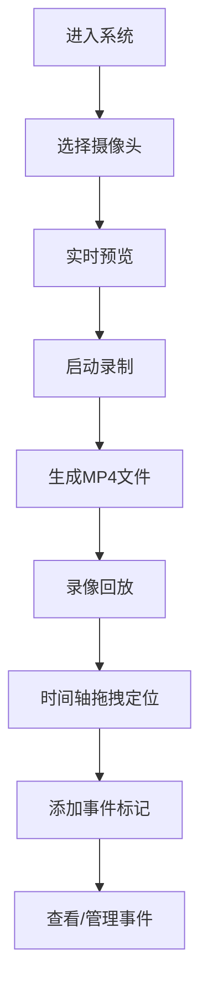

# ONVIF摄像头录像回放系统 - 产品需求文档

## 1. 产品概述

本系统是一个Web端摄像头录像管理与回放平台，支持接入ONVIF协议摄像头（或模拟摄像头），实现视频录制、存储、时间轴回放和事件标记功能。主要目标用户为安防监控人员、物业管理人员等需要查看历史录像的用户。

## 2. 核心功能

### 2.1 用户角色

| 角色 | 注册方式 | 核心权限 |
|------|----------|----------|
| 管理员 | 默认账号 | 摄像头管理、录像配置、查看回放、事件标记 |
| 普通用户 | 管理员创建 | 查看回放、查看事件标记 |

### 2.2 功能模块

1. **实时监控页**：摄像头列表、实时视频预览、录制控制
2. **录像回放页**：时间轴播放器、录像搜索、进度拖拽定位
3. **事件管理页**：事件标记列表、事件筛选、事件详情查看

### 2.3 页面详情

| 页面名称 | 模块名称 | 功能描述 |
|-----------|-------------|---------------------|
| 实时监控页 | 摄像头列表 | 显示所有已配置摄像头，支持点击切换预览 |
| 实时监控页 | 视频预览 | 显示摄像头实时画面，显示录制状态 |
| 实时监控页 | 录制控制 | 手动开始/停止录制，设置录制时长 |
| 录像回放页 | 视频播放器 | MP4视频播放，支持暂停/播放/音量控制 |
| 录像回放页 | 时间轴组件 | 可视化时间轴，显示录像片段和事件标记 |
| 录像回放页 | 时间轴交互 | 支持拖拽定位、缩放、点击事件标记跳转 |
| 事件管理页 | 事件列表 | 显示所有事件标记，支持按时间/类型筛选 |
| 事件管理页 | 事件编辑 | 添加/删除/修改事件标记及备注信息 |

## 3. 核心流程

用户进入系统后，在实时监控页查看摄像头画面并启动录制；录制完成后，在录像回放页通过时间轴选择时间段进行回放；回放过程中可对重要时刻添加事件标记；所有事件可在事件管理页统一管理。

## 4. 用户界面设计

### 4.1 设计风格

- **主色调**：深色主题（#0f172a），科技感安防监控风格
- **强调色**：亮青色（#06b6d4），用于录制状态、时间轴高亮
- **警告色**：红色（#ef4444），用于事件标记、异常状态
- **按钮风格**：圆角8px，悬停有阴影和颜色变化
- **字体**：JetBrains Mono（标题）、Inter（正文）
- **布局风格**：卡片式布局，左侧导航栏，右侧内容区
- **图标风格**：线性图标，使用Lucide React图标库

### 4.2 页面设计概述

| 页面名称 | 模块名称 | UI元素 |
|-----------|-------------|-------------|
| 实时监控页 | 视频预览 | 大尺寸视频窗口、状态指示标签、录制控制按钮 |
| 录像回放页 | 时间轴 | 可拖拽时间滑块、录像段高亮、事件标记点、缩放控件 |
| 事件管理页 | 事件列表 | 时间排序卡片、类型标签、搜索筛选栏、快速跳转按钮 |

### 4.3 响应式

- 桌面端优先设计，主内容区最小宽度1200px
- 时间轴组件自适应容器宽度
- 移动端可折叠侧边栏
- 视频播放器保持16:9比例

### 4.4 动画与交互

- 录制状态指示灯呼吸动画
- 时间轴拖拽平滑过渡
- 页面切换淡入淡出效果
- 悬停时按钮和卡片微缩放
