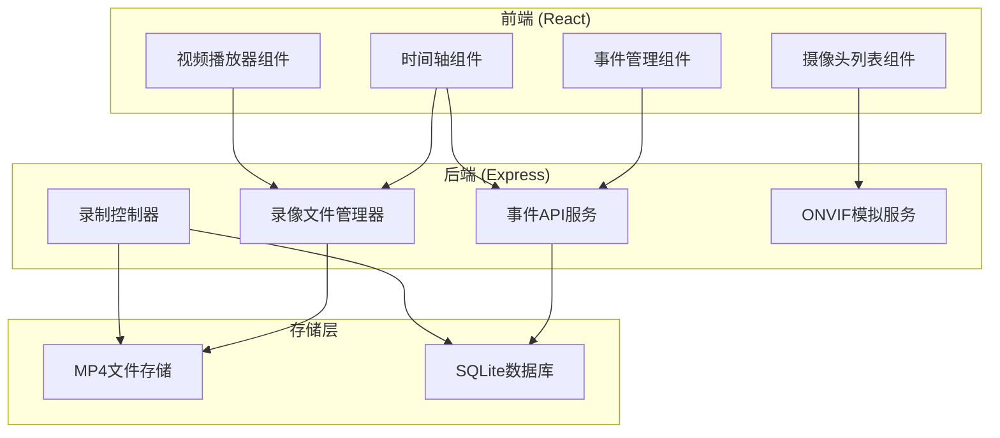
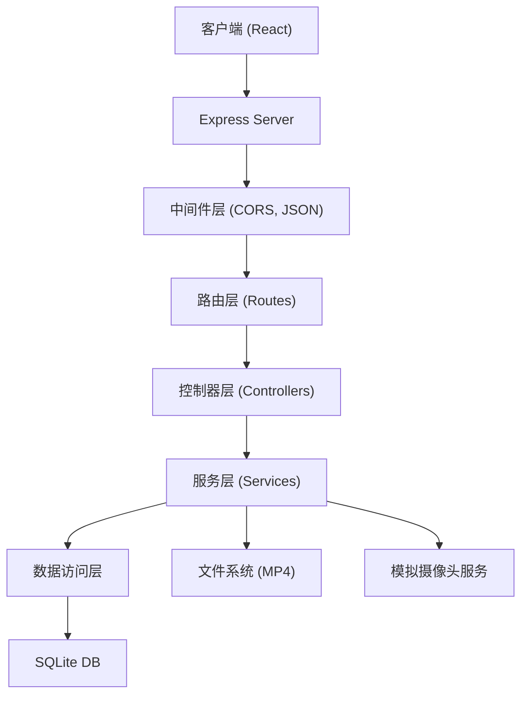
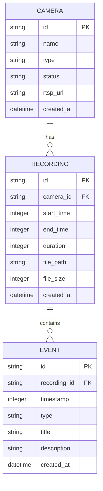

# ONVIF摄像头录像回放系统 - 技术架构文档

## 1. 架构设计



## 2. 技术描述

- **前端**：React@18 + TypeScript + TailwindCSS@3 + Zustand + Lucide React
- **构建工具**：Vite
- **后端**：Express@4 + TypeScript + ESM
- **数据库**：SQLite（存储事件标记、录像元数据）
- **视频处理**：使用模拟视频流生成MP4（FFmpeg可选）
- **初始化工具**：vite-init

## 3. 路由定义

### 前端路由
| 路由 | 页面 | 用途 |
|-------|------|---------|
| / | 实时监控页 | 摄像头预览、录制控制 |
| /playback | 录像回放页 | 时间轴回放、事件标记 |
| /events | 事件管理页 | 事件列表、筛选管理 |

### 后端API路由
| 方法 | 路由 | 用途 |
|-------|-------|---------|
| GET | /api/cameras | 获取摄像头列表 |
| GET | /api/cameras/:id | 获取摄像头详情 |
| POST | /api/record/start | 开始录制 |
| POST | /api/record/stop | 停止录制 |
| GET | /api/recordings | 获取录像列表 |
| GET | /api/recordings/:id | 获取录像详情 |
| GET | /api/recordings/:id/video | 播放录像视频 |
| GET | /api/events | 获取事件列表 |
| POST | /api/events | 创建事件标记 |
| PUT | /api/events/:id | 更新事件标记 |
| DELETE | /api/events/:id | 删除事件标记 |

## 4. API类型定义

```typescript
// 摄像头
interface Camera {
  id: string;
  name: string;
  type: 'onvif' | 'simulated';
  status: 'online' | 'offline' | 'recording';
  rtspUrl?: string;
}

// 录像记录
interface Recording {
  id: string;
  cameraId: string;
  startTime: number;
  endTime: number;
  duration: number;
  filePath: string;
  fileSize: number;
}

// 事件标记
interface Event {
  id: string;
  recordingId: string;
  timestamp: number;
  type: 'motion' | 'alert' | 'custom';
  title: string;
  description?: string;
  createdAt: number;
}

// 时间轴数据
interface TimelineData {
  recordings: Recording[];
  events: Event[];
  dateRange: { start: number; end: number };
}
```

## 5. 服务器架构图



## 6. 数据模型

### 6.1 数据模型定义



### 6.2 数据库初始化SQL

```sql
CREATE TABLE IF NOT EXISTS cameras (
  id TEXT PRIMARY KEY,
  name TEXT NOT NULL,
  type TEXT NOT NULL DEFAULT 'simulated',
  status TEXT NOT NULL DEFAULT 'online',
  rtsp_url TEXT,
  created_at INTEGER NOT NULL
);

CREATE TABLE IF NOT EXISTS recordings (
  id TEXT PRIMARY KEY,
  camera_id TEXT NOT NULL,
  start_time INTEGER NOT NULL,
  end_time INTEGER,
  duration INTEGER,
  file_path TEXT NOT NULL,
  file_size INTEGER DEFAULT 0,
  created_at INTEGER NOT NULL,
  FOREIGN KEY (camera_id) REFERENCES cameras(id)
);

CREATE TABLE IF NOT EXISTS events (
  id TEXT PRIMARY KEY,
  recording_id TEXT NOT NULL,
  timestamp INTEGER NOT NULL,
  type TEXT NOT NULL,
  title TEXT NOT NULL,
  description TEXT,
  created_at INTEGER NOT NULL,
  FOREIGN KEY (recording_id) REFERENCES recordings(id)
);

CREATE INDEX IF NOT EXISTS idx_recordings_camera ON recordings(camera_id);
CREATE INDEX IF NOT EXISTS idx_recordings_time ON recordings(start_time);
CREATE INDEX IF NOT EXISTS idx_events_recording ON events(recording_id);
CREATE INDEX IF NOT EXISTS idx_events_timestamp ON events(timestamp);
```

## 7. 项目结构

```
.
├── src/                          # 前端源码
│   ├── components/               # 组件
│   │   ├── VideoPlayer.tsx       # 视频播放器
│   │   ├── Timeline.tsx          # 时间轴组件
│   │   ├── TimelineEvent.tsx     # 时间轴事件标记
│   │   ├── CameraCard.tsx        # 摄像头卡片
│   │   ├── EventList.tsx         # 事件列表
│   │   └── Layout/               # 布局组件
│   ├── pages/                    # 页面
│   │   ├── LiveMonitor.tsx       # 实时监控
│   │   ├── Playback.tsx          # 录像回放
│   │   └── Events.tsx            # 事件管理
│   ├── store/                    # Zustand状态管理
│   ├── utils/                    # 工具函数
│   ├── types/                    # 类型定义
│   └── App.tsx
├── api/                          # 后端源码
│   ├── controllers/              # 控制器
│   ├── services/                 # 业务服务
│   ├── models/                   # 数据模型
│   ├── routes/                   # 路由
│   ├── db/                       # 数据库
│   ├── mock/                     # 模拟数据
│   └── index.ts
├── recordings/                   # MP4存储目录
├── shared/                       # 共享类型
└── package.json
```
