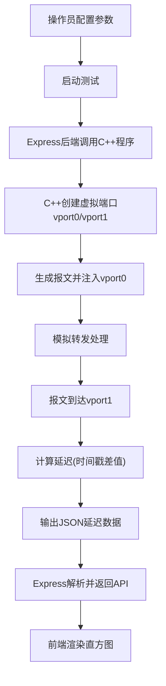

## 1. 产品概述

一个基于C++ DPDK模拟的报文转发延迟测量系统，通过两个虚拟端口模拟报文收发流程，精确测量每包转发延迟（纳秒级时间戳），并在Web前端以直方图形式实时展示延迟分布。

- 目标用户：网络工程师、DPDK开发者、性能测试人员
- 核心价值：无需真实DPDK硬件即可模拟和可视化报文转发延迟特征

## 2. 核心功能

### 2.1 用户角色

| 角色 | 说明 |
|------|------|
| 操作员 | 配置模拟参数、启动/停止测试、查看延迟数据 |

### 2.2 功能模块

1. **控制台页面**：参数配置、测试控制、延迟直方图、实时统计

### 2.3 页面详情

| 页面名称 | 模块名称 | 功能描述 |
|----------|----------|----------|
| 控制台 | 参数配置面板 | 配置报文数量、报文大小、转发模式（直通/存储转发）、模拟延迟参数 |
| 控制台 | 测试控制 | 启动/停止/重置测试，显示运行状态 |
| 控制台 | 延迟直方图 | 以直方图展示延迟分布，支持分桶粒度调整，显示P50/P90/P99/P999延迟 |
| 控制台 | 实时统计面板 | 显示总报文数、平均延迟、最大/最小延迟、吞吐量 |
| 控制台 | 端口状态 | 显示两个虚拟端口状态（收包/发包计数） |

## 3. 核心流程

1. 操作员在控制台配置测试参数（报文数量、大小、模式等）
2. 点击「启动测试」，Express后端调用C++模拟程序
3. C++程序创建两个虚拟端口，模拟报文从Port0→Port1的转发
4. 每个报文记录发送时间戳和接收时间戳，计算转发延迟
5. C++程序将延迟数据以JSON格式输出
6. Express后端解析结果并通过API返回给前端
7. 前端渲染延迟直方图和统计信息

## 4. 用户界面设计

### 4.1 设计风格

- 主色调：深色工业风，#0F172A背景 + #22D3EE青色高亮 + #F97316橙色警告
- 辅助色：#1E293B卡片背景、#334155边框
- 按钮风格：圆角矩形，微妙的3D按压效果，启动按钮青色、停止按钮橙红色
- 字体：JetBrains Mono（数据/代码区域）+ DM Sans（UI文本）
- 布局风格：单页仪表盘布局，顶部控制栏 + 主体双栏（左：直方图，右：统计面板）
- 图标风格：线条式，Lucide图标集

### 4.2 页面设计概览

| 页面名称 | 模块名称 | UI元素 |
|----------|----------|--------|
| 控制台 | 参数配置面板 | 滑块（报文数量）、下拉选择（转发模式）、输入框（报文大小），深色卡片容器 |
| 控制台 | 测试控制 | 启动/停止按钮，状态指示灯（绿色运行/红色停止/灰色空闲） |
| 控制台 | 延迟直方图 | Canvas/SVG直方图，X轴延迟(μs)，Y轴频次，悬停显示桶详情，P50/P90/P99竖线标注 |
| 控制台 | 实时统计面板 | 数字卡片网格：总包数、平均延迟、P99延迟、吞吐量(pps)，数字动画效果 |
| 控制台 | 端口状态 | 两个端口卡片，显示收/发计数器，端口状态图标 |

### 4.3 响应式设计

- 桌面优先设计，1920px最佳
- 平板端：单栏布局，直方图在上，统计在下
- 移动端：简化视图，仅显示核心统计和简化直方图

### 4.4 3D场景指引

不适用
