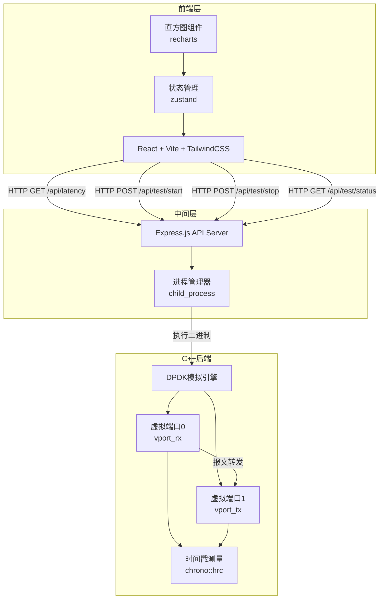
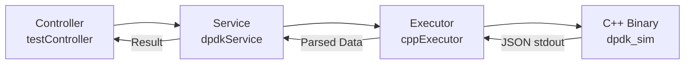

## 1. 架构设计



## 2. 技术说明

- 前端：React@18 + TailwindCSS@3 + Vite + recharts（直方图）+ zustand（状态管理）
- 初始化工具：vite-init
- 中间层：Express@4 + TypeScript（ESM格式）
- C++后端：C++17标准，仅依赖标准库（chrono、thread、random、queue），无需真实DPDK环境
- 数据传递：C++程序输出JSON到stdout，Express通过child_process捕获并解析

## 3. 路由定义

| 路由 | 用途 |
|------|------|
| / | 控制台主页（参数配置+直方图+统计） |

## 4. API定义

### 4.1 启动测试

```
POST /api/test/start
Request Body: {
  packetCount: number;    // 报文数量 (100-100000)
  packetSize: number;     // 报文大小 (64-9000 bytes)
  forwardMode: "cut_through" | "store_forward";  // 转发模式
  baseLatencyNs: number;  // 基础延迟 (纳秒)
  jitterNs: number;       // 抖动范围 (纳秒)
}
Response: { testId: string; status: "running" }
```

### 4.2 停止测试

```
POST /api/test/stop
Response: { testId: string; status: "stopped" }
```

### 4.3 测试状态

```
GET /api/test/status
Response: {
  status: "idle" | "running" | "completed";
  testId: string | null;
  progress: number;       // 0-100
  packetsProcessed: number;
}
```

### 4.4 获取延迟数据

```
GET /api/latency?testId=xxx
Response: {
  testId: string;
  config: { packetCount, packetSize, forwardMode, baseLatencyNs, jitterNs };
  latencies: number[];     // 每包延迟(纳秒)
  stats: {
    count: number;
    mean: number;
    min: number;
    max: number;
    p50: number;
    p90: number;
    p99: number;
    p999: number;
    stddev: number;
  };
  portStats: {
    vport0: { received: number; sent: number; };
    vport1: { received: number; sent: number; };
  };
  histogram: {
    buckets: { start: number; end: number; count: number; }[];
  };
}
```

## 5. 服务器架构图



## 6. C++模拟引擎设计

### 6.1 核心数据结构

```
struct Packet {
    uint64_t id;
    uint32_t size;
    uint64_t tx_timestamp_ns;   // 发送时间戳
    uint64_t rx_timestamp_ns;   // 接收时间戳
};

struct VirtualPort {
    string name;
    queue<Packet> rx_queue;
    queue<Packet> tx_queue;
    uint64_t received_count;
    uint64_t sent_count;
};
```

### 6.2 模拟流程

1. 创建vport0和vport1
2. 根据参数生成N个报文，注入vport0.rx_queue
3. 对每个报文：
   - 记录tx_timestamp（发送时间）
   - 模拟转发处理延迟（baseLatency + random jitter）
   - 存储转发模式额外增加packetSize/bandwidth延迟
   - 记录rx_timestamp（接收时间）
   - 报文进入vport1.rx_queue
4. 计算每包延迟 = rx_timestamp - tx_timestamp
5. 输出JSON结果到stdout

### 6.3 编译

```bash
g++ -std=c++17 -O2 -o dpdk_sim src/dpdk_sim.cpp -lpthread
```
