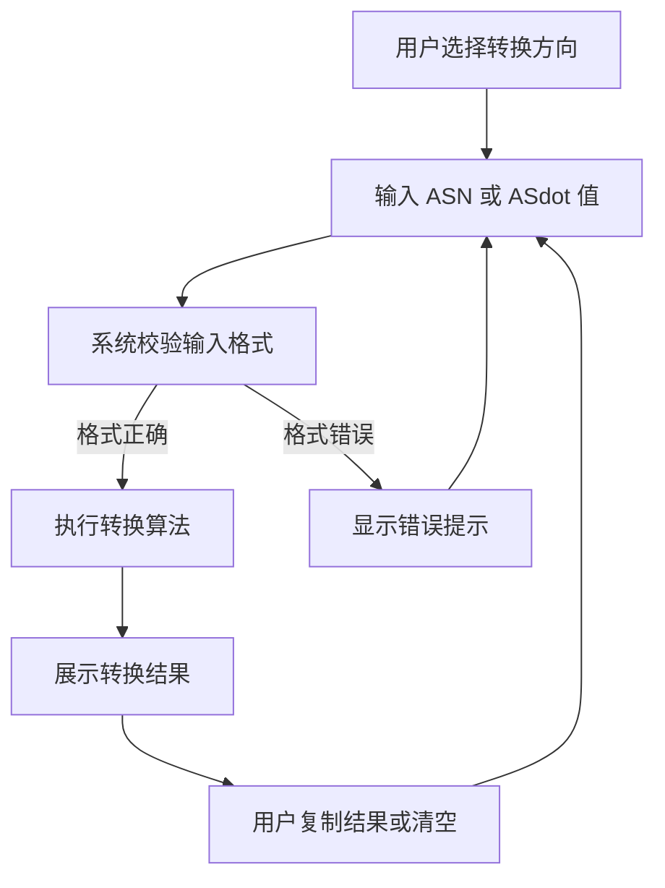

## 1. 产品概述

ASN 格式转换工具，用于网络工程师和运维人员在 2 字节 ASN（1-64511）与 4 字节 ASdot 表示法（如 `1.2`）之间进行快速转换，支持批量处理，提升工作效率。

## 2. 核心功能

### 2.1 用户角色

| 角色 | 注册方式 | 核心权限 |
|------|----------|----------|
| 普通用户 | 无需注册 | 使用转换功能、批量转换、复制结果 |

### 2.2 功能模块

1. **首页**：单页应用，包含 ASN 转换、批量转换、结果展示

### 2.3 页面详情

| 页面名称 | 模块名称 | 功能描述 |
|----------|----------|----------|
| 首页 | 转换模式切换 | 在「2字节→ASdot」和「ASdot→2字节」之间切换转换方向 |
| 首页 | 单个转换输入 | 输入单个 ASN 或 ASdot 格式，实时显示转换结果 |
| 首页 | 批量转换输入 | 支持多行输入，每行一个值，批量进行转换 |
| 首页 | 结果展示区 | 清晰展示转换结果，支持一键复制单个或全部结果 |
| 首页 | 输入校验 | 实时校验输入格式，错误提示友好 |
| 首页 | 转换历史 | 保存最近的转换记录，方便查看 |

## 3. 核心流程

用户选择转换方向 → 输入单个或多个 ASN/ASdot 值 → 系统校验输入格式 → 执行转换算法 → 展示转换结果 → 用户可复制结果或清空重新输入

## 4. 用户界面设计

### 4.1 设计风格

- **主色调**：深蓝色（#0ea5e9）代表网络技术的专业感
- **辅助色**：深灰背景（#0f172a）营造科技感，浅灰文字（#cbd5e1）保证可读性
- **按钮风格**：扁平化设计，圆角 8px，悬停有微动画效果
- **字体**：使用 JetBrains Mono 等宽字体展示 ASN 数值，Inter 作为界面字体
- **布局风格**：卡片式布局，居中对齐，左侧输入区右侧结果区的双栏设计
- **图标风格**：简约线性图标，使用 Lucide React 图标库

### 4.2 页面设计概述

| 页面名称 | 模块名称 | UI 元素 |
|----------|----------|---------|
| 首页 | 头部区域 | 大标题、副标题、转换模式切换开关 |
| 首页 | 输入区域 | 文本输入框（支持多行）、转换按钮、清空按钮 |
| 首页 | 结果区域 | 表格展示输入输出对应关系、复制按钮 |
| 首页 | 历史记录 | 最近转换记录列表，可点击快速复用 |
| 首页 | 页脚 | 说明文字、ASN 格式说明链接 |

### 4.3 响应式设计

- 桌面端优先设计，双栏布局（输入区 + 结果区）
- 移动端自适应为单栏堆叠布局
- 触摸设备优化按钮尺寸和输入框高度

### 4.4 转换算法说明

**2 字节 ASN 转 ASdot 格式：**
- 2 字节 ASN 范围：1 - 64511
- 转换公式：`高16位 = ASN // 65536`，`低16位 = ASN % 65536`
- 表示为：`高16位.低16位`
- 示例：ASN 65538 → 1 * 65536 + 2 → `1.2`

**ASdot 格式转 2 字节 ASN：**
- 格式：`a.b`，其中 a 为高 16 位，b 为低 16 位
- 转换公式：`ASN = a * 65536 + b`
- 结果范围需在 1 - 64511 之间才有效
- 示例：`1.2` → 1 * 65536 + 2 = 65538（需校验范围）
