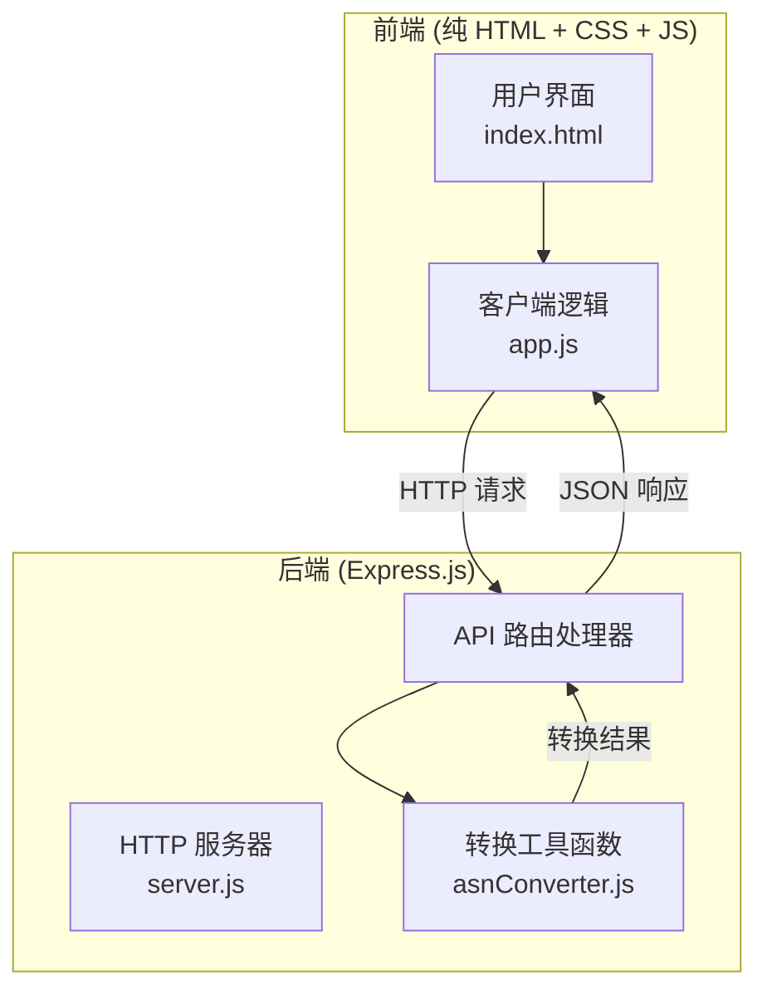

## 1. 架构设计



## 2. 技术描述

- **前端**：纯 HTML + CSS + 原生 JavaScript（无框架，轻量高效）
- **后端**：Node.js + Express@4
- **跨域**：CORS 中间件
- **样式**：内联 CSS，专业深色主题
- **图标**：使用 Font Awesome CDN
- **后端逻辑**：asnConverter.js 模块实现 ASN 转换算法

## 3. 路由定义

| 路由 | 方法 | 用途 |
|------|------|------|
| / | GET | 首页，ASN 转换工具界面 |
| /api/convert | POST | 执行转换（支持单个和批量） |

## 4. API 定义

### 4.1 请求格式

```javascript
// POST /api/convert
{
  "direction": "asn-to-asdot" | "asdot-to-asn",
  "inputs": string[]    // 输入值数组
}
```

### 4.2 响应格式

```javascript
{
  "success": boolean,
  "results": [
    {
      "input": string,      // 原始输入
      "output": string,     // 转换结果（成功时）
      "isValid": boolean,   // 是否转换成功
      "error": string       // 错误信息（失败时）
    }
  ]
}
```

## 5. 项目结构

```
p192/
├── public/
│   ├── index.html          # 前端界面
│   ├── css/
│   │   └── style.css       # 样式文件
│   └── js/
│       └── app.js          # 客户端逻辑
├── asnConverter.js         # ASN 转换核心逻辑
├── server.js               # Express 服务器
└── package.json
```

## 6. 核心算法说明

### 6.1 ASN 范围定义
- 2 字节 ASN 有效范围：1 - 64511
- 16 位最大值：65535

### 6.2 2 字节 ASN 转 ASdot
```
输入：asn (1-64511)
高16位 = Math.floor(asn / 65536)
低16位 = asn % 65536
输出：`${高16位}.${低16位}`
示例：100 → 0 * 65536 + 100 → "0.100"
示例：65538 → 1 * 65536 + 2 → "1.2" (注：65538 超出 2 字节范围)
```

### 6.3 ASdot 转 2 字节 ASN
```
输入：asdot (格式: "a.b")
解析为 [a, b] 两个整数
asn = a * 65536 + b
校验 asn 是否在 1-64511 范围内
有效则返回 asn，无效返回错误
示例："0.100" → 0 * 65536 + 100 = 100 ✓
示例："1.2" → 1 * 65536 + 2 = 65538 ✗ (超出范围)
```

## 7. 服务器架构


