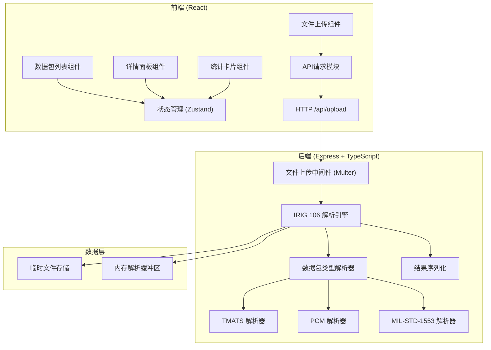

## 1. 架构设计



## 2. 技术描述
- **前端**：React@18 + TypeScript + Vite + TailwindCSS@3 + Zustand + Lucide React
- **后端**：Express@4 + TypeScript + Multer (文件上传)
- **初始化工具**：vite-init
- **数据库**：无需数据库，文件解析后返回JSON结果，不持久化存储
- **包管理器**：pnpm（优先）或 npm

## 3. 技术栈说明

### 3.1 IRIG 106 Chapter 10 解析核心
- 二进制文件解析：使用 Node.js Buffer API 解析大端/小端数据
- 文件头解析：24字节标准文件头，包含版本号、文件大小、创建时间等
- 数据包解析：支持多种数据包类型识别
  - Type 0x01: TMATS (Telemetry Attributes Transfer Standard)
  - Type 0x02: PCM (Pulse Code Modulation)
  - Type 0x07: MIL-STD-1553 Bus Data
  - 其他类型：标记为未知类型但仍显示基本信息

### 3.2 数据包结构
每个IRIG 106数据包包含：
- 数据包头（16字节）：同步字、包类型、长度、时间戳
- 可选二级头（可选）
- 数据包体：根据类型解析
- 包校验和（可选）

## 4. 路由定义

| 路由 | 方法 | 用途 |
|-------|------|---------|
| / | GET | 首页（React SPA） |
| /api/upload | POST | 上传IRIG 106文件并解析 |
| /api/health | GET | 健康检查 |

## 5. API 定义

### 5.1 类型定义

```typescript
// shared/types.ts
export enum PacketType {
  TMATS = 0x01,
  PCM = 0x02,
  MIL_STD_1553 = 0x07,
  ANALOG = 0x03,
  DISCRETE = 0x04,
  MESSAGE = 0x05,
  ARINC_429 = 0x06,
  VIDEO = 0x08,
  IMAGE = 0x09,
  UART = 0x0A,
  IEEE_1394 = 0x0B,
  PARALLEL = 0x0C,
  ETHERNET = 0x0D,
  UNKNOWN = 0xFF
}

export interface FileHeader {
  syncPattern: string;
  version: string;
  fileSize: number;
  creationTime: Date;
  packetCount: number;
}

export interface PacketHeader {
  sync: string;
  packetType: PacketType;
  packetLength: number;
  dataLength: number;
  timestamp: bigint;
  sequenceNumber: number;
  checksumPresent: boolean;
}

export interface PacketSummary {
  index: number;
  type: PacketType;
  typeName: string;
  timestamp: string;
  packetLength: number;
  dataLength: number;
  sequenceNumber: number;
  offset: number;
  checksumValid?: boolean;
  preview?: string;
}

export interface PacketDetail extends PacketSummary {
  header: PacketHeader;
  fields: Record<string, string | number | bigint>;
  rawDataHex: string;
}

export interface ParseResult {
  success: boolean;
  fileName: string;
  fileSize: number;
  fileHeader: FileHeader;
  totalPackets: number;
  packets: PacketSummary[];
  packetDetails: Record<number, PacketDetail>;
  stats: Record<PacketType, number>;
  errors?: string[];
}

export interface ParseError {
  error: string;
  code: string;
}
```

### 5.2 请求/响应

**POST /api/upload**
- Request: `multipart/form-data` 包含 `file` 字段
- Response: `ParseResult | ParseError`

成功响应示例：
```json
{
  "success": true,
  "fileName": "test_data.ch10",
  "fileSize": 1048576,
  "fileHeader": {
    "syncPattern": "IRIG106",
    "version": "10.0",
    "fileSize": 1048576,
    "creationTime": "2024-01-15T10:30:00.000Z",
    "packetCount": 42
  },
  "totalPackets": 42,
  "packets": [
    {
      "index": 0,
      "type": 1,
      "typeName": "TMATS",
      "timestamp": "0.000000",
      "packetLength": 1024,
      "dataLength": 1000,
      "sequenceNumber": 0,
      "offset": 24,
      "preview": "BEGIN TMATS\\nID: RECORDER-001..."
    }
  ],
  "stats": {
    "1": 1,
    "2": 35,
    "7": 6
  }
}
```

## 6. 项目结构

```
.
├── src/                    # 前端源码
│   ├── components/         # React组件
│   │   ├── FileUpload.tsx
│   │   ├── StatsCards.tsx
│   │   ├── PacketList.tsx
│   │   ├── PacketDetail.tsx
│   │   └── TypeFilter.tsx
│   ├── hooks/              # 自定义Hooks
│   │   └── useFileUpload.ts
│   ├── store/              # Zustand状态管理
│   │   └── useAppStore.ts
│   ├── pages/              # 页面组件
│   │   └── Home.tsx
│   ├── utils/              # 工具函数
│   │   └── formatters.ts
│   ├── App.tsx
│   ├── main.tsx
│   └── index.css
├── api/                    # 后端源码
│   ├── index.ts            # Express入口
│   ├── routes/
│   │   └── upload.ts
│   └── utils/
│       ├── irig106/        # IRIG 106解析核心
│       │   ├── parser.ts
│       │   ├── fileHeader.ts
│       │   ├── packetHeader.ts
│       │   ├── tmats.ts
│       │   ├── pcm.ts
│       │   └── milstd1553.ts
│       └── types.ts
├── shared/                 # 共享类型
│   └── types.ts
├── vite.config.ts
├── tailwind.config.js
├── tsconfig.json
└── package.json
```

## 7. 解析算法说明

### 7.1 文件头解析 (24字节)
| 偏移 | 长度 | 字段 | 类型 | 说明 |
|------|------|------|------|------|
| 0 | 8 | Sync Pattern | ASCII | "IRIG106\x00" |
| 8 | 2 | Version | UInt16 LE | 格式版本号 |
| 10 | 8 | File Size | UInt64 LE | 文件总字节数 |
| 18 | 4 | Creation Time | UInt32 LE | Unix时间戳 |
| 22 | 2 | Reserved | UInt16 | 保留 |

### 7.2 数据包头解析 (16字节)
| 偏移 | 长度 | 字段 | 类型 | 说明 |
|------|------|------|------|------|
| 0 | 2 | Sync | UInt16 LE | 0xEB90 |
| 2 | 2 | Chunk Info | UInt16 LE | 包含类型和标志 |
| 4 | 4 | Packet Length | UInt32 LE | 总长度（含头） |
| 8 | 8 | Timestamp | UInt64 LE | 纳秒级时间戳 |

### 7.3 包类型提取
从Chunk Info字段提取：
- 低11位：数据包类型 (Packet Type)
- 第12位：二级头标志
- 第13位：校验和标志
- 第14-16位：保留

## 8. 性能考虑
- 流式解析：对于大文件使用流式处理，避免一次性加载全部内容
- 缓冲区管理：使用固定大小缓冲区逐块解析
- 内存限制：对于超过1GB的文件只解析文件头和前1000个数据包
- 并行处理：多线程解析不同类型的数据包（Node.js worker_threads）
