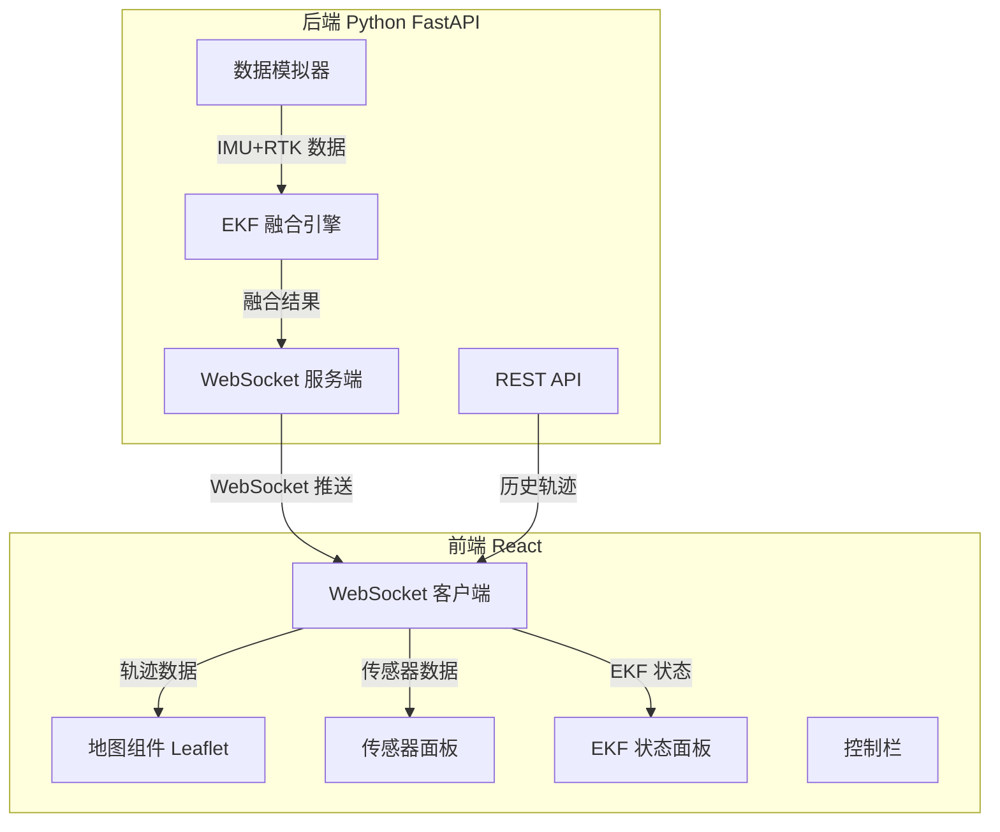

## 1. 架构设计



## 2. 技术说明

- 前端：React@18 + TypeScript + Vite + TailwindCSS + Leaflet + Recharts
- 初始化工具：vite-init (react-ts 模板)
- 后端：Python 3.10+ / FastAPI / NumPy / WebSocket
- 数据库：无（实时数据流 + 内存历史缓冲）
- 通信协议：WebSocket（实时推流） + REST API（历史查询）

## 3. 路由定义

| 路由 | 用途 |
|------|------|
| / | 轨迹地图页 - 实时地图与传感器监控 |
| /replay | 数据回放页 - 历史轨迹回放 |

## 4. API 定义

### 4.1 WebSocket 端点

```
ws://localhost:8000/ws/trajectory
```

推送消息格式：
```typescript
interface TrajectoryMessage {
  timestamp: number;
  imu: {
    accel: [number, number, number]; // m/s²
    gyro: [number, number, number];  // rad/s
  };
  rtk: {
    lat: number;
    lon: number;
    alt: number;
    accuracy: number; // 米
  };
  ekf: {
    lat: number;
    lon: number;
    alt: number;
    vel_n: number;  // 北向速度 m/s
    vel_e: number;  // 东向速度 m/s
    vel_d: number;  // 垂直速度 m/s
    roll: number;   // rad
    pitch: number;  // rad
    yaw: number;    // rad
    pos_covariance: number[][]; // 3x3 位置协方差
  };
}
```

### 4.2 REST API

```
GET /api/history?start=0&end=-1  — 获取历史轨迹数据
POST /api/control                 — 控制数据流 (start/stop/reset)
```

## 5. 后端架构图

```mermaid
graph LR
    "FastAPI 路由" --> "数据模拟器"
    "数据模拟器" --> "EKF 引擎"
    "EKF 引擎" --> "WebSocket 推送器"
    "EKF 引擎" --> "历史缓冲区"
    "历史缓冲区" --> "REST API"
```

## 6. EKF 算法设计

### 6.1 状态向量（15维）

```
x = [lat, lon, alt, vel_n, vel_e, vel_d, roll, pitch, yaw,
     accel_bias_x, accel_bias_y, accel_bias_z,
     gyro_bias_x, gyro_bias_y, gyro_bias_z]
```

### 6.2 预测步骤（IMU 驱动）

- 使用 IMU 加速度计和陀螺仪数据进行状态预测
- 捷联惯导力学方程推导状态转移矩阵 F
- 过程噪声 Q 根据传感器噪声特性设定

### 6.3 更新步骤（RTK 驱动）

- RTK 提供位置观测（lat, lon, alt）
- 观测矩阵 H 提取位置分量
- 根据 RTK 精度设定观测噪声 R
- 标准卡尔曼更新方程

## 7. 项目目录结构

```
p195/
├── backend/
│   ├── main.py              # FastAPI 入口
│   ├── ekf.py               # EKF 融合算法
│   ├── simulator.py          # IMU/RTK 数据模拟器
│   ├── models.py             # 数据模型
│   └── requirements.txt      # Python 依赖
├── src/                      # React 前端
│   ├── components/
│   │   ├── MapView.tsx       # Leaflet 地图组件
│   │   ├── SensorPanel.tsx   # 传感器数据面板
│   │   ├── EkfPanel.tsx      # EKF 状态面板
│   │   └── ControlBar.tsx    # 控制栏
│   ├── pages/
│   │   ├── TrajectoryPage.tsx
│   │   └── ReplayPage.tsx
│   ├── hooks/
│   │   └── useWebSocket.ts
│   ├── utils/
│   │   └── coordinate.ts
│   └── App.tsx
├── package.json
└── vite.config.ts
```
