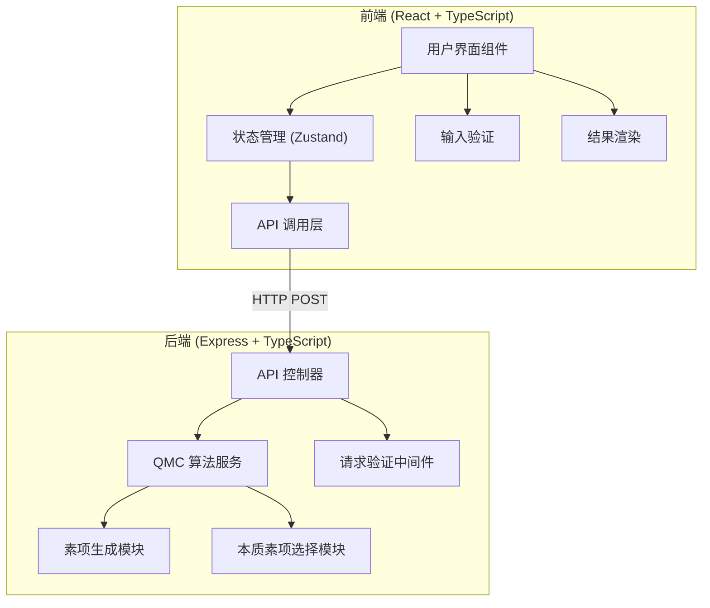
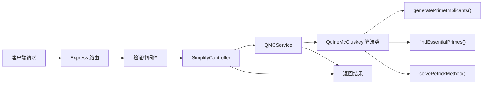

## 1. 架构设计



## 2. 技术描述

- **前端**：React@18 + TypeScript + Vite + TailwindCSS@3 + Zustand + lucide-react
- **初始化工具**：vite-init
- **后端**：Express@4 + TypeScript
- **算法**：Quine-McCluskey (QMC) 算法，TypeScript 实现
- **通信**：RESTful API，JSON 格式
- **包管理器**：pnpm

## 3. 路由定义

| 路由 | 用途 |
|------|------|
| / | 首页（主应用界面） |
| /api/simplify | 布尔函数化简 API |
| /api/health | 健康检查 |

## 4. API 定义

### 4.1 类型定义

```typescript
// 共享类型定义
interface SimplifyRequest {
  variableCount: number;          // 变量数量 2-8
  inputType: 'truthTable' | 'sumOfProducts';
  truthTable?: (0 | 1 | 2)[];     // 0=假, 1=真, 2=无关项
  minterms?: number[];            // 最小项编号
  dontCare?: number[];            // 无关项编号
}

interface PrimeImplicant {
  binary: string;                 // 二进制表示，含 '-'
  minterms: number[];             // 覆盖的最小项
  isEssential: boolean;           // 是否为本质素项
}

interface SimplifyResponse {
  success: boolean;
  expression: string;             // 最简与或式，如 A'B + BC'
  primeImplicants: PrimeImplicant[];
  essentialPrimes: PrimeImplicant[];
  steps: {
    description: string;
    content: string;
  }[];
  error?: string;
}
```

### 4.2 端点说明

**POST /api/simplify**
- 请求体：`SimplifyRequest`
- 响应：`SimplifyResponse`
- 错误码：400（参数错误）、500（服务器错误）

## 5. 服务器架构图



## 6. 数据模型

### 6.1 前端状态管理 (Zustand)

```typescript
interface AppState {
  variableCount: number;
  inputType: 'truthTable' | 'sumOfProducts';
  truthTable: (0 | 1 | 2)[];
  minterms: string;
  dontCare: string;
  result: SimplifyResponse | null;
  isLoading: boolean;
  error: string | null;
  
  setVariableCount: (n: number) => void;
  setInputType: (type: 'truthTable' | 'sumOfProducts') => void;
  setTruthTableCell: (index: number, value: 0 | 1 | 2) => void;
  setMinterms: (value: string) => void;
  setDontCare: (value: string) => void;
  simplify: () => Promise<void>;
  reset: () => void;
}
```

### 6.2 QMC 算法数据结构

```typescript
// 最小项分组
interface MintermGroup {
  [numOnes: number]: {
    binary: string;
    minterms: number[];
    used: boolean;
  }[];
}

// 素项表（Petrick方法用）
interface PrimeTable {
  [minterm: number]: string[];  // 最小项 -> 覆盖它的素项列表
}
```
