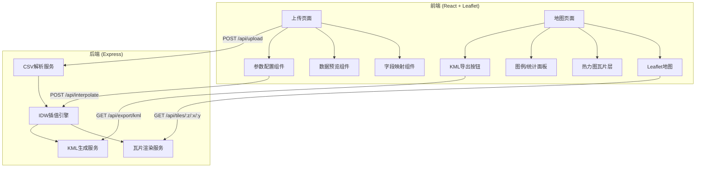
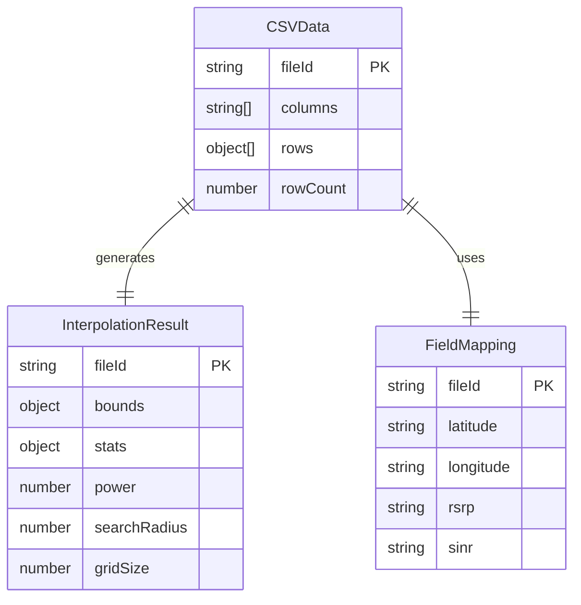

## 1. 架构设计



## 2. 技术说明

- 前端：React@18 + TypeScript + TailwindCSS@3 + Vite
- 初始化工具：vite-init
- 后端：Express@4 + TypeScript (ESM)
- 数据库：无（基于文件处理的临时数据存储，使用内存缓存）
- 地图库：Leaflet + react-leaflet
- 关键算法：反距离加权插值（IDW），Canvas瓦片渲染

## 3. 路由定义

| 路由 | 用途 |
|------|------|
| / | 上传页面，CSV文件上传+字段映射+参数配置 |
| /map/:fileId | 热力图展示页面，Leaflet地图+瓦片叠加 |

## 4. API定义

### 4.1 上传CSV

```
POST /api/upload
Content-Type: multipart/form-data

Request:
  file: CSV文件

Response:
{
  fileId: string
  columns: string[]
  preview: Array<Record<string, string>>
  rowCount: number
  detectedFields: {
    latitude?: string
    longitude?: string
    rsrp?: string
    sinr?: string
  }
}
```

### 4.2 执行插值

```
POST /api/interpolate

Request:
{
  fileId: string
  fieldMapping: {
    latitude: string
    longitude: string
    rsrp?: string
    sinr?: string
  }
  params: {
    power: number        // IDW幂参数，默认2
    searchRadius: number // 搜索半径（米），默认500
    gridSize: number     // 网格分辨率（米），默认20
  }
}

Response:
{
  fileId: string
  bounds: { minLat: number, maxLat: number, minLon: number, maxLon: number }
  stats: {
    rsrp?: { min: number, max: number, mean: number, count: number }
    sinr?: { min: number, max: number, mean: number, count: number }
  }
}
```

### 4.3 获取热力图瓦片

```
GET /api/tiles/:fileId/:metric/:z/:x/:y.png

Params:
  fileId: string
  metric: "rsrp" | "sinr"
  z: 缩放级别
  x: 瓦片X坐标
  y: 瓦片Y坐标

Response: PNG图片 (256x256)
```

### 4.4 导出KML

```
GET /api/export/kml/:fileId/:metric

Params:
  fileId: string
  metric: "rsrp" | "sinr"

Response: KML文件 (application/vnd.google-earth.kml+xml)
```

### 4.5 获取数据统计

```
GET /api/stats/:fileId

Response:
{
  fileId: string
  rowCount: number
  stats: {
    rsrp?: { min: number, max: number, mean: number, count: number }
    sinr?: { min: number, max: number, count: number }
  }
}
```

## 5. 服务端架构图

```mermaid
graph LR
    "Controller" --> "Service"
    "Service" --> "IDW引擎"
    "IDW引擎" --> "瓦片渲染器"
    "IDW引擎" --> "KML生成器"
    "Service" --> "数据缓存"
```

## 6. 数据模型

### 6.1 数据模型定义

本应用无需持久化数据库。数据流转基于内存缓存：



### 6.2 数据定义语言

无需DDL，使用TypeScript接口定义：

```typescript
interface CSVData {
  fileId: string
  columns: string[]
  rows: Array<Record<string, string>>
  rowCount: number
}

interface InterpolationResult {
  fileId: string
  bounds: { minLat: number; maxLat: number; minLon: number; maxLon: number }
  stats: MetricStats
  power: number
  searchRadius: number
  gridSize: number
  grid: Float64Array
  gridWidth: number
  gridHeight: number
}

interface FieldMapping {
  latitude: string
  longitude: string
  rsrp?: string
  sinr?: string
}

interface MetricStats {
  rsrp?: { min: number; max: number; mean: number; count: number }
  sinr?: { min: number; max: number; mean: number; count: number }
}
```

## 7. 核心算法说明

### 7.1 反距离加权插值 (IDW)

公式：`V(p) = Σ(wi * Vi) / Σ(wi)`，其中 `wi = 1 / d(pi, p)^power`

- `d(pi, p)`: 插值点到数据点的距离（使用Haversine公式计算球面距离）
- `power`: 幂参数，默认2，值越大插值越局部化
- `searchRadius`: 搜索半径，仅考虑半径内的数据点

### 7.2 瓦片生成

- 使用Slippy Map瓦片规范（z/x/y）
- 每个瓦片256x256像素
- 根据瓦片边界计算对应网格区域
- 使用Canvas API渲染PNG瓦片
- RSRP色标：红(-140dBm) → 黄(-110dBm) → 绿(-80dBm) → 蓝(-50dBm)
- SINR色标：红(-20dB) → 黄(0dB) → 绿(10dB) → 蓝(30dB)

### 7.3 KML导出

- 将插值网格转换为KML GroundOverlay
- 按网格分块生成GroundOverlay，每块对应一个颜色区域
- 或生成带颜色编码的点/多边形集合
