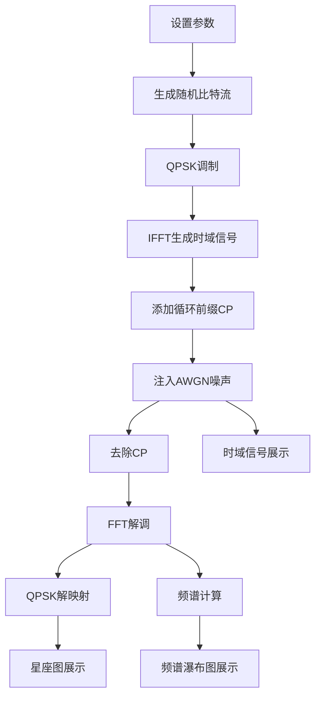

## 1. 产品概述

OFDM信号仿真与可视化平台——一个纯前端的正交频分复用(OFDM)信号处理演示工具，帮助用户直观理解OFDM系统的调制解调流程。通过QPSK调制生成OFDM时域信号，支持AWGN噪声注入，实时展示子载波星座图与频谱瀑布图。

- 目标用户：通信工程学生、信号处理研究人员、无线通信工程师
- 核心价值：将抽象的OFDM信号处理过程可视化，降低学习门槛，提供交互式参数调节体验

## 2. 核心功能

### 2.1 功能模块

1. **信号生成模块**：QPSK调制 → IFFT → 添加CP → 生成OFDM时域信号
2. **噪声注入模块**：AWGN噪声添加，可调SNR
3. **解调模块**：去除CP → FFT → QPSK解调
4. **星座图可视化**：展示解调后的子载波星座点
5. **频谱瀑布图**：实时滚动的频谱瀑布图，展示信号频域特征随时间变化

### 2.2 页面详情

| 页面名称 | 模块名称 | 功能描述 |
|----------|----------|----------|
| 主页面 | 参数控制面板 | 调节子载波数、CP长度、SNR等参数，触发信号生成 |
| 主页面 | 时域信号显示 | 展示OFDM符号的时域波形 |
| 主页面 | 星座图 | 展示解调后各子载波的QPSK星座点分布 |
| 主页面 | 频谱瀑布图 | 滚动展示频域幅度随时间变化的2D热力图 |
| 主页面 | 频谱曲线 | 展示当前帧的频域幅度谱 |

## 3. 核心流程

用户设置参数（子载波数、CP长度、SNR）→ 系统生成随机比特流 → QPSK调制映射到子载波 → IFFT生成时域信号 → 添加循环前缀 → 注入AWGN噪声 → 去除CP → FFT解调 → QPSK解映射 → 展示星座图和频谱瀑布图

## 4. 用户界面设计

### 4.1 设计风格

- **主色调**：深色科技风（深蓝黑底 #0a0e1a），辅以青色(#00e5ff)和琥珀色(#ffab00)作为强调色
- **按钮风格**：圆角胶囊型按钮，带微光边框效果
- **字体**：显示字体使用 JetBrains Mono（等宽技术感），UI字体使用 Noto Sans SC
- **布局风格**：左侧控制面板 + 右侧可视化区域网格布局
- **图标风格**：线条图标，来自lucide-react

### 4.2 页面设计概览

| 页面名称 | 模块名称 | UI元素 |
|----------|----------|--------|
| 主页面 | 参数控制面板 | 深色卡片背景，滑块+数字输入，胶囊型生成按钮，发光边框 |
| 主页面 | 时域信号显示 | Canvas绘制波形，青色线条，暗色网格背景 |
| 主页面 | 星座图 | Canvas散点图，四种颜色区分QPSK象限，理想点标记，坐标轴标注 |
| 主页面 | 频谱瀑布图 | Canvas热力图，垂直滚动，冷→暖色映射，时间轴标注 |
| 主页面 | 频谱曲线 | Canvas折线图，幅度谱曲线，标注子载波位置 |

### 4.3 响应式设计

- 桌面端优先（1920×1080最佳）
- 大屏：左右分栏布局
- 中屏：控制面板折叠为顶部工具栏
- 小屏：垂直堆叠布局，可视化区域全宽

### 4.4 动效设计

- 参数变化时星座图点平滑过渡
- 瀑布图持续向下滚动，新数据从顶部进入
- 信号生成时波形绘制动画
- 按钮悬停发光效果
