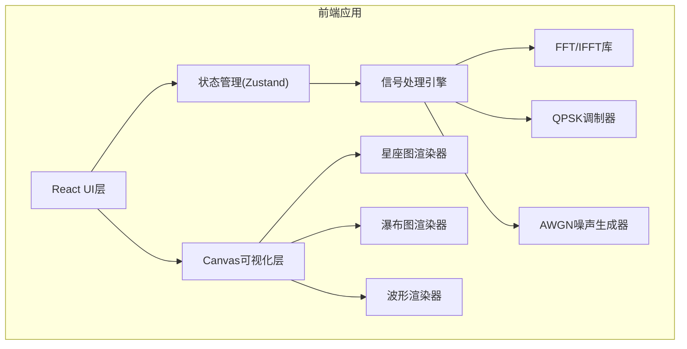

## 1. 架构设计



纯前端架构，所有信号处理在浏览器端完成，无需后端服务。

## 2. 技术选型

- **前端框架**：React 18 + TypeScript
- **构建工具**：Vite
- **样式方案**：Tailwind CSS 3
- **状态管理**：Zustand
- **信号处理**：自行实现FFT/IFFT（基2算法）
- **可视化**：原生Canvas 2D API（高性能，适合实时渲染）
- **路由**：单页应用，无需路由
- **后端**：无

## 3. 路由定义

| 路由 | 用途 |
|------|------|
| / | 主页面，包含所有功能模块 |

## 4. 核心模块设计

### 4.1 信号处理模块 (`src/utils/signal.ts`)

- `generateBits(count: number): number[]` — 生成随机比特流
- `qpskModulate(bits: number[]): Complex[]` — QPSK调制，返回复数符号
- `ofdmModulate(symbols: Complex[], fftSize: number): Complex[]` — IFFT生成时域OFDM信号
- `addCp(signal: Complex[], cpLength: number): Complex[]` — 添加循环前缀
- `addAwgn(signal: Complex[], snrDb: number): Complex[]` — 添加AWGN噪声
- `removeCp(signal: Complex[], cpLength: number, fftSize: number): Complex[]` — 去除CP
- `ofdmDemodulate(signal: Complex[]): Complex[]` — FFT解调
- `qpskDemodulate(symbols: Complex[]): number[]` — QPSK硬判决解调

### 4.2 FFT模块 (`src/utils/fft.ts`)

- `fft(input: Complex[]): Complex[]` — 基2 FFT
- `ifft(input: Complex[]): Complex[]` — 基2 IFFT

### 4.3 可视化模块

- `ConstellationCanvas` — 星座图Canvas组件
- `WaterfallCanvas` — 频谱瀑布图Canvas组件
- `WaveformCanvas` — 时域波形Canvas组件
- `SpectrumCanvas` — 频谱曲线Canvas组件

## 5. 数据模型

### 5.1 核心数据结构

```typescript
interface Complex {
  re: number;
  im: number;
}

interface OfdmParams {
  fftSize: number;
  cpLength: number;
  snrDb: number;
  numSymbols: number;
}

interface OfdmResult {
  txSignal: Complex[];
  rxSignal: Complex[];
  txSymbols: Complex[];
  rxSymbols: Complex[];
  txBits: number[];
  rxBits: number[];
  spectrum: Float64Array;
  ber: number;
}
```

### 5.2 状态管理

```typescript
interface SignalStore {
  params: OfdmParams;
  result: OfdmResult | null;
  waterfallHistory: Float64Array[];
  isRunning: boolean;
  setParams: (params: Partial<OfdmParams>) => void;
  generate: () => void;
  startContinuous: () => void;
  stopContinuous: () => void;
}
```
