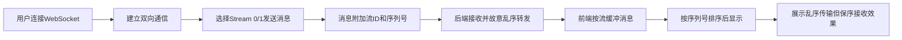

## 1. 产品概述
SCTP多流特性模拟器是一个技术演示应用，通过WebSocket模拟SCTP协议的多流传输机制，直观展示多流环境下消息乱序发送但保序接收的核心特性。
- 核心目的：教育与演示SCTP多流协议的工作原理，帮助理解流控制、消息排序机制
- 目标用户：网络协议学习者、开发人员、技术爱好者

## 2. 核心功能

### 2.1 功能模块
1. **主控制台**：连接管理、流状态展示、传输控制
2. **流可视化面板**：Stream 0（控制流）和 Stream 1（数据流）的实时消息展示
3. **消息发送区**：支持自定义消息发送，模拟不同发送模式
4. **传输演示区**：直观展示数据包在网络中的乱序传输与保序重组过程

### 2.2 页面详情
| 页面名称 | 模块名称 | 功能描述 |
|-----------|-------------|---------------------|
| 主页面 | 连接控制区 | WebSocket连接/断开按钮，连接状态指示 |
| 主页面 | 流状态面板 | 显示Stream 0和Stream 1的当前状态、消息计数 |
| 主页面 | 消息发送区 | 选择流编号、输入消息内容、发送按钮、批量发送功能 |
| 主页面 | 消息接收区 | 分流展示接收到的消息，标注消息序号和接收时间 |
| 主页面 | 传输动画区 | 可视化展示数据包乱序传输过程，缓冲重组演示 |

## 3. 核心流程
用户建立WebSocket连接后，可通过两个独立的逻辑流发送消息。后端接收到消息后故意打乱发送顺序再转发，前端按流编号和序列号重新排序，演示SCTP的多流保序特性。

## 4. 用户界面设计
### 4.1 设计风格
- **主色调**：深蓝科技风（#0a192f）配合青色高亮（#64ffda），营造网络技术专业感
- **辅助色**：橙色（#ff6b35）用于数据流标识，紫色（#9d4edd）用于控制流标识
- **按钮风格**：胶囊型圆角按钮，带微妙发光hover效果
- **字体**：使用JetBrains Mono作为等宽字体展示代码/消息，搭配现代无衬线字体
- **布局风格**：左右分栏卡片式布局，左侧控制面板，右侧可视化展示
- **图标风格**：线性简约图标，使用SVG实现

### 4.2 页面设计概述
| 页面名称 | 模块名称 | UI元素 |
|-----------|-------------|-------------|
| 主页面 | 连接控制区 | 状态指示灯、连接/断开按钮、连接地址显示 |
| 主页面 | 流状态面板 | 彩色流标识卡片、消息计数器、状态徽章 |
| 主页面 | 消息发送区 | 下拉选择器、文本输入框、发送按钮、批量发送滑块 |
| 主页面 | 消息接收区 | 分标签消息列表、时间戳、序列号高亮、消息内容 |
| 主页面 | 传输动画区 | 飞行数据包动画、缓冲队列可视化、排序过程演示 |

### 4.3 响应式
- 桌面端：左右双栏布局，左侧控制区占40%，右侧展示区占60%
- 平板端：上下堆叠布局，控制区在上，展示区在下
- 移动端：单列布局，优化触摸交互区域
