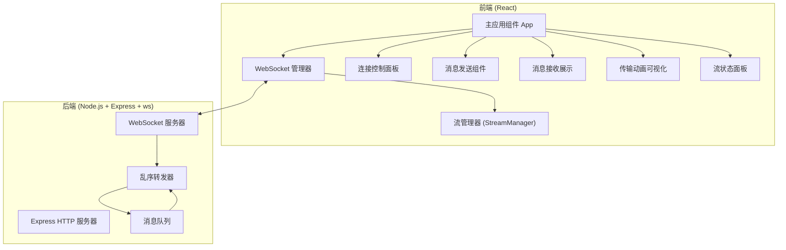

## 1. 架构设计



## 2. 技术描述
- **前端**：React@18 + TypeScript + Vite + TailwindCSS@3 + Framer Motion（动画）
- **初始化工具**：Vite
- **后端**：Node.js + Express@4 + ws（WebSocket库）
- **通信协议**：WebSocket 双向通信
- **构建工具**：concurrently（前后端同时运行）

## 3. 目录结构

```
p204/
├── client/                 # 前端应用
│   ├── src/
│   │   ├── components/     # React组件
│   │   ├── hooks/          # 自定义hooks
│   │   ├── types/          # TypeScript类型定义
│   │   ├── utils/          # 工具函数
│   │   ├── App.tsx         # 主应用
│   │   └── main.tsx        # 入口文件
│   ├── package.json
│   └── vite.config.ts
├── server/                 # 后端应用
│   ├── src/
│   │   ├── server.ts       # 服务器入口
│   │   └── websocket.ts    # WebSocket处理
│   └── package.json
└── package.json            # 根package.json
```

## 4. 核心数据类型定义

```typescript
// 消息类型
interface SCTPMessage {
  streamId: number;      // 流ID: 0=控制流, 1=数据流
  sequence: number;      // 序列号
  content: string;       // 消息内容
  timestamp: number;     // 发送时间戳
  type: 'data' | 'ack';  // 消息类型
}

// 流状态
interface StreamState {
  streamId: number;
  name: string;          // 流名称
  nextSequence: number;  // 下一个发送序列号
  expectedSequence: number; // 期望接收的序列号
  buffer: Map<number, SCTPMessage>; // 乱序消息缓冲区
  receivedCount: number; // 已接收消息数
  sentCount: number;     // 已发送消息数
}

// WebSocket连接状态
type ConnectionStatus = 'disconnected' | 'connecting' | 'connected' | 'error';
```

## 5. API / WebSocket 消息协议

### 5.1 客户端 -> 服务器 消息

| 消息类型 | 格式 | 说明 |
|---------|------|------|
| 发送消息 | `{ type: 'send', streamId: number, content: string }` | 发送数据到指定流 |
| 批量发送 | `{ type: 'batchSend', streamId: number, count: number }` | 批量发送测试消息 |

### 5.2 服务器 -> 客户端 消息

| 消息类型 | 格式 | 说明 |
|---------|------|------|
| 消息转发 | `{ type: 'message', streamId: number, sequence: number, content: string, timestamp: number }` | 转发（可能乱序）的消息 |
| 连接确认 | `{ type: 'connected', clientId: string }` | 连接成功确认 |

## 6. 核心算法

### 6.1 后端乱序转发算法
```
1. 接收客户端消息，附加序列号
2. 将消息存入延迟队列
3. 随机延迟 100-500ms 后转发
4. 批量消息会被打乱顺序发送
```

### 6.2 前端保序算法
```
1. 为每个流维护 expectedSequence 和 buffer
2. 收到消息时：
   a. 如果消息.sequence === expectedSequence:
      - 直接交付显示
      - expectedSequence++
      - 检查buffer中是否有后续连续消息
   b. 否则:
      - 存入buffer等待
```
