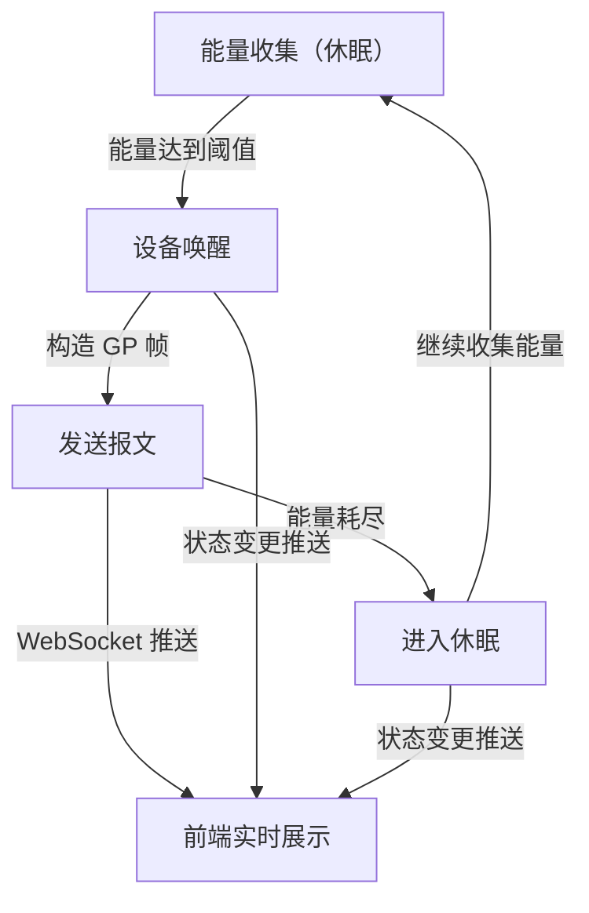

## 1. 产品概述

ZigBee Green Power 设备模拟器是一个可视化监控平台，用于模拟无电池 ZigBee GP 设备的能量收集生命周期（唤醒→发送→休眠），并实时展示设备的能量状态和报文发送记录。面向 IoT 开发者和测试工程师，用于理解与验证 Green Power 协议的能源约束行为。

## 2. 核心功能

### 2.1 用户角色
| 角色 | 注册方式 | 核心权限 |
|------|----------|----------|
| 开发者/测试工程师 | 无需注册 | 查看设备状态、控制模拟参数 |

### 2.2 功能模块
1. **监控面板页**：设备能量状态可视化、报文时间线、能量收集周期动画、模拟参数控制

### 2.3 页面详情
| 页面名称 | 模块名称 | 功能描述 |
|----------|----------|----------|
| 监控面板 | 设备状态卡片 | 展示每个 GP 设备的当前状态（休眠/唤醒/发送）、能量条、设备 ID、信号强度 |
| 监控面板 | 能量收集周期动画 | 可视化唤醒→发送→休眠的状态流转，展示能量收集进度 |
| 监控面板 | 报文时间线 | 按时间倒序展示已发送的 GP 报文，包含报文类型、载荷、信号强度、耗时 |
| 监控面板 | 模拟控制面板 | 可调节能量收集速率、发送间隔、设备数量，启动/暂停/重置模拟 |
| 监控面板 | 网络拓扑 | 简化展示 GP 设备与协调器的关系 |

## 3. 核心流程

用户打开监控面板后，后端自动启动模拟器。模拟器按能量收集周期驱动 GP 设备：设备从环境中收集能量（太阳能/动能/射频），能量累积到阈值后唤醒，发送 GP 报文至协调器，随后因能量耗尽进入休眠，等待下一轮能量收集。前端通过 WebSocket 实时接收设备状态和报文数据。

## 4. 用户界面设计

### 4.1 设计风格
- 主色调：深墨绿 `#0A1F1C` + 亮绿 `#00FF88`（呼应绿色能源/ZigBee Green Power 主题）
- 辅助色：琥珀色 `#FFB800`（能量指示）、暗红 `#FF3B5C`（低能量警告）
- 按钮风格：圆角胶囊按钮，微发光边框效果
- 字体：JetBrains Mono（数据/代码区）+ DM Sans（界面文字）
- 布局风格：深色仪表盘风格，卡片式布局，顶部导航
- 图标风格：线条图标（lucide-react），搭配发光/脉冲动画

### 4.2 页面设计概览
| 页面名称 | 模块名称 | UI 元素 |
|----------|----------|---------|
| 监控面板 | 设备状态卡片 | 深色卡片，圆形能量环动画，状态指示灯（绿/黄/红脉冲），JetBrains Mono 数据字体 |
| 监控面板 | 能量收集周期 | 水平进度条+阶段标签，呼吸灯效果表示能量收集，闪烁效果表示发送 |
| 监控面板 | 报文时间线 | 左侧时间轴竖线，右侧报文气泡，十六进制载荷高亮显示，淡入动画 |
| 监控面板 | 模拟控制 | 滑块（能量速率/发送间隔），数字输入（设备数量），启动/暂停/重置按钮 |
| 监控面板 | 网络拓扑 | 中心协调器节点+辐射状设备节点，连线动画表示报文传输 |

### 4.3 响应式
- 桌面优先设计，3列网格布局
- 平板端2列，移动端单列堆叠
- 控制面板始终固定在右侧或底部
