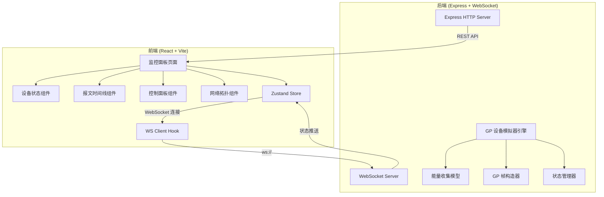
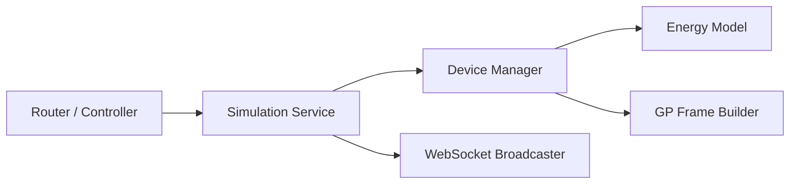
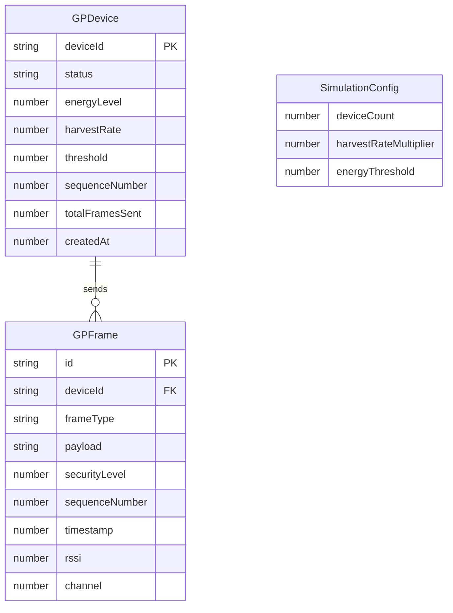

## 1. 架构设计



## 2. 技术说明

- **前端**：React@18 + TailwindCSS@3 + Vite + Zustand
- **初始化工具**：vite-init（react-express-ts 模板）
- **后端**：Express@4 + ws（WebSocket 库）
- **数据库**：无，使用内存状态（模拟器场景无需持久化）
- **通信**：WebSocket 实时双向通信，REST API 用于控制指令

## 3. 路由定义

| 路由 | 用途 |
|------|------|
| `/` | 监控面板主页，展示设备状态和报文 |

## 4. API 定义

### 4.1 WebSocket 消息类型

**服务端 → 客户端：**

```typescript
interface WSMessage {
  type: 'device_state' | 'gp_frame' | 'simulation_status' | 'energy_update';
  payload: DeviceState | GPFrame | SimulationStatus | EnergyUpdate;
}

interface DeviceState {
  deviceId: string;
  status: 'sleeping' | 'waking' | 'sending' | 'recharging';
  energyLevel: number;       // 0-100
  energyHarvestRate: number; // 单位/秒
  lastActiveAt: number;      // timestamp
  totalFramesSent: number;
  signalStrength: number;    // dBm
}

interface GPFrame {
  id: string;
  deviceId: string;
  frameType: 'notification' | 'commissioning' | 'decommissioning' | 'success' | 'channel_request';
  payload: string;           // 十六进制
  securityLevel: number;
  sequenceNumber: number;
  timestamp: number;
  rssi: number;
  channel: number;
}

interface SimulationStatus {
  running: boolean;
  deviceCount: number;
  elapsedTime: number;
  totalFramesSent: number;
}

interface EnergyUpdate {
  deviceId: string;
  energyLevel: number;
  status: string;
  harvestRate: number;
}
```

**客户端 → 服务端：**

```typescript
interface WSCommand {
  type: 'start' | 'pause' | 'reset' | 'set_config';
  payload?: SimulationConfig;
}

interface SimulationConfig {
  deviceCount?: number;
  harvestRate?: number;       // 能量收集速率倍数
  sendInterval?: number;      // 发送间隔（毫秒）
  energyThreshold?: number;   // 唤醒阈值 0-100
}
```

### 4.2 REST API

| 方法 | 路径 | 用途 |
|------|------|------|
| GET | `/api/devices` | 获取所有设备当前状态 |
| GET | `/api/devices/:id/frames` | 获取指定设备的报文历史 |
| GET | `/api/simulation/status` | 获取模拟器运行状态 |
| POST | `/api/simulation/start` | 启动模拟 |
| POST | `/api/simulation/pause` | 暂停模拟 |
| POST | `/api/simulation/reset` | 重置模拟 |
| PUT | `/api/simulation/config` | 更新模拟参数 |

## 5. 服务器架构图



## 6. 数据模型

### 6.1 数据模型定义



### 6.2 核心模拟逻辑

**能量收集周期状态机：**

```
[休眠/收集能量] --能量≥阈值--> [唤醒] --帧构造完成--> [发送报文] --能量耗尽--> [休眠/收集能量]
```

- 休眠期间：能量以 `harvestRate` 线性增长，叠加随机波动
- 唤醒阶段：能量消耗 10%，耗时 50-200ms 模拟启动
- 发送阶段：能量消耗 60-80%，构造 GP 帧，模拟传输延迟 10-50ms
- 每次完整周期约 5-30 秒（可配置）
