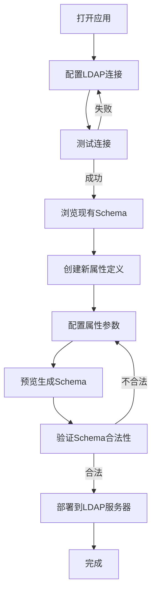

## 1. 产品概述

OpenLDAP Schema 管理 Web 应用，提供可视化的 LDAP Schema 管理界面。帮助 LDAP 管理员轻松连接 LDAP 服务器、浏览现有 Schema 定义、扩展新的属性类型，并自动生成和部署 Schema 文件。

- **核心价值**：简化 LDAP Schema 管理流程，降低手工编辑 Schema 文件的错误率
- **目标用户**：LDAP 管理员、系统运维人员、身份管理工程师
- **解决问题**：传统命令行方式管理 Schema 复杂繁琐，容易出错，缺乏可视化预览能力

## 2. 核心功能

### 2.1 用户角色

| 角色 | 认证方式 | 核心权限 |
|------|----------|----------|
| LDAP 管理员 | LDAP 绑定认证（DN + 密码） | 连接 LDAP、浏览 Schema、定义新属性、生成和部署 Schema |

### 2.2 功能模块

1. **连接配置页面**：LDAP 服务器连接参数配置、连接测试、认证管理
2. **Schema 浏览页面**：objectClass 列表展示、attributeType 详情查看、Schema 结构树
3. **新属性定义页面**：属性名称、OID、语法类型、单/多值配置、约束条件定义
4. **Schema 生成部署页面**：Schema 文件预览、生成 LDIF 格式、一键部署到 LDAP 服务器

### 2.3 页面详情

| 页面名称 | 模块名称 | 功能描述 |
|----------|----------|----------|
| 连接配置 | 连接表单 | 输入 LDAP 服务器地址、端口、Base DN、绑定 DN、密码，支持 StartTLS |
| 连接配置 | 连接测试 | 测试连接是否成功，显示连接状态和错误信息 |
| Schema 浏览 | ObjectClass 列表 | 分页展示所有 objectClass，支持搜索过滤 |
| Schema 浏览 | AttributeType 详情 | 展示属性的 OID、语法、单/多值、匹配规则等详细信息 |
| 新属性定义 | 属性表单 | 定义属性名称、OID、描述、语法类型、单值/多值、是否必填 |
| 新属性定义 | 语法选择器 | 下拉选择常用 LDAP 语法（Directory String、Integer、Boolean 等） |
| Schema 生成 | 预览面板 | 实时预览生成的 Schema LDIF 内容，支持语法高亮 |
| Schema 生成 | 部署操作 | 生成 schema 文件、验证 Schema、部署到 LDAP 服务器 |

## 3. 核心流程

用户打开应用 → 配置 LDAP 连接参数 → 测试连接 → 浏览现有 Schema → 创建新属性定义 → 预览生成的 Schema → 验证 Schema 合法性 → 部署到 LDAP 服务器

## 4. 用户界面设计

### 4.1 设计风格

- **主色调**：深蓝色 #1e3a5f（专业、可信赖的企业级应用风格）
- **辅助色**：青色 #0ea5e9（操作按钮、高亮状态）、绿色 #10b981（成功状态）、红色 #ef4444（错误状态）
- **按钮风格**：圆角 6px，轻微阴影，hover 时有亮度提升动画
- **字体**：IBM Plex Sans（现代、清晰的无衬线字体，适合技术类应用）
- **布局风格**：左侧导航栏 + 右侧内容区，卡片式容器，清晰的视觉层次
- **图标风格**：使用 Lucide React 线性图标，保持简洁一致

### 4.2 页面设计概述

| 页面名称 | 模块名称 | UI 元素 |
|----------|----------|---------|
| 连接配置 | 连接表单 | 卡片式表单布局，输入框带图标，按钮组水平排列，状态提示条 |
| Schema 浏览 | 列表/详情 | 左侧树形导航，右侧详情面板，搜索框置顶，表格展示属性列表 |
| 新属性定义 | 属性表单 | 分段表单，必填项标记，实时校验提示，语法选择器带说明 |
| Schema 生成 | 预览/部署 | 左侧配置面板，右侧代码预览区（带语法高亮），底部操作按钮组 |

### 4.3 响应式

- 采用桌面优先设计，支持最小宽度 1280px
- 平板设备（768px-1280px）：导航栏收起为图标模式，内容区自适应
- 移动端（<768px）：导航栏变为底部 Tab 栏，内容区单列布局

### 4.4 交互细节

- 页面加载动画：骨架屏 + 渐入效果
- 表单验证：实时校验，错误信息优雅显示
- 按钮状态：loading 状态禁用并显示旋转图标
- 数据加载：分页 + 虚拟滚动，支持大量数据流畅展示
- 过渡动画：页面切换时的淡入淡出，元素 hover 时的微交互
