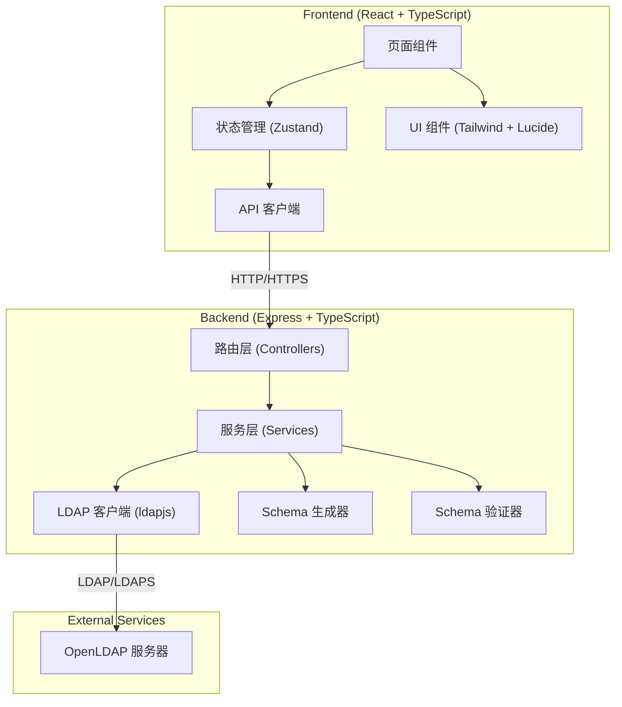
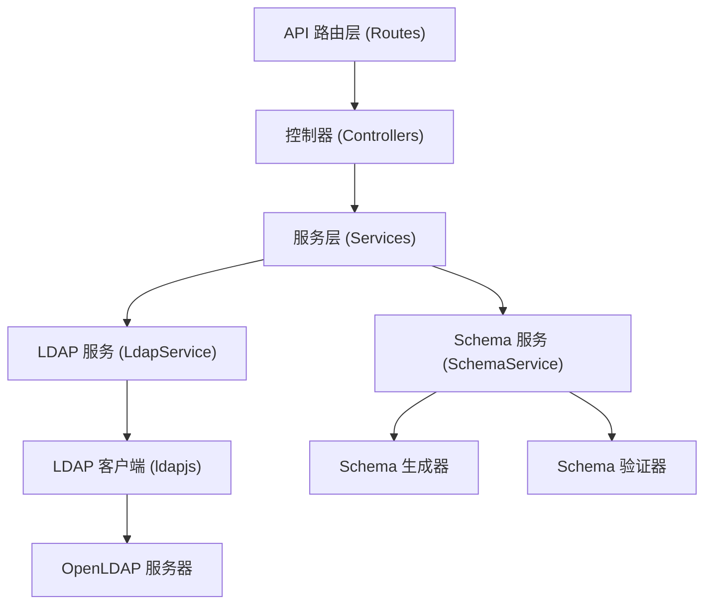
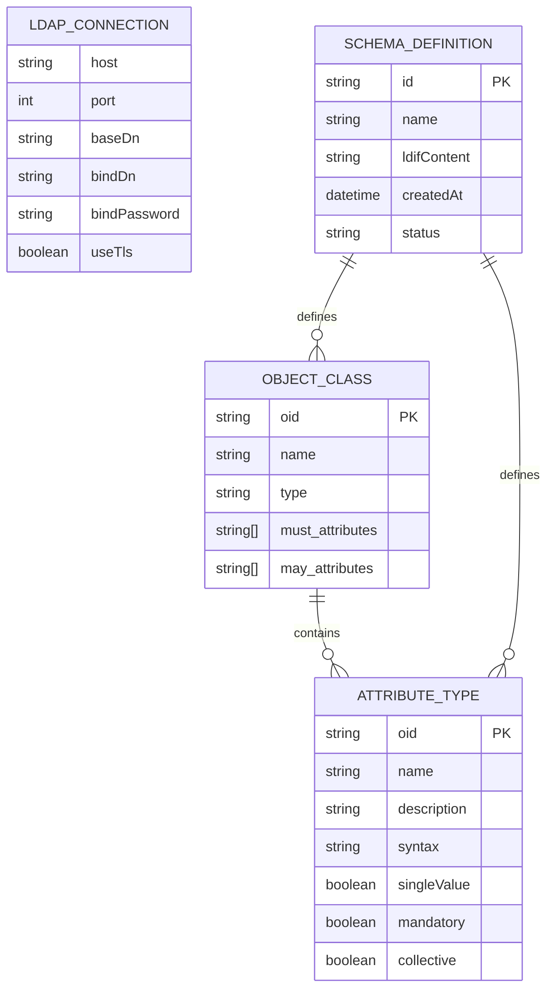

## 1. 架构设计



## 2. 技术描述

- **前端**：React@18 + TypeScript + Vite + TailwindCSS@3 + Zustand + React Router DOM
- **后端**：Express@4 + TypeScript + ESM
- **LDAP 客户端**：ldapjs（Node.js LDAP 客户端库）
- **图标**：lucide-react
- **代码高亮**：prismjs 或 react-syntax-highlighter
- **初始化工具**：vite-init 使用 react-express-ts 模板

## 3. 路由定义

### 前端路由

| 路由 | 页面 | 用途 |
|------|------|------|
| / | 重定向到 /connection | 首页重定向 |
| /connection | ConnectionConfig | LDAP 连接配置 |
| /schema | SchemaBrowser | Schema 浏览 |
| /attributes/new | AttributeCreator | 新属性定义 |
| /deploy | SchemaDeploy | Schema 生成与部署 |

### 后端 API 路由

| 路由 | 方法 | 用途 |
|------|------|------|
| /api/ldap/connect | POST | 测试 LDAP 连接 |
| /api/ldap/schema | GET | 获取所有 Schema（objectClasses + attributeTypes） |
| /api/ldap/schema/objectclasses | GET | 获取所有 objectClass |
| /api/ldap/schema/attributetypes | GET | 获取所有 attributeType |
| /api/schema/generate | POST | 根据属性定义生成 Schema LDIF |
| /api/schema/validate | POST | 验证 Schema 合法性 |
| /api/schema/deploy | POST | 部署 Schema 到 LDAP 服务器 |

## 4. API 定义

### 类型定义

```typescript
// LDAP 连接配置
interface LdapConnectionConfig {
  host: string;
  port: number;
  baseDn: string;
  bindDn: string;
  bindPassword: string;
  useTls: boolean;
  caCert?: string;
}

// LDAP 属性类型定义
interface LdapAttributeType {
  oid: string;
  name: string[];
  description?: string;
  syntax: string;
  singleValue: boolean;
  mandatory: boolean;
  collective: boolean;
  obsolete: boolean;
  matchingRule?: string;
  substringMatchingRule?: string;
  orderingMatchingRule?: string;
}

// LDAP 对象类定义
interface LdapObjectClass {
  oid: string;
  name: string[];
  description?: string;
  type: 'structural' | 'auxiliary' | 'abstract';
  must: string[];
  may: string[];
  superior?: string[];
  obsolete: boolean;
}

// 新属性定义表单
interface NewAttributeDefinition {
  name: string;
  oid: string;
  description: string;
  syntax: string;
  singleValue: boolean;
  mandatory: boolean;
  collective: boolean;
  matchingRule?: string;
}

// Schema 生成请求
interface SchemaGenerateRequest {
  attributes: NewAttributeDefinition[];
  objectClassName?: string;
  objectClassOid?: string;
  objectClassType?: 'structural' | 'auxiliary';
}

// Schema 生成响应
interface SchemaGenerateResponse {
  ldifContent: string;
  schemaFileContent: string;
  warnings: string[];
  errors: string[];
}

// 部署请求
interface SchemaDeployRequest {
  ldifContent: string;
  connectionConfig: LdapConnectionConfig;
  restartRequired: boolean;
}

// 部署响应
interface SchemaDeployResponse {
  success: boolean;
  message: string;
  restartRequired: boolean;
  deployLog: string[];
}
```

## 5. 服务器架构图



### 核心模块说明

1. **LdapService**：封装 LDAP 连接、查询、Schema 读取操作
2. **SchemaService**：Schema 生成、验证、部署逻辑
3. **SchemaGenerator**：将属性定义转换为标准 LDAP Schema 格式和 LDIF 格式
4. **SchemaValidator**：验证 OID 格式、名称合法性、语法正确性

## 6. 数据模型

### 6.1 数据模型定义



### 6.2 前端状态管理（Zustand）

```typescript
// LDAP 连接状态
interface LdapStore {
  connectionConfig: LdapConnectionConfig | null;
  isConnected: boolean;
  connectionError: string | null;
  setConnectionConfig: (config: LdapConnectionConfig) => void;
  testConnection: () => Promise<boolean>;
  clearConnection: () => void;
}

// Schema 状态
interface SchemaStore {
  objectClasses: LdapObjectClass[];
  attributeTypes: LdapAttributeType[];
  loading: boolean;
  error: string | null;
  fetchSchema: () => Promise<void>;
  selectedObjectClass: LdapObjectClass | null;
  selectedAttributeType: LdapAttributeType | null;
  setSelectedObjectClass: (oc: LdapObjectClass | null) => void;
  setSelectedAttributeType: (at: LdapAttributeType | null) => void;
}

// 新属性定义状态
interface AttributeDefinitionStore {
  draftAttributes: NewAttributeDefinition[];
  addDraftAttribute: (attr: NewAttributeDefinition) => void;
  removeDraftAttribute: (index: number) => void;
  updateDraftAttribute: (index: number, attr: Partial<NewAttributeDefinition>) => void;
  clearDraftAttributes: () => void;
  generatedLdif: string | null;
  setGeneratedLdif: (ldif: string | null) => void;
}
```
