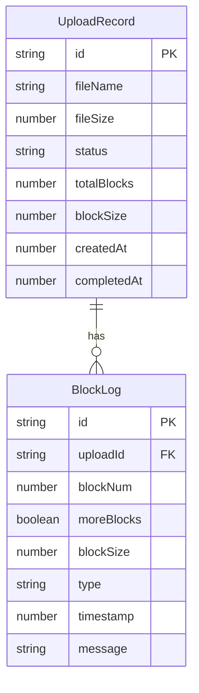

## 1. 架构设计

```mermaid
flowchart TB
    subgraph "前端 (React)"
        "A[文件上传页面]"
        "B[传输记录页面]"
    end
    subgraph "HTTP桥接层 (Express + WS)"
        "C[REST API"
        "D[WebSocket 推送"]
    end
    subgraph "CoAP客户端 (UDP)"
        "E[Block1 分块发送器"]
    end
    subgraph "CoAP服务器 (UDP)"
        "F[Block1 请求处理器"]
        "G[文件重组与存储"]
    end
    "A" -->|"HTTP POST /api/upload"| "C"
    "C" -->|"读取文件"| "E"
    "E" -->|"CoAP PUT + Block1"| "F"
    "F" -->|"2.31 Continue / 2.04 Changed"| "E"
    "E" -->|"进度回调"| "D"
    "D" -->|"WebSocket"| "A"
    "F" -->|"写入磁盘"| "G"
    "A" -->|"HTTP GET /api/uploads"| "C"
    "B" -->|"HTTP GET /api/uploads"| "C"
```

## 2. 技术说明

- 前端：React@18 + TypeScript + Tailwind CSS + Vite
- 初始化工具：vite-init (react-express-ts模板)
- 后端HTTP桥接：Express@4 + ws (WebSocket)
- CoAP协议：自实现轻量CoAP协议栈（基于UDP），完整支持Block1选项
- 数据存储：本地文件系统（上传文件保存至 `uploads/` 目录）
- 状态管理：Zustand

## 3. 路由定义

| 路由 | 用途 |
|------|------|
| `/` | 文件上传主页面 |
| `/history` | 传输记录页面 |

## 4. API定义

### 4.1 HTTP REST API

```typescript
interface UploadRequest {
  file: File
}

interface UploadResponse {
  id: string
  fileName: string
  fileSize: number
  totalBlocks: number
  blockSize: number
}

interface UploadProgress {
  id: string
  status: 'pending' | 'uploading' | 'completed' | 'failed'
  currentBlock: number
  totalBlocks: number
  bytesSent: number
  totalBytes: number
  speed: number
  logs: LogEntry[]
}

interface LogEntry {
  timestamp: number
  type: 'send' | 'ack' | 'error' | 'info'
  message: string
  blockNum?: number
  blockSize?: number
  moreBlocks?: boolean
}

interface UploadRecord {
  id: string
  fileName: string
  fileSize: number
  status: 'completed' | 'failed'
  totalBlocks: number
  blockSize: number
  createdAt: number
  completedAt?: number
}
```

| 方法 | 路径 | 描述 |
|------|------|------|
| POST | `/api/upload` | 上传文件（multipart/form-data），触发CoAP分块传输 |
| GET | `/api/uploads` | 获取所有传输记录 |
| GET | `/api/upload/:id` | 获取单个传输状态 |
| WS | `/ws` | WebSocket连接，实时推送上传进度 |

### 4.2 CoAP协议交互

| 方向 | 消息类型 | 选项 | 描述 |
|------|---------|------|------|
| 客户端→服务器 | PUT, CON | Content-Format, Block1(SZX, M, NUM) | 发送文件分块 |
| 服务器→客户端 | 2.31 Continue, ACK | Block1(SZX, M, NUM) | 确认中间块 |
| 服务器→客户端 | 2.04 Changed, ACK | Block1(SZX, 0, NUM) | 确认最后一块 |

Block1选项编码：
- SZX (3 bit): 块大小指数，实际大小 = 2^(SZX+4)，SZX=6 → 1024字节
- M (1 bit): 更多块标志，1=还有后续块，0=最后一块
- NUM (4+ bit): 块序号（从0开始）

## 5. 服务器架构图

```mermaid
flowchart LR
    subgraph "Express HTTP服务器"
        "A[上传路由控制器"] --> "B[上传服务"]
        "C[记录路由控制器"] --> "D[记录服务"]
    end
    subgraph "CoAP UDP服务器"
        "E[CoAP消息解析器"] --> "F[Block1处理器"]
        "F" --> "G[文件重组器"]
    end
    subgraph "CoAP客户端"
        "H[文件分块器"] --> "I[Block1发送器"]
        "I" --> "J[ACK等待器"]
    end
    "B" --> "H"
    "I" --> "|UDP| "E""
    "G" --> "|写入| "K[文件系统]""
```

## 6. 数据模型

### 6.1 数据模型定义



### 6.2 存储方案

使用内存Map存储运行时状态（UploadProgress），文件系统持久化已完成的上传文件和JSON格式的传输记录。
