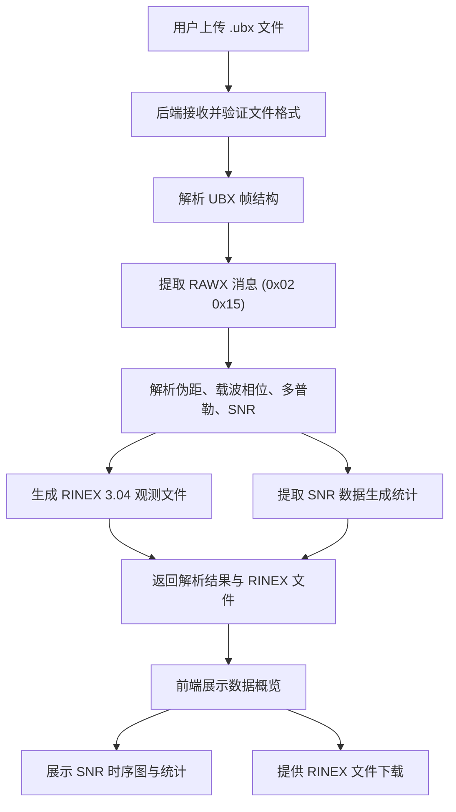

## 1. 产品概述

UBX-GNSS 数据处理工具是一款面向 GNSS 测量人员和科研工作者的 Web 应用，用于解析 u-blox 接收机录制的 .ubx 文件（RAWX 消息），提取伪距、载波相位、多普勒等观测值，生成标准 RINEX 3.x 观测文件，并提供各卫星信噪比质量图的可视化分析。

- 解决传统命令行工具操作门槛高、缺乏可视化反馈的问题
- 目标用户：测绘工程师、GNSS 科研人员、定位算法开发者

## 2. 核心功能

### 2.1 用户角色
| 角色 | 注册方式 | 核心权限 |
|------|----------|----------|
| 普通用户 | 无需注册 | 上传文件、查看解析结果、下载 RINEX、查看 SNR 图表 |

### 2.2 功能模块
1. **文件上传页**：UBX 文件拖拽/选择上传、文件信息预览、解析进度显示
2. **数据概览页**：观测数据统计摘要、卫星列表与信号概况、时间跨度信息
3. **信噪比分析页**：各卫星 SNR 时序图、SNR 天空图、信号质量统计

### 2.3 页面详情
| 页面名称 | 模块名称 | 功能描述 |
|----------|----------|----------|
| 文件上传页 | 上传区域 | 支持拖拽或点击上传 .ubx 文件，显示文件名、大小、上传进度 |
| 文件上传页 | 解析状态 | 实时显示 UBX 解析进度，包含已处理消息数和总消息数 |
| 数据概览页 | 统计摘要 | 显示观测历元数、卫星数、信号类型数、时间范围等 |
| 数据概览页 | RINEX 预览 | 在线预览生成的 RINEX 文件头部和部分数据 |
| 数据概览页 | 下载功能 | 下载生成的 RINEX 3.04 观测文件（.obs） |
| 信噪比分析页 | SNR 时序图 | 按卫星/信号类型展示 SNR 随时间变化的折线图 |
| 信噪比分析页 | SNR 统计表 | 各卫星各信号类型的 SNR 均值、最大值、最小值统计 |

## 3. 核心流程

用户上传 .ubx 文件 → 后端解析 UBX 二进制协议 → 提取 RAWX (0x02 0x15) 消息中的观测数据 → 生成 RINEX 3.04 格式文件 → 前端展示数据摘要和 SNR 可视化图表 → 用户下载 RINEX 文件

## 4. 用户界面设计

### 4.1 设计风格
- 主色调：深蓝科技风（#0A1628 深色背景 + #00D4FF 科技蓝高亮）
- 辅助色：#1E3A5F 中蓝、#2DD4BF 青绿、#F59E0B 琥珀警示色
- 按钮风格：圆角矩形 + 微光效，主操作按钮带渐变
- 字体：JetBrains Mono（数据/代码展示）+ DM Sans（界面文字）
- 布局：左侧导航栏 + 右侧内容区，卡片式模块布局
- 图标：Lucide 图标库，线性风格

### 4.2 页面设计概览
| 页面名称 | 模块名称 | UI 元素 |
|----------|----------|---------|
| 文件上传页 | 上传区域 | 虚线边框拖拽区，中心卫星图标，渐变背景，文件信息卡片 |
| 文件上传页 | 解析进度 | 进度条 + 百分比 + 动态粒子效果 |
| 数据概览页 | 统计摘要 | 4列统计卡片网格，数字大字体 + 标签小字体，图标装饰 |
| 数据概览页 | RINEX 预览 | 代码风格等宽字体显示区，行号高亮，复制/下载按钮 |
| 信噪比分析页 | SNR 时序图 | 多色折线图，图例可点击筛选，工具提示悬浮框 |
| 信噪比分析页 | SNR 统计表 | 表格带斑马纹，条件格式化低SNR红色高亮 |

### 4.3 响应式
- 桌面优先设计，1280px 以上最佳体验
- 平板适配：导航栏折叠为汉堡菜单，卡片网格变为双列
- 移动端：单列布局，图表可横滑查看

### 4.4 3D 场景指导
- 不适用
