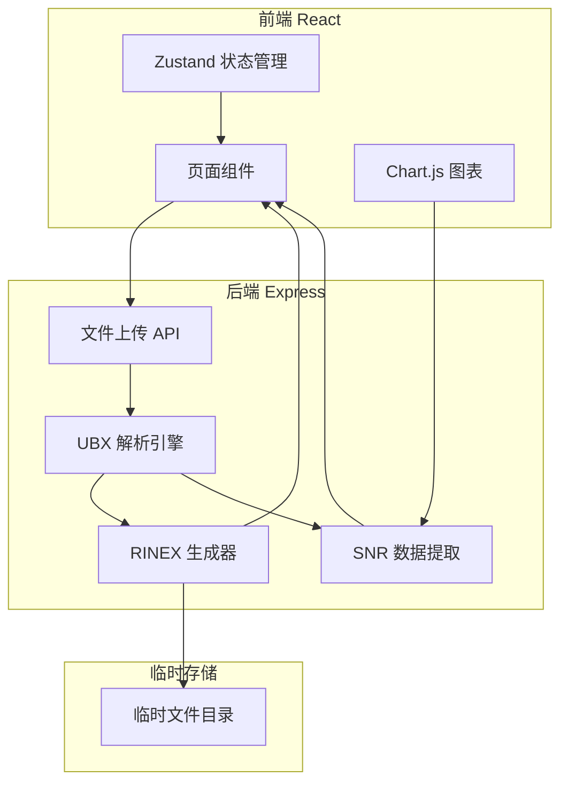
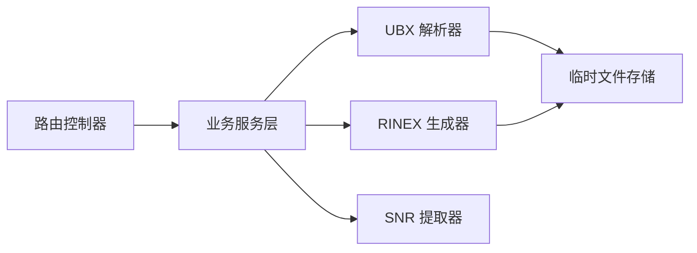
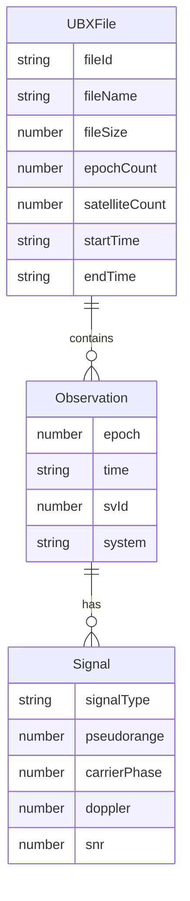

## 1. 架构设计



## 2. 技术说明
- 前端：React@18 + TypeScript + Tailwind CSS@3 + Vite
- 初始化工具：vite-init
- 后端：Express@4 + TypeScript (ESM)
- 数据库：无（临时文件存储，处理后返回结果）
- 图表库：Chart.js + react-chartjs-2
- 状态管理：Zustand
- 文件上传：multer

## 3. 路由定义
| 路由 | 用途 |
|------|------|
| / | 文件上传页，首页入口 |
| /overview/:fileId | 数据概览页，展示解析结果摘要和 RINEX 预览 |
| /snr/:fileId | 信噪比分析页，SNR 时序图和统计 |

## 4. API 定义

### 4.1 上传并解析 UBX 文件
```
POST /api/upload
Content-Type: multipart/form-data
Body: file (UBX文件)

Response: {
  fileId: string
  fileName: string
  fileSize: number
  stats: {
    epochCount: number
    satelliteCount: number
    signalTypes: string[]
    timeRange: { start: string, end: string }
    satellites: { svId: number, signalType: string, avgSnr: number }[]
  }
}
```

### 4.2 获取 RINEX 文件内容
```
GET /api/rinex/:fileId

Response: text/plain (RINEX文件内容)
```

### 4.3 下载 RINEX 文件
```
GET /api/rinex/:fileId/download

Response: application/octet-stream (文件下载)
```

### 4.4 获取 SNR 数据
```
GET /api/snr/:fileId

Response: {
  satellites: {
    svId: number
    signalType: string
    snrData: { time: string, snr: number }[]
    stats: { avg: number, max: number, min: number, median: number }
  }[]
}
```

## 5. 服务器架构图



## 6. 数据模型

### 6.1 核心数据结构



### 6.2 UBX RAWX 消息结构 (Class 0x02, ID 0x15)
- 消息头：0xB5 0x62
- Class: 0x02, ID: 0x15
- 载荷包含：rcvTow, week, leapS, numMeas, recStat
- 每个测量块：prMes, cpMes, doMes, gnssId, svId, sigId, freqId, locktime, cno, prStdev, cpStdev, doStdev, trkStat

### 6.3 GNSS 系统映射
| gnssId | 系统 | RINEX 系统标识 |
|--------|------|----------------|
| 0 | GPS | G |
| 1 | SBAS | S |
| 2 | Galileo | E |
| 3 | BeiDou | C |
| 4 | IMES | I |
| 5 | QZSS | J |
| 6 | GLONASS | R |

### 6.4 RINEX 3.04 信号映射
| gnssId + sigId | RINEX 信号标识 |
|----------------|----------------|
| 0+0 | C1C |
| 0+3 | L1C |
| 0+4 | S1C |
| 0+6 | C2W |
| 2+0 | C1C |
| 2+5 | C5Q |
| 3+0 | C2I |
| 3+3 | C6I |
| 3+4 | C7I |
| 6+0 | C1C |
| 6+2 | C2C |
