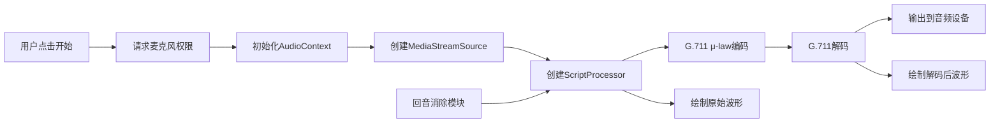

## 1. 产品概述

G.711音频编解码器演示应用，通过Web Audio API实现实时语音采集、G.711 μ-law压缩编码、解码播放、波形可视化及回音消除模拟。面向音频开发者、学生和技术爱好者，用于学习和演示语音压缩算法原理。

## 2. 核心功能

### 2.1 用户角色
| 角色 | 注册方式 | 核心权限 |
|------|---------|---------|
| 访客用户 | 无需注册 | 使用所有音频处理功能 |

### 2.2 功能模块
1. **主页面**：音频采集控制、编解码器参数配置、波形显示区
2. **波形可视化**：原始音频波形与压缩后波形的实时对比
3. **音频处理管道**：麦克风采集 → G.711编码 → G.711解码 → 播放
4. **回音消除**：基于Delay节点的模拟AEC（Acoustic Echo Cancellation）

### 2.3 页面详情
| 页面名称 | 模块名称 | 功能描述 |
|---------|---------|---------|
| 主页面 | 控制面板 | 开始/停止录音、音量调节、压缩参数设置 |
| 主页面 | 波形显示区 | 上下双画布分别展示原始音频和解码后音频波形 |
| 主页面 | 状态面板 | 实时显示采样率、比特率、延迟等技术指标 |
| 主页面 | 回音消除控制 | 开启/关闭AEC、调节延迟时间和衰减系数 |

## 3. 核心流程

用户点击"开始采集"按钮 → 请求麦克风权限 → 初始化Web Audio上下文 → 创建音频处理节点链 → 实时采集音频数据 → G.711 μ-law编码压缩 → G.711解码 → 播放解码音频 → 双画布同步绘制波形 → 用户可调节参数实时生效 → 点击"停止"结束采集

## 4. 用户界面设计

### 4.1 设计风格
- **主色调**：深科技蓝 (#165DFF) 搭配 深色背景 (#0F172A)
- **辅助色**：波形原色使用绿色 (#10B981)，压缩后使用橙色 (#F59E0B)
- **按钮风格**：圆角胶囊按钮，悬浮时有发光效果
- **字体**：使用 JetBrains Mono 等宽字体显示技术数据，Inter 作为界面字体
- **布局风格**：卡片式布局，毛玻璃效果，科技感十足
- **图标风格**：线性图标，统一2px描边

### 4.2 页面设计概述
| 页面名称 | 模块名称 | UI元素 |
|---------|---------|--------|
| 主页面 | 头部区域 | 应用标题、副标题、状态指示灯 |
| 主页面 | 控制面板 | 大尺寸开始/停止按钮、参数滑块、开关按钮 |
| 主页面 | 波形显示区 | 上下两个Canvas，带网格背景，实时波形动画 |
| 主页面 | 数据面板 | 采样率、比特率、CPU使用率等实时数据卡片 |
| 主页面 | 底部区域 | 技术说明、G.711算法简介 |

### 4.3 响应式
- 桌面端：双列布局，控制面板在左，波形在右
- 平板端：单列布局，控制面板在上，波形在下
- 移动端：简化控制，优先保证波形显示区域

### 4.4 交互效果
- 开始按钮点击时有脉冲动画
- 波形绘制有平滑过渡效果
- 参数调节时实时反馈
- 状态变化有颜色过渡动画
