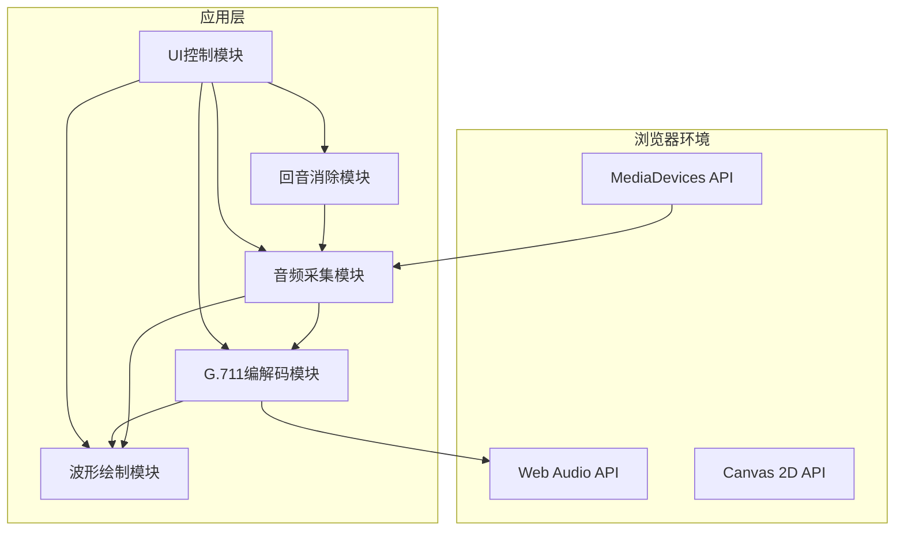

## 1. 架构设计



## 2. 技术描述

- **前端技术栈**：纯原生 HTML5 + CSS3 + JavaScript (ES6+)
- **构建工具**：无构建工具，直接运行静态HTML文件
- **音频处理**：Web Audio API (ScriptProcessorNode / AudioWorklet)
- **可视化**：HTML5 Canvas 2D API
- **音频编码**：G.711 μ-law 算法纯JavaScript实现
- **回音消除**：Web Audio DelayNode + GainNode 模拟AEC

## 3. 模块结构

| 模块 | 文件 | 功能描述 |
|------|------|---------|
| 主应用 | index.html | 页面结构与入口 |
| 样式表 | css/style.css | 全局样式与组件样式 |
| 音频采集 | js/audio-capture.js | 麦克风访问与音频流管理 |
| G.711编解码 | js/g711-codec.js | μ-law压缩与解压缩算法 |
| 波形绘制 | js/waveform.js | Canvas波形可视化 |
| 回音消除 | js/echo-canceller.js | 基于Delay节点的AEC模拟 |
| 主控制器 | js/app.js | 应用逻辑与状态管理 |

## 4. 核心API

### 4.1 G.711编解码接口
```javascript
// G.711 μ-law 编码
function encodeULaw(pcmSample) {
  // 输入: 16位PCM样本 (-32768 到 32767)
  // 输出: 8位压缩字节 (0-255)
}

// G.711 μ-law 解码
function decodeULaw(ulawByte) {
  // 输入: 8位压缩字节 (0-255)
  // 输出: 16位PCM样本 (-32768 到 32767)
}
```

### 4.2 音频处理管道
```javascript
// AudioContext 节点连接图
MediaStreamSource 
  → ScriptProcessor (采集&编码&解码)
  → GainNode (音量控制)
  → DelayNode (回音模拟)
  → GainNode (回音衰减)
  → Destination (扬声器)
```

## 5. 关键技术点

### 5.1 G.711 μ-law 算法原理
- 对数压缩：将14位动态范围压缩到8位
- 符号位 + 3位段号 + 4位量化值
- 压缩比：2:1（16位→8位）

### 5.2 回音消除模拟
- 使用DelayNode模拟扬声器到麦克风的延迟
- 使用GainNode模拟声音衰减
- 将延迟信号从输入信号中抵消

### 5.3 实时波形绘制
- 使用requestAnimationFrame实现60fps刷新
- 环形缓冲区存储最新音频数据
- 双画布同步绘制原始与解码后波形

## 6. 浏览器兼容性

| 特性 | Chrome | Firefox | Safari | Edge |
|------|--------|---------|--------|------|
| Web Audio API | ✅ | ✅ | ✅ | ✅ |
| MediaDevices | ✅ | ✅ | ✅ | ✅ |
| Canvas 2D | ✅ | ✅ | ✅ | ✅ |
