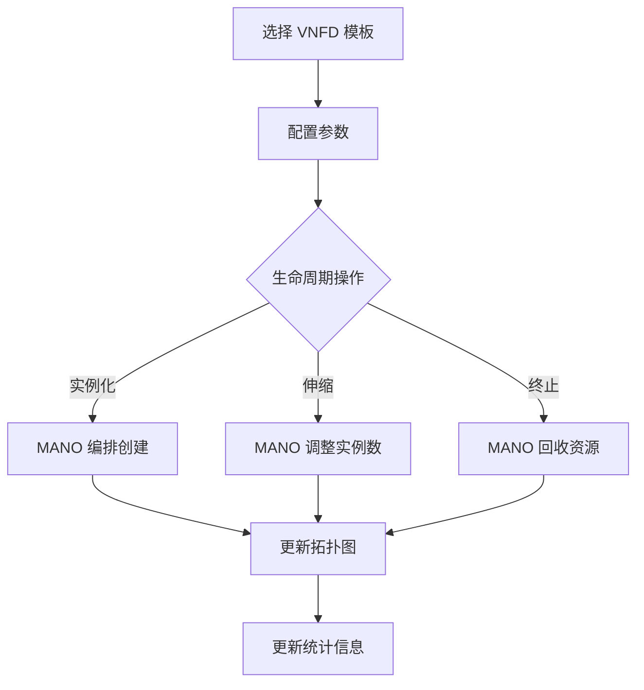

## 1. 产品概述

NFV MANO 管理平台是一个模拟 ETSI NFV MANO 架构的 Web 应用，用于管理虚拟网络功能（VNF）的完整生命周期。平台提供可视化拓扑视图，让运维人员直观地监控和操作虚拟防火墙、vRouter 等 VNF 实例的实例化、弹性伸缩和终止流程。

- 目标用户：网络运维工程师、NFV 系统管理员
- 核心价值：通过直观的图形化界面降低 NFV 编排复杂度，实时感知 VNF 状态与链路拓扑

## 2. 核心功能

### 2.1 用户角色

| 角色 | 注册方式 | 核心权限 |
|------|----------|----------|
| 网络运维工程师 | 默认登录 | 查看 VNF 拓扑、执行生命周期操作 |
| 系统管理员 | 默认登录 | 全部操作 + VNF 描述符管理 |

### 2.2 功能模块

1. **仪表盘页面**：全局概览，展示 VNF 实例统计、资源使用、告警信息
2. **拓扑管理页面**：可视化 VNF 拓扑图与链路，支持交互式操作

### 2.3 页面详情

| 页面名称 | 模块名称 | 功能描述 |
|----------|----------|----------|
| 仪表盘 | 统计卡片 | 展示运行中/已停止/异常 VNF 数量、CPU/内存总占用 |
| 仪表盘 | VNF 列表 | 展示所有 VNF 实例表格，支持筛选、搜索和快捷操作 |
| 仪表盘 | 告警面板 | 展示最近告警事件（伸缩触发、实例异常等） |
| 拓扑管理 | 拓扑画布 | 以节点-连线形式展示 VNF 实例及其虚拟链路 |
| 拓扑管理 | 操作面板 | 选中节点后弹出操作面板：实例化、伸缩、终止 |
| 拓扑管理 | VNF 描述符 | 管理 VNFD（虚拟防火墙/vRouter 模板） |

## 3. 核心流程

用户通过拓扑图或列表选择 VNF 实例，执行生命周期操作：

1. **实例化**：选择 VNFD 模板 → 配置参数（规格、数量） → MANO 编排 → 创建 VNF 实例 → 拓扑图更新
2. **弹性伸缩**：选择运行中实例 → 设定目标实例数 → MANO 调度 → 增减实例 → 拓扑图/列表更新
3. **终止**：选择实例 → 确认终止 → MANO 回收资源 → 实例移除 → 拓扑图更新

## 4. 用户界面设计

### 4.1 设计风格

- **主色调**：深蓝黑（#0B1120）+ 电光青（#00F0FF）科技风
- **辅助色**：翠绿（#00FF88，运行中）、琥珀（#FFB800，伸缩中）、玫红（#FF3366，异常/终止）
- **按钮风格**：微圆角（6px），带发光边框效果，悬停时亮度提升
- **字体**：JetBrains Mono（数据/代码）+ DM Sans（正文），体现工业/运维感
- **布局风格**：左侧导航 + 主内容区，拓扑画布占据主要空间
- **图标风格**：线条图标（Lucide），2px 描边，与科技风匹配

### 4.2 页面设计概览

| 页面名称 | 模块名称 | UI 元素 |
|----------|----------|---------|
| 仪表盘 | 统计卡片 | 玻璃态卡片，数字使用大号 JetBrains Mono，带脉冲动画 |
| 仪表盘 | VNF 列表 | 暗色表格，状态列带彩色圆点指示器，操作列带图标按钮 |
| 仪表盘 | 告警面板 | 右侧滑出面板，告警条目带时间戳和级别色条 |
| 拓扑管理 | 拓扑画布 | 全屏深色画布，节点为带图标的六边形/圆形，连线带流动粒子动画 |
| 拓扑管理 | 操作面板 | 选中节点后右侧滑出，表单控件 + 操作按钮 |
| 拓扑管理 | VNF 描述符 | 底部抽屉式面板，展示可用 VNFD 模板卡片 |

### 4.3 响应式

- 桌面优先设计（1920×1080 最佳）
- 平板端拓扑画布缩小，列表视图优先
- 移动端仅展示列表视图，拓扑画布隐藏

### 4.4 3D 场景指引

不适用
