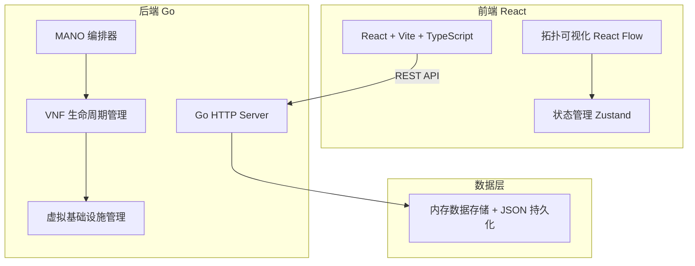
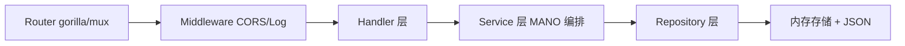
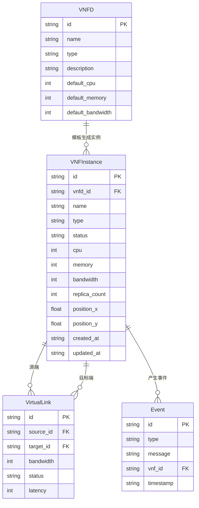

## 1. 架构设计



## 2. 技术说明

- **前端**：React@18 + TypeScript + Vite + TailwindCSS + React Flow（拓扑可视化） + Zustand（状态管理）
- **后端**：Go 1.21+ + 标准库 net/http + gorilla/mux（路由）
- **数据存储**：内存存储 + JSON 文件持久化（模拟 VIM）
- **通信**：RESTful API，JSON 格式

## 3. 路由定义

| 路由 | 用途 |
|------|------|
| `/` | 仪表盘页面 |
| `/topology` | 拓扑管理页面 |

## 4. API 定义

### 4.1 VNF 描述符（VNFD）

```
GET    /api/v1/vnfds           # 获取所有 VNFD
GET    /api/v1/vnfds/:id       # 获取单个 VNFD
POST   /api/v1/vnfds           # 创建 VNFD
DELETE /api/v1/vnfds/:id       # 删除 VNFD
```

### 4.2 VNF 实例

```
GET    /api/v1/vnfs            # 获取所有 VNF 实例
GET    /api/v1/vnfs/:id        # 获取单个 VNF 实例
POST   /api/v1/vnfs            # 实例化 VNF（基于 VNFD）
PUT    /api/v1/vnfs/:id/scale  # 弹性伸缩 VNF
DELETE /api/v1/vnfs/:id        # 终止 VNF 实例
```

### 4.3 虚拟链路

```
GET    /api/v1/links           # 获取所有虚拟链路
POST   /api/v1/links           # 创建虚拟链路
DELETE /api/v1/links/:id       # 删除虚拟链路
```

### 4.4 告警与事件

```
GET    /api/v1/events          # 获取最近事件
```

### 4.5 统计信息

```
GET    /api/v1/stats           # 获取仪表盘统计数据
```

### 4.6 TypeScript 类型定义

```typescript
interface Vnfd {
  id: string;
  name: string;
  type: "firewall" | "vrouter";
  description: string;
  defaultCpu: number;
  defaultMemory: number;
  defaultBandwidth: number;
  icon: string;
}

interface VnfInstance {
  id: string;
  vnfdId: string;
  name: string;
  type: "firewall" | "vrouter";
  status: "instantiating" | "running" | "scaling" | "terminating" | "stopped" | "error";
  cpu: number;
  memory: number;
  bandwidth: number;
  replicaCount: number;
  position: { x: number; y: number };
  createdAt: string;
  updatedAt: string;
}

interface VirtualLink {
  id: string;
  sourceId: string;
  targetId: string;
  bandwidth: number;
  status: "active" | "inactive";
  latency: number;
}

interface Event {
  id: string;
  type: "info" | "warning" | "error";
  message: string;
  vnfId?: string;
  timestamp: string;
}

interface Stats {
  totalVnfs: number;
  runningVnfs: number;
  stoppedVnfs: number;
  errorVnfs: number;
  totalCpu: number;
  totalMemory: number;
  totalBandwidth: number;
}
```

## 5. 服务器架构图



## 6. 数据模型

### 6.1 数据模型定义



### 6.2 Go 结构体定义

```go
type Vnfd struct {
    ID               string  `json:"id"`
    Name             string  `json:"name"`
    Type             string  `json:"type"`
    Description      string  `json:"description"`
    DefaultCpu       int     `json:"defaultCpu"`
    DefaultMemory    int     `json:"defaultMemory"`
    DefaultBandwidth int     `json:"defaultBandwidth"`
}

type VnfInstance struct {
    ID           string    `json:"id"`
    VnfdID       string    `json:"vnfdId"`
    Name         string    `json:"name"`
    Type         string    `json:"type"`
    Status       string    `json:"status"`
    Cpu          int       `json:"cpu"`
    Memory       int       `json:"memory"`
    Bandwidth    int       `json:"bandwidth"`
    ReplicaCount int       `json:"replicaCount"`
    PositionX    float64   `json:"positionX"`
    PositionY    float64   `json:"positionY"`
    CreatedAt    time.Time `json:"createdAt"`
    UpdatedAt    time.Time `json:"updatedAt"`
}

type VirtualLink struct {
    ID        string `json:"id"`
    SourceID  string `json:"sourceId"`
    TargetID  string `json:"targetId"`
    Bandwidth int    `json:"bandwidth"`
    Status    string `json:"status"`
    Latency   int    `json:"latency"`
}

type Event struct {
    ID        string    `json:"id"`
    Type      string    `json:"type"`
    Message   string    `json:"message"`
    VnfID     string    `json:"vnfId,omitempty"`
    Timestamp time.Time `json:"timestamp"`
}
```
