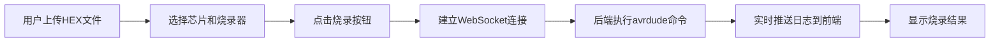

## 1. 产品概述

Avrdude Web 烧录工具是一个基于 Web 的单片机烧录界面，通过 WebSocket 实时通信，将 avrdude 命令行工具封装为可视化的 Web 应用。主要解决嵌入式开发中命令行烧录不直观、日志查看困难的问题，为嵌入式开发者提供友好的烧录体验。

## 2. 核心功能

### 2.1 用户角色
| 角色 | 注册方式 | 核心权限 |
|------|----------|----------|
| 开发者 | 无需注册 | 上传 HEX 文件、选择芯片和烧录器、执行烧录操作、查看实时日志 |

### 2.2 功能模块
1. **烧录控制台**: 文件上传、芯片选择、烧录器选择、烧录控制
2. **实时日志**: WebSocket 实时输出烧录进度和详细日志
3. **配置管理**: 常用配置保存和快速选择

### 2.3 页面详情
| 页面名称 | 模块名称 | 功能描述 |
|----------|----------|----------|
| 烧录控制台 | 文件上传区 | 拖拽或点击上传 HEX 文件，显示文件信息 |
| 烧录控制台 | 配置选择区 | 下拉选择芯片型号(ATMega328P等)和烧录器(USBasp等) |
| 烧录控制台 | 操作控制区 | 烧录、读取、擦除等操作按钮，进度条显示 |
| 烧录控制台 | 实时日志区 | 滚动显示 avrdude 输出日志，支持自动滚动和清空 |

## 3. 核心流程

用户上传 HEX 文件 → 选择目标芯片和烧录器 → 点击烧录按钮 → 建立 WebSocket 连接 → 后端执行 avrdude 命令 → 实时推送日志到前端 → 显示烧录结果

## 4. 用户界面设计

### 4.1 设计风格
- **主色调**: 深灰色系 (#1a1a2e) 搭配科技蓝 (#16213e)，营造专业工具氛围
- **强调色**: 荧光绿 (#00ff88) 表示成功，橙红 (#ff6b6b) 表示警告/错误
- **按钮风格**: 圆角矩形，带有微妙的阴影和 hover 动效
- **字体**: JetBrains Mono (等宽字体) 用于日志显示，Inter 用于界面文本
- **布局风格**: 卡片式分栏布局，左侧配置区，右侧日志区
- **图标风格**: 简洁的线性图标，配合霓虹灯效果

### 4.2 页面设计概述
| 页面名称 | 模块名称 | UI 元素 |
|----------|----------|----------|
| 烧录控制台 | 文件上传区 | 虚线边框拖拽区域，文件图标，文件名和大小显示 |
| 烧录控制台 | 配置选择区 | 下拉选择框，标签，配置说明文字 |
| 烧录控制台 | 操作控制区 | 主操作按钮组，进度条，状态指示灯 |
| 烧录控制台 | 实时日志区 | 深色终端背景，彩色日志输出，时间戳，滚动条 |

### 4.3 响应式
- 桌面端: 左右分栏布局(配置区40%，日志区60%)
- 平板端: 上下堆叠布局
- 移动端: 垂直流式布局，优化触摸区域
