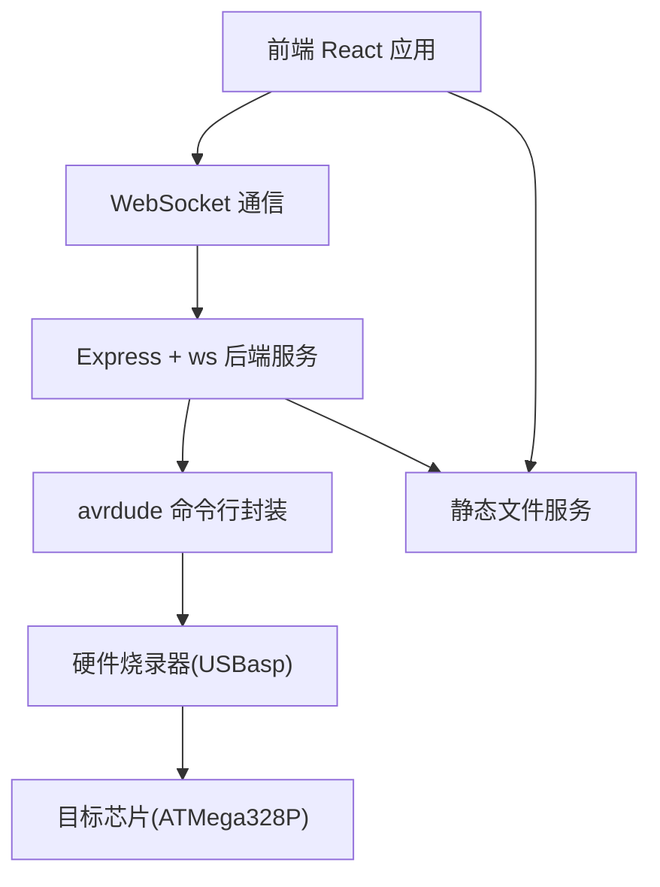
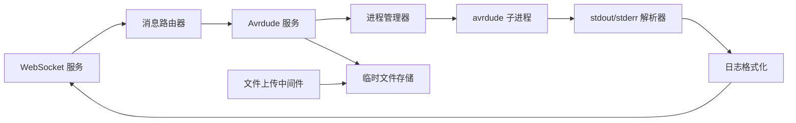

## 1. 架构设计



## 2. 技术描述

- **前端**: React@18 + TypeScript + TailwindCSS@3 + Vite
- **初始化工具**: Vite
- **后端**: Express@4 + ws (WebSocket)
- **进程管理**: child_process 执行 avrdude 命令
- **通信协议**: WebSocket 实时双向通信

## 3. 路由定义

| 路由 | 用途 |
|------|------|
| / | 烧录控制台主页面 |
| /ws | WebSocket 连接端点 |
| /api/upload | HEX 文件上传接口 |

## 4. API 定义

### 4.1 WebSocket 消息协议

```typescript
// 客户端 -> 服务端 消息类型
interface ClientMessage {
  type: 'flash' | 'read' | 'erase' | 'stop';
  payload: {
    hexFile?: string;
    mcu: string;
    programmer: string;
    port?: string;
    baudRate?: number;
  };
}

// 服务端 -> 客户端 消息类型
interface ServerMessage {
  type: 'log' | 'progress' | 'status' | 'error' | 'complete';
  payload: {
    message?: string;
    level?: 'info' | 'warn' | 'error' | 'success';
    progress?: number;
    status?: 'idle' | 'connecting' | 'flashing' | 'verifying' | 'complete' | 'error';
  };
}
```

### 4.2 文件上传接口

```typescript
// POST /api/upload
// Content-Type: multipart/form-data
interface UploadResponse {
  success: boolean;
  fileId: string;
  fileName: string;
  fileSize: number;
}
```

## 5. 服务端架构图



## 6. 数据模型

### 6.1 配置选项

```typescript
interface MCUConfig {
  id: string;
  name: string;
  signature: string;
  flashSize: number;
  eepromSize: number;
}

interface ProgrammerConfig {
  id: string;
  name: string;
  description: string;
}
```

### 6.2 预设配置列表

**支持的芯片列表:**
- ATMega328P (Arduino Uno)
- ATMega2560 (Arduino Mega)
- ATMega32U4 (Arduino Leonardo)
- ATTiny85
- ATMega168

**支持的烧录器列表:**
- USBasp
- Arduino as ISP
- AVRISP mkII
- Pololu USB AVR Programmer
- usbtiny
