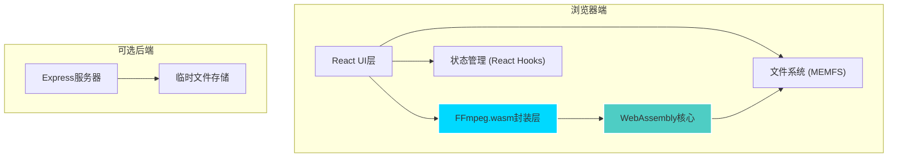

## 1. 架构设计



## 2. 技术描述

- **前端框架**: React@18 + TypeScript + Vite@5
- **样式方案**: TailwindCSS@3 + 自定义CSS变量
- **核心库**: @ffmpeg/ffmpeg@0.12 + @ffmpeg/util@0.12
- **图标库**: lucide-react
- **后端（可选）**: Express@4（仅用于静态文件服务和可选的临时存储）
- **构建工具**: Vite（配置Cross-Origin-Opener-Policy和Cross-Origin-Embedder-Policy头部）

## 3. 目录结构

```
src/
├── components/
│   ├── FileUploader.tsx      # 文件上传组件
│   ├── TerminalInput.tsx     # 命令行输入组件
│   ├── FilterPanel.tsx       # 滤镜配置面板
│   ├── ProgressBar.tsx       # 进度条组件
│   ├── LogOutput.tsx         # 日志输出组件
│   ├── VideoPreview.tsx      # 视频预览组件
│   └── ResultCard.tsx        # 结果展示卡片
├── hooks/
│   ├── useFFmpeg.ts          # FFmpeg.wasm封装Hook
│   └── useFileHandler.ts     # 文件处理Hook
├── utils/
│   ├── ffmpegUtils.ts        # FFmpeg命令解析工具
│   └── fileUtils.ts          # 文件工具函数
├── types/
│   └── index.ts              # TypeScript类型定义
├── App.tsx                   # 主应用组件
├── main.tsx                  # 入口文件
└── index.css                 # 全局样式
```

## 4. 核心功能实现要点

### 4.1 FFmpeg.wasm 集成
- 使用 `@ffmpeg/ffmpeg` v0.12 版本（ESM支持）
- 实现懒加载，首次使用时下载wasm二进制
- 配置 `coreURL` 和 `wasmURL` 指向CDN资源
- 实现 `load()` 状态管理和错误重试机制

### 4.2 命令行解析
- 解析用户输入的FFmpeg命令（如 `-i input.mp4 -o output.avi`）
- 支持 `-vf` 滤镜参数解析
- 快捷命令模板预设（格式转换、缩放、裁剪）

### 4.3 文件处理
- 使用 MEMFS 虚拟文件系统
- 支持大文件分片处理
- 自动检测输入输出格式
- Blob URL 生成用于预览和下载

### 4.4 滤镜系统
- 缩放滤镜：`scale=width:height`
- 裁剪滤镜：`crop=width:height:x:y`
- 可视化参数调节滑块
- 实时生成滤镜命令字符串

## 5. Vite 配置要点

```typescript
// vite.config.ts 关键配置
export default defineConfig({
  plugins: [react()],
  server: {
    headers: {
      'Cross-Origin-Opener-Policy': 'same-origin',
      'Cross-Origin-Embedder-Policy': 'require-corp'
    }
  },
  optimizeDeps: {
    exclude: ['@ffmpeg/ffmpeg', '@ffmpeg/util']
  }
})
```

## 6. 状态管理

使用 React Context + useReducer 管理全局状态：
- `ffmpegState`: loading, ready, processing, error
- `fileState`: inputFile, outputFile, fileInfo
- `processingState`: progress, logs, currentCommand

## 7. 性能优化

- FFmpeg.wasm 懒加载
- Web Worker 隔离处理
- 进度节流（避免频繁UI更新）
- 大文件处理时的内存管理
- 及时 revoke Blob URL 释放内存

## 8. 浏览器兼容性

- Chrome/Edge >= 91（支持 SharedArrayBuffer）
- Firefox >= 79
- Safari >= 15.2
- 需要 HTTPS 或 localhost 环境
