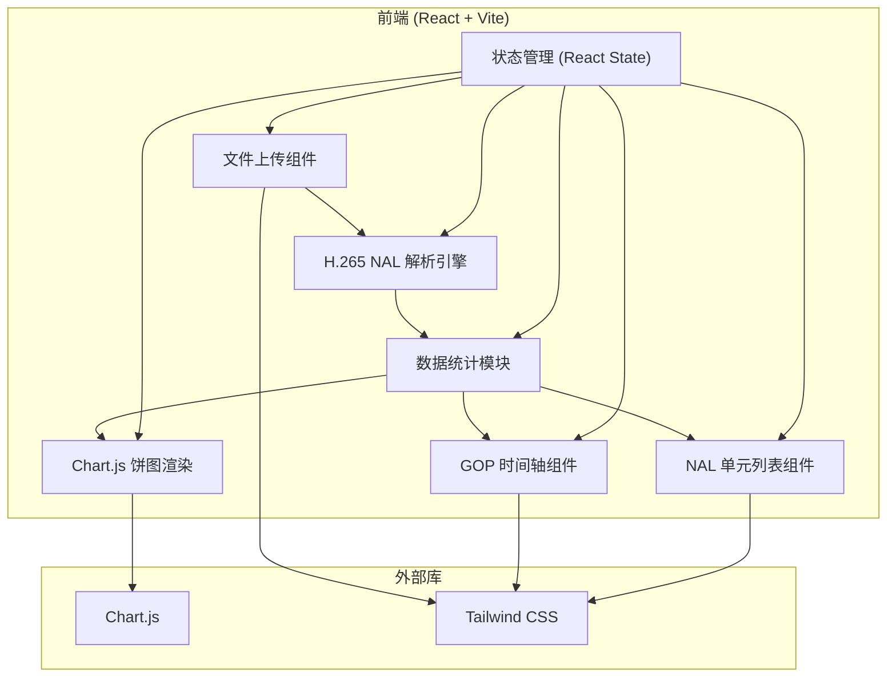

## 1. 架构设计



## 2. 技术选型

- **前端框架**：React@18 + TypeScript
- **构建工具**：Vite@5
- **样式方案**：Tailwind CSS@3
- **图表库**：Chart.js + react-chartjs-2
- **纯前端**：无后端，所有处理在浏览器完成

## 3. 核心模块定义

### 3.1 文件结构

```
src/
├── components/
│   ├── FileUpload.tsx      # 文件上传组件
│   ├── StatsCards.tsx      # 统计卡片
│   ├── FrameTypeChart.tsx  # 帧类型饼图
│   ├── GOPTimeline.tsx     # GOP 时间轴
│   └── NALTable.tsx        # NAL 单元列表
├── utils/
│   └── h265Parser.ts       # H.265 NAL 解析核心逻辑
├── types/
│   └── index.ts            # TypeScript 类型定义
├── App.tsx                 # 主应用组件
├── main.tsx               # 入口文件
└── index.css              # 全局样式
```

### 3.2 类型定义

```typescript
// NAL 单元类型
type NALUnitType = 
  | 'VPS'      // 32
  | 'SPS'      // 33
  | 'PPS'      // 34
  | 'IDR'      // 19, 20
  | 'P'        // 1
  | 'B'        // 0
  | 'AUD'      // 35
  | 'SEI'      // 39, 40
  | 'UNKNOWN';

interface NALUnit {
  index: number;
  type: NALUnitType;
  typeCode: number;
  size: number;
  offset: number;
  data: Uint8Array;
}

interface ParseResult {
  fileName: string;
  fileSize: number;
  nalUnits: NALUnit[];
  stats: {
    total: number;
    vps: number;
    sps: number;
    pps: number;
    idr: number;
    pFrame: number;
    bFrame: number;
    aud: number;
    sei: number;
    unknown: number;
  };
  gopStructure: GOP[];
}

interface GOP {
  index: number;
  startIndex: number;
  endIndex: number;
  frameCount: number;
  idrCount: number;
  pFrameCount: number;
  bFrameCount: number;
}
```

### 3.3 H.265 NAL 解析逻辑

核心解析函数：
1. `findStartCodes(buffer: Uint8Array): number[]` - 查找 NAL 起始码 (0x000001 或 0x00000001)
2. `parseNALUnitType(headerByte: number): NALUnitType` - 解析 NAL 单元类型
3. `parseH265(buffer: ArrayBuffer, fileName: string): ParseResult` - 主解析函数
4. `analyzeGOPStructure(nalUnits: NALUnit[]): GOP[]` - 分析 GOP 结构

## 4. 核心技术点

### 4.1 NAL 起始码检测
- 支持两种起始码格式：3字节 (0x000001) 和 4字节 (0x00000001)
- 使用高效的字节扫描算法

### 4.2 NAL 类型解析
H.265 NAL 头部结构：
```
+---------------+---------------+
|0|1|2|3|4|5|6|7|0|1|2|3|4|5|6|7|
+-+-+-+-+-+-+-+-+-+-+-+-+-+-+-+-+
|F|   Type    |  LayerId  | TID |
+-------------+-----------------+
```
- Type (6位)：决定 NAL 单元类型
- LayerId (6位)：层级标识
- TID (3位)：时间标识

### 4.3 GOP 结构分析
- IDR 帧作为 GOP 的起始标志
- 统计每个 GOP 内的帧类型分布
- 计算 GOP 长度和间隔

## 5. 性能优化
- 使用 Web Worker 处理大文件解析，避免 UI 阻塞
- 增量解析和流式处理
- 虚拟列表渲染大量 NAL 单元
- Canvas 渲染时间轴以优化性能
