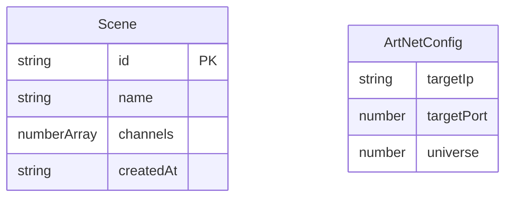

## 1. 架构设计

```mermaid
flowchart TB
    subgraph "前端 React"
        "控制台页面" --> "Zustand Store"
        "场景管理页面" --> "Zustand Store"
        "Zustand Store" --> "WebSocket Client"
    end

    subgraph "后端 Express"
        "WebSocket Server" --> "Art-Net 打包器"
        "Art-Net 打包器" --> "UDP Socket"
        "HTTP API" --> "场景存储服务"
        "场景存储服务" --> "JSON文件"
    end

    "WebSocket Client" <-->|"ws://host:3001"| "WebSocket Server"
    "控制台页面" -->|"HTTP API"| "HTTP API"
    "UDP Socket" -->|"Art-Net UDP:6454"| "灯光控制器"
```

## 2. 技术说明

- **前端**：React@18 + TypeScript + TailwindCSS@3 + Vite
- **初始化工具**：vite-init
- **后端**：Express@4 + ws（WebSocket）+ Node:dgram（UDP）
- **数据存储**：JSON文件存储场景数据（无需数据库）
- **状态管理**：Zustand
- **协议**：Art-Net（基于UDP的DMX512-over-Ethernet协议，端口6454）

## 3. 路由定义

| 路由 | 用途 |
|------|------|
| `/` | 控制台主页面，512通道推子面板 |
| `/scenes` | 场景管理页面，保存/加载/删除场景 |

## 4. API 定义

### 4.1 WebSocket 消息协议

```typescript
interface ChannelUpdateMessage {
  type: 'channel-update';
  channels: { channel: number; value: number }[];
}

interface FullFrameMessage {
  type: 'full-frame';
  data: number[];
}

interface ConnectionMessage {
  type: 'connection';
  status: 'connected' | 'disconnected';
}

interface ArtNetConfigMessage {
  type: 'artnet-config';
  ip: string;
  port: number;
  universe: number;
}
```

### 4.2 HTTP REST API

```typescript
interface Scene {
  id: string;
  name: string;
  channels: number[];
  createdAt: string;
}

GET    /api/scenes          -> Scene[]
GET    /api/scenes/:id      -> Scene
POST   /api/scenes          -> { name: string; channels: number[] } -> Scene
DELETE /api/scenes/:id      -> { success: boolean }
PUT    /api/artnet-config   -> { ip: string; port: number; universe: number } -> { success: boolean }
GET    /api/artnet-config   -> { ip: string; port: number; universe: number }
```

## 5. 服务端架构图

```mermaid
flowchart LR
    "Express HTTP" --> "场景路由"
    "场景路由" --> "场景服务"
    "场景服务" --> "JSON文件读写"
    "WS服务器" --> "消息分发器"
    "消息分发器" --> "Art-Net打包器"
    "消息分发器" --> "配置管理器"
    "Art-Net打包器" --> "UDP Socket"
    "UDP Socket" --> "灯光控制器"
```

## 6. 数据模型

### 6.1 数据模型定义



### 6.2 数据存储

场景数据存储在 `api/data/scenes.json` 文件中，Art-Net配置存储在 `api/data/config.json` 文件中。

```json
{
  "scenes": [
    {
      "id": "uuid-string",
      "name": "场景名称",
      "channels": [0, 0, 0, ..., 255],
      "createdAt": "2025-01-01T00:00:00.000Z"
    }
  ]
}
```

```json
{
  "targetIp": "255.255.255.255",
  "targetPort": 6454,
  "universe": 0
}
```
