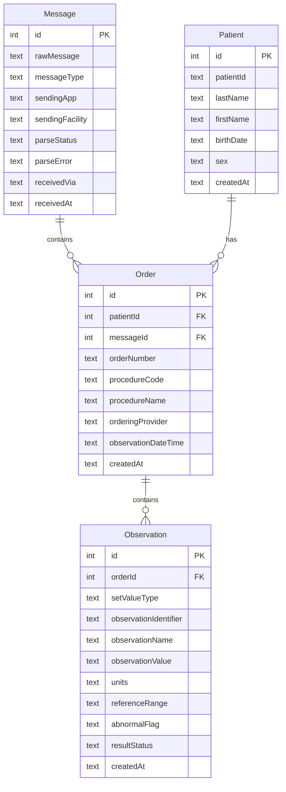

## 1. 架构设计

```mermaid
flowchart TB
    subgraph "外部系统"
        "HIS/LIS" --> "HL7 TCP连接"
        "HL7文件" --> "文件上传"
    end
    subgraph "后端 (Node.js + Express)"
        "HL7 TCP服务器" --> "HL7解析器"
        "文件上传API" --> "HL7解析器"
        "HL7解析器" --> "数据存储服务"
        "数据存储服务" --> "SQLite数据库"
        "REST API" --> "数据存储服务"
    end
    subgraph "前端 (React)"
        "检验结果总览" --> "REST API"
        "患者检验详情" --> "REST API"
        "消息监控" --> "REST API"
        "系统状态" --> "REST API"
    end
```

## 2. 技术说明
- 前端：React@18 + TypeScript + TailwindCSS@3 + Vite
- 初始化工具：vite-init（react-express-ts模板）
- 后端：Express@4 + TypeScript (ESM格式)
- 数据库：SQLite（better-sqlite3，零配置嵌入式数据库）
- HL7解析：自研轻量解析器（无需外部依赖，支持MSH/PID/OBR/OBX段）
- TCP服务器：Node.js原生net模块

## 3. 路由定义
| 路由 | 用途 |
|------|------|
| / | 检验结果总览页，展示患者列表与统计信息 |
| /patient/:id | 患者检验详情页，展示指定患者的检验订单与结果 |
| /messages | 消息监控页，展示HL7消息接收日志 |
| /status | 系统状态页，展示服务与数据库状态 |

## 4. API定义

```typescript
interface Patient {
  id: number;
  patientId: string;
  lastName: string;
  firstName: string;
  birthDate: string;
  sex: string;
  createdAt: string;
}

interface Order {
  id: number;
  patientId: number;
  orderNumber: string;
  procedureCode: string;
  procedureName: string;
  orderingProvider: string;
  observationDateTime: string;
  createdAt: string;
}

interface Observation {
  id: number;
  orderId: number;
  setValueType: string;
  observationIdentifier: string;
  observationName: string;
  observationValue: string;
  units: string;
  referenceRange: string;
  abnormalFlag: string;
  resultStatus: string;
  createdAt: string;
}

interface Message {
  id: number;
  rawMessage: string;
  messageType: string;
  sendingApp: string;
  sendingFacility: string;
  parseStatus: 'success' | 'partial' | 'failed';
  parseError: string | null;
  receivedAt: string;
  receivedVia: 'tcp' | 'file';
}

// API Endpoints
// GET /api/patients - 获取患者列表（支持搜索 ?search=）
// GET /api/patients/:id - 获取患者详情
// GET /api/patients/:id/orders - 获取患者的检验订单
// GET /api/orders/:id/observations - 获取订单的检验结果
// GET /api/messages - 获取消息日志（支持分页 ?page=&limit=）
// GET /api/messages/:id - 获取消息详情（含原始消息）
// POST /api/messages/upload - 上传HL7文件
// GET /api/status - 获取系统状态

interface DashboardStats {
  todayMessageCount: number;
  patientCount: number;
  abnormalResultCount: number;
  pendingReviewCount: number;
}

interface SystemStatus {
  tcpServer: { running: boolean; port: number; connections: number };
  database: { connected: boolean; messageCount: number; patientCount: number; orderCount: number };
}
```

## 5. 服务器架构图

```mermaid
flowchart LR
    "TCP Server" --> "HL7 Parser"
    "File Upload Controller" --> "HL7 Parser"
    "HL7 Parser" --> "Storage Service"
    "Patient Controller" --> "Storage Service"
    "Message Controller" --> "Storage Service"
    "Status Controller" --> "Storage Service"
    "Storage Service" --> "SQLite DB"
```

## 6. 数据模型

### 6.1 数据模型定义



### 6.2 数据定义语言

```sql
CREATE TABLE IF NOT EXISTS messages (
  id INTEGER PRIMARY KEY AUTOINCREMENT,
  rawMessage TEXT NOT NULL,
  messageType TEXT,
  sendingApp TEXT,
  sendingFacility TEXT,
  parseStatus TEXT NOT NULL DEFAULT 'success',
  parseError TEXT,
  receivedVia TEXT NOT NULL DEFAULT 'tcp',
  receivedAt TEXT NOT NULL DEFAULT (datetime('now'))
);

CREATE TABLE IF NOT EXISTS patients (
  id INTEGER PRIMARY KEY AUTOINCREMENT,
  patientId TEXT NOT NULL UNIQUE,
  lastName TEXT,
  firstName TEXT,
  birthDate TEXT,
  sex TEXT,
  createdAt TEXT NOT NULL DEFAULT (datetime('now'))
);

CREATE TABLE IF NOT EXISTS orders (
  id INTEGER PRIMARY KEY AUTOINCREMENT,
  patientId INTEGER NOT NULL,
  messageId INTEGER NOT NULL,
  orderNumber TEXT,
  procedureCode TEXT,
  procedureName TEXT,
  orderingProvider TEXT,
  observationDateTime TEXT,
  createdAt TEXT NOT NULL DEFAULT (datetime('now')),
  FOREIGN KEY (patientId) REFERENCES patients(id),
  FOREIGN KEY (messageId) REFERENCES messages(id)
);

CREATE TABLE IF NOT EXISTS observations (
  id INTEGER PRIMARY KEY AUTOINCREMENT,
  orderId INTEGER NOT NULL,
  setValueType TEXT,
  observationIdentifier TEXT,
  observationName TEXT,
  observationValue TEXT,
  units TEXT,
  referenceRange TEXT,
  abnormalFlag TEXT,
  resultStatus TEXT,
  createdAt TEXT NOT NULL DEFAULT (datetime('now')),
  FOREIGN KEY (orderId) REFERENCES orders(id)
);

CREATE INDEX IF NOT EXISTS idx_patients_patientId ON patients(patientId);
CREATE INDEX IF NOT EXISTS idx_orders_patientId ON orders(patientId);
CREATE INDEX IF NOT EXISTS idx_observations_orderId ON observations(orderId);
CREATE INDEX IF NOT EXISTS idx_messages_receivedAt ON messages(receivedAt);
CREATE INDEX IF NOT EXISTS idx_messages_parseStatus ON messages(parseStatus);
```
