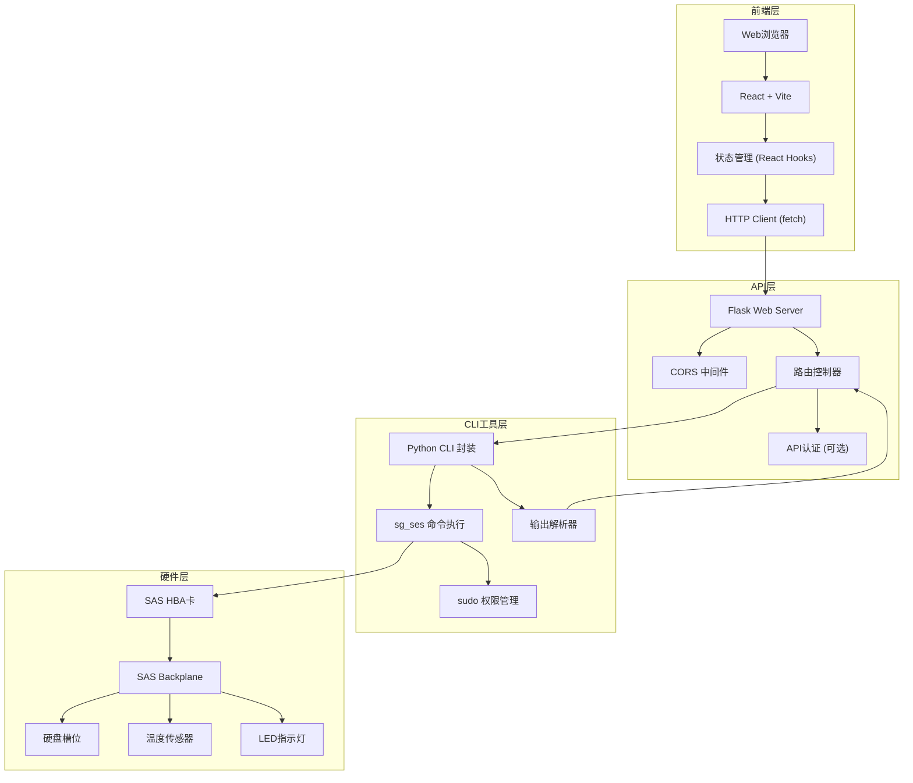
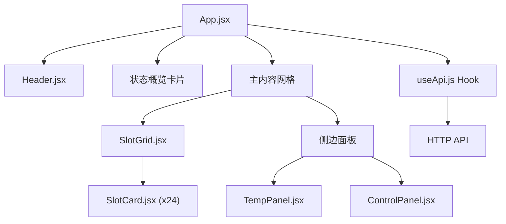

## 1. 架构设计



## 2. 技术描述

### 2.1 技术栈

| 层级 | 技术选型 | 版本 | 说明 |
|------|---------|------|------|
| 前端 | React | 18.x | UI框架 |
| 前端 | Vite | 5.x | 构建工具 |
| 前端 | TailwindCSS | 3.x | CSS框架 |
| 前端 | Lucide React | 0.344.x | 图标库 |
| 后端 | Python | 3.9+ | 编程语言 |
| 后端 | Flask | 3.x | Web框架 |
| 后端 | Flask-CORS | 4.x | 跨域支持 |
| 系统工具 | sg3_utils | latest | sg_ses 命令来源 |
| 系统工具 | sudo | latest | 权限提升 |

### 2.2 目录结构

```
p228/
├── backend/
│   ├── cli/
│   │   ├── __init__.py
│   │   ├── ses_cli.py          # sg_ses 命令封装
│   │   └── parser.py           # 输出解析器
│   ├── api/
│   │   ├── __init__.py
│   │   ├── app.py              # Flask 应用
│   │   └── routes.py           # API 路由
│   ├── requirements.txt
│   ├── config.py
│   └── run.py                  # 启动入口
├── frontend/
│   ├── src/
│   │   ├── components/
│   │   │   ├── Header.jsx
│   │   │   ├── SlotGrid.jsx
│   │   │   ├── SlotCard.jsx
│   │   │   ├── TempPanel.jsx
│   │   │   └── ControlPanel.jsx
│   │   ├── hooks/
│   │   │   └── useApi.js
│   │   ├── App.jsx
│   │   ├── main.jsx
│   │   └── index.css
│   ├── index.html
│   ├── package.json
│   ├── vite.config.js
│   └── tailwind.config.js
├── README.md
└── .trae/
    └── documents/
```

## 3. API 定义

### 3.1 数据类型

```typescript
// 槽位状态
interface SlotStatus {
  slot: number;           // 槽位号
  present: boolean;       // 硬盘是否存在
  locate: boolean;        // 定位灯状态
  fault: boolean;         // 错误灯状态
  active: boolean;        // 活动灯状态
  device?: string;        // 设备名 (如 /dev/sda)
  model?: string;         // 硬盘型号
  serial?: string;        // 序列号
}

// 温度传感器
interface TempSensor {
  id: string;             // 传感器ID
  name: string;           // 传感器名称
  current: number;        // 当前温度 (°C)
  min?: number;           // 最低温度
  max?: number;           // 最高温度
  warning?: number;       // 告警阈值
  critical?: number;      // 临界阈值
}

// 系统状态
interface SystemStatus {
  enclosure: string;      // Enclosure 名称
  slot_count: number;     // 总槽位数
  slots: SlotStatus[];    // 槽位状态列表
  temperatures: TempSensor[];
  updated_at: string;     // 更新时间
}

// LED 控制请求
interface LedControlRequest {
  slot: number;
  type: 'locate' | 'fault' | 'active';
  action: 'on' | 'off';
}

// API 响应
interface ApiResponse<T> {
  success: boolean;
  data?: T;
  error?: string;
}
```

### 3.2 接口列表

| 方法 | 路径 | 说明 | 请求体 | 响应 |
|------|------|------|--------|------|
| GET | `/api/enclosures` | 获取enclosure列表 | - | `ApiResponse<string[]>` |
| GET | `/api/status` | 获取所有状态 | - | `ApiResponse<SystemStatus>` |
| GET | `/api/slots` | 获取槽位状态 | - | `ApiResponse<SlotStatus[]>` |
| GET | `/api/slots/{slot}` | 获取单个槽位状态 | - | `ApiResponse<SlotStatus>` |
| POST | `/api/led/{slot}/{type}/{action}` | 控制LED灯 | - | `ApiResponse<null>` |
| GET | `/api/temperature` | 获取温度 | - | `ApiResponse<TempSensor[]>` |
| GET | `/api/health` | 健康检查 | - | `{status: 'ok'}` |

## 4. CLI 工具

### 4.1 sg_ses 命令映射

| 功能 | sg_ses 命令 |
|------|-----------|
| 发现设备 | `sg_ses --scan` |
| 查看状态 | `sg_ses /dev/sgX --status` |
| 查看详细页 | `sg_ses /dev/sgX --page=ed` |
| 开启定位灯 | `sg_ses /dev/sgX --set locate=on --index=SLOT` |
| 关闭定位灯 | `sg_ses /dev/sgX --set locate=off --index=SLOT` |
| 开启错误灯 | `sg_ses /dev/sgX --set fault=on --index=SLOT` |
| 关闭错误灯 | `sg_ses /dev/sgX --set fault=off --index=SLOT` |
| 读取温度 | `sg_ses /dev/sgX --page=ec` |

### 4.2 模拟模式

为了支持开发测试，CLI工具提供模拟模式：
- 当检测不到 sg_ses 或没有权限时，自动启用模拟模式
- 生成模拟的24槽位数据，随机温度和LED状态
- 支持通过配置文件强制启用模拟模式

## 5. 前端架构

### 5.1 组件结构



### 5.2 核心Hook (useApi.js)

- 封装所有API调用
- 管理轮询逻辑
- 处理加载和错误状态
- 缓存和状态更新

### 5.3 状态管理

- 使用 React useState/useReducer 管理本地状态
- 选中槽位状态：当前选中的槽位号
- 自动刷新：是否开启自动轮询，轮询间隔
- 系统状态：完整的 SystemStatus 数据

## 6. 配置文件 (backend/config.py)

```python
# Enclosure 设备路径，可配置多个
ENCLOSURE_DEVICES = ['/dev/sg1', '/dev/sg2']

# 模拟模式
SIMULATION_MODE = False

# 温度阈值
TEMP_WARNING_THRESHOLD = 45
TEMP_CRITICAL_THRESHOLD = 55

# 轮询间隔（秒）
DEFAULT_POLL_INTERVAL = 5

# 槽位数量（模拟模式使用）
SIMULATED_SLOT_COUNT = 24
```
