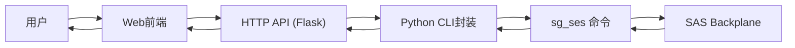
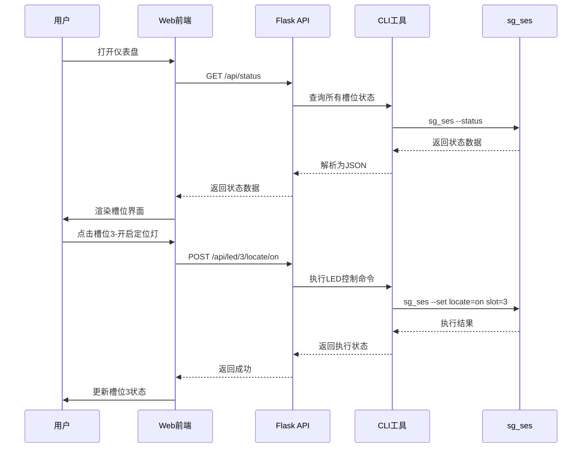

## 1. 产品概述

SAS背板LED管理与温度监控系统，通过CLI工具控制SAS硬盘背板的LED指示灯（定位灯/错误灯/活动灯），读取enclosure温度传感器数据，并提供Web界面实时展示硬盘槽位状态。

- 目标用户：服务器运维人员、存储管理员
- 解决问题：快速定位硬盘槽位、监控硬盘状态、实时获取 enclosure 温度
- 核心价值：提高故障排查效率，可视化硬盘状态，降低运维成本

## 2. 核心功能

### 2.1 用户角色

| 角色 | 注册方式 | 核心权限 |
|------|---------|----------|
| 运维管理员 | 本地系统账号登录 | 控制LED灯、查看温度、管理硬盘槽位 |

### 2.2 功能模块

1. **CLI工具**：sg_ses 命令封装，LED灯控制，温度读取，槽位状态查询
2. **HTTP API服务**：RESTful API，封装CLI操作，提供JSON接口
3. **Web前端仪表盘**：硬盘槽位可视化，LED状态展示，温度监控，控制操作界面

### 2.3 功能详情

| 模块 | 子模块 | 功能描述 |
|------|--------|---------|
| CLI工具 | LED控制 | 开启/关闭指定槽位的定位灯、错误灯、活动灯 |
| CLI工具 | 状态查询 | 查询所有槽位的LED状态、硬盘存在状态 |
| CLI工具 | 温度监控 | 读取enclosure所有温度传感器数据 |
| CLI工具 | 设备发现 | 扫描系统中的SAS enclosures |
| HTTP API | LED控制接口 | POST /api/led/{slot}/{type}/{action} |
| HTTP API | 状态查询接口 | GET /api/status |
| HTTP API | 温度接口 | GET /api/temperature |
| Web前端 | 槽位可视化 | 以网格形式展示所有硬盘槽位，颜色区分状态 |
| Web前端 | 温度面板 | 实时展示各温度传感器数据及趋势 |
| Web前端 | 控制面板 | 点击槽位控制LED灯开关 |
| Web前端 | 自动刷新 | 定期轮询更新状态 |

## 3. 核心流程

## 4. 用户界面设计

### 4.1 设计风格

- 主色调：工业蓝 (#165DFF) 搭配深灰背景，符合运维监控系统风格
- 辅助色：红色 (#F53F3F) 表示错误/故障，绿色 (#00B42A) 表示正常，橙色 (#FF7D00) 表示定位
- 字体：JetBrains Mono 作为数字和代码展示，Inter 作为正文
- 布局：卡片式布局，顶部导航 + 状态概览 + 槽位网格 + 温度面板
- 整体风格：科技感、工业风、深色主题，适合长时间监控使用

### 4.2 页面设计概述

| 页面 | 模块 | UI元素 |
|------|------|--------|
| 仪表盘 | 顶部导航 | Logo、系统标题、刷新按钮、自动刷新开关 |
| 仪表盘 | 状态概览 | 总槽位数、在线硬盘数、故障数、温度告警数卡片 |
| 仪表盘 | 槽位网格 | 8xN网格，每个槽位显示槽位号、LED状态指示灯、硬盘存在状态 |
| 仪表盘 | 温度面板 | 温度传感器列表，实时温度，进度条，颜色告警 |
| 仪表盘 | 控制面板 | 选中槽位后显示LED控制按钮（定位/错误/活动） |

### 4.3 响应式设计

- 桌面端优先，支持1920x1080及以上分辨率
- 槽位网格自适应宽度，根据屏幕尺寸调整列数
- 移动端将槽位网格改为垂直列表，温度面板折叠

### 4.4 交互细节

- 槽位悬停：高亮边框，显示详细状态信息
- 槽位点击：选中槽位，显示控制面板，边框高亮
- LED状态：用不同颜色的发光圆点表示
- 温度告警：超过阈值时数字闪烁，进度条变红
- 状态更新：数据刷新时有平滑过渡动画
