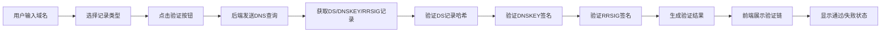

## 1. 产品概述

DNSSEC验证工具是一个专业的网络安全Web应用，用于解析和验证DNS响应的数字签名，帮助用户检测DNS数据是否被篡改。

- 核心功能：解析DNS响应中的RRSIG记录，使用DNSKEY验证签名有效性，展示完整的信任链验证过程
- 目标用户：网络管理员、安全工程师、DNS运维人员、对DNS安全感兴趣的技术人员
- 产品价值：可视化展示DNSSEC验证流程，帮助用户理解和排查DNS安全问题

## 2. 核心功能

### 2.1 用户角色

| 角色 | 注册方式 | 核心权限 |
|------|----------|----------|
| 普通用户 | 无需注册 | 输入域名进行DNSSEC验证，查看验证结果和验证链 |

### 2.2 功能模块

1. **首页**：域名输入区域、快速查询入口、验证结果展示、验证链可视化
2. **详情面板**：DNS记录详情、签名算法信息、验证步骤明细

### 2.3 页面详情

| 页面名称 | 模块名称 | 功能描述 |
|---------|----------|----------|
| 首页 | 查询输入区 | 域名输入框、记录类型选择（A/AAAA/NS/TXT等）、查询按钮 |
| 首页 | 验证状态区 | 显示整体验证结果（通过/失败）、签名算法、验证时间 |
| 首页 | 验证链可视化 | 图形化展示DS->DNSKEY->RRSIG的信任链，每个节点显示验证状态 |
| 首页 | 记录详情区 | 展示获取到的DS记录、DNSKEY记录、RRSIG记录的详细信息 |
| 首页 | 验证步骤区 | 分步展示每个验证环节的执行过程和结果 |

## 3. 核心流程

用户输入域名并选择记录类型，系统发送DNS查询获取相关记录，后端依次验证DS记录、DNSKEY记录和RRSIG签名，前端将验证结果和信任链以可视化方式呈现给用户。

## 4. 用户界面设计

### 4.1 设计风格

- **主色调**：深海军蓝 `#0f172a` 作为背景色，营造专业技术感
- **成功色**：霓虹绿 `#10b981` 表示验证通过
- **失败色**：霓虹红 `#ef4444` 表示验证失败
- **强调色**：科技蓝 `#3b82f6` 用于交互元素
- **中性色**：石板灰系列用于文本和边框
- **按钮风格**：圆角矩形，带有微妙的发光效果，悬停时有颜色过渡动画
- **字体**：使用 `JetBrains Mono` 作为等宽字体展示DNS记录数据，`Space Grotesk` 作为标题字体
- **布局风格**：卡片式布局，配合玻璃拟态效果和微妙的边框发光
- **图标风格**：使用简洁的线条图标，配合状态指示点

### 4.2 页面设计概述

| 页面名称 | 模块名称 | UI元素 |
|---------|----------|--------|
| 首页 | 查询输入区 | 大尺寸输入框、下拉选择器、主按钮带发光效果、输入时的微动画 |
| 首页 | 验证状态区 | 大型状态徽章（通过/失败）、动画状态指示点、关键信息标签 |
| 首页 | 验证链可视化 | 垂直时间线布局、节点卡片、连接动画、状态颜色编码、悬停详情 |
| 首页 | 记录详情区 | 可折叠面板、代码块样式展示、语法高亮、复制按钮 |
| 首页 | 验证步骤区 | 步骤进度条、勾叉状态图标、详细日志文本 |

### 4.3 响应式设计

- **桌面优先**：以1280px以上宽度为主要设计目标
- **平板适配**：768px-1280px，调整卡片间距和字体大小
- **手机适配**：375px-768px，单列布局，简化验证链展示
- **触摸优化**：按钮最小高度48px，增加触摸反馈

### 4.4 动效设计

- **页面加载**：元素从下往上淡入，错开延迟创造层次感
- **验证过程**：验证链节点逐个点亮，带有脉冲动画
- **状态变化**：通过/失败状态切换时有颜色渐变和缩放效果
- **悬停效果**：卡片轻微上浮，边框发光增强
- **折叠面板**：平滑的高度过渡动画
