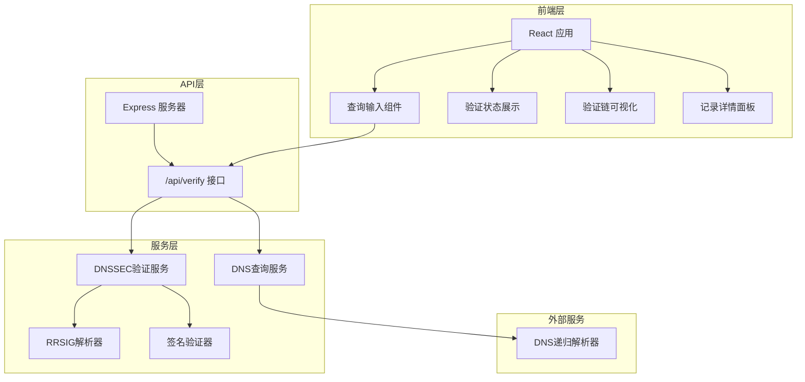
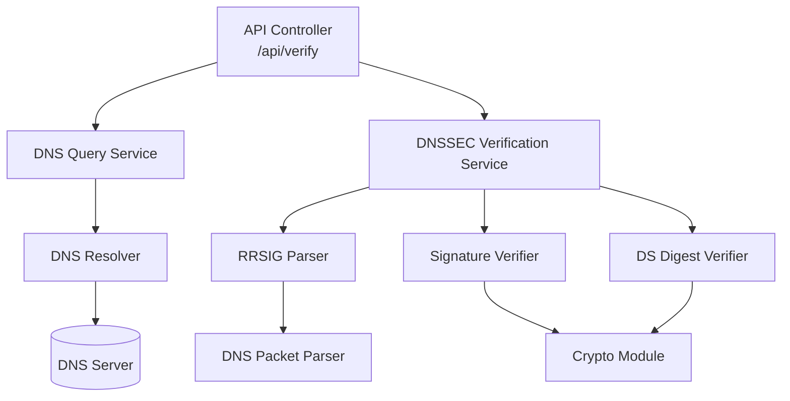
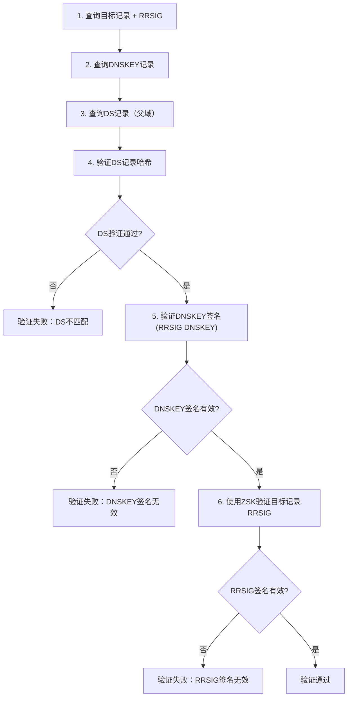

## 1. 架构设计



## 2. 技术描述

- **前端**：React@18 + TypeScript + TailwindCSS@3 + Vite@5 + Framer Motion（动画）
- **初始化工具**：Vite
- **后端**：Express@4 + TypeScript + ts-node
- **DNS库**：`dns`（Node.js内置）+ `dns-packet`（DNS报文解析）+ `@types/node`
- **加密库**：Node.js `crypto` 模块（用于签名验证）
- **HTTP客户端**：Axios（前后端通信）

## 3. 路由定义

| 路由 | 用途 |
|------|------|
| / | 首页，DNSSEC验证主界面 |
| /api/verify | DNSSEC验证API接口 |

## 4. API 定义

### 4.1 验证请求

```typescript
interface VerifyRequest {
  domain: string;
  recordType: 'A' | 'AAAA' | 'NS' | 'TXT' | 'MX' | 'SOA' | 'CNAME';
}
```

### 4.2 验证响应

```typescript
interface DNSRecord {
  name: string;
  type: string;
  ttl: number;
  data: string;
}

interface DSRecord extends DNSRecord {
  keyTag: number;
  algorithm: number;
  digestType: number;
  digest: string;
}

interface DNSKEYRecord extends DNSRecord {
  flags: number;
  protocol: number;
  algorithm: number;
  publicKey: string;
  keyTag: number;
  isZSK: boolean;
  isKSK: boolean;
}

interface RRSIGRecord extends DNSRecord {
  typeCovered: string;
  algorithm: number;
  labels: number;
  originalTTL: number;
  signatureExpiration: number;
  signatureInception: number;
  keyTag: number;
  signerName: string;
  signature: string;
}

interface VerificationStep {
  name: string;
  status: 'passed' | 'failed' | 'pending';
  message: string;
  details?: string;
}

interface ChainNode {
  id: 'ds' | 'dnskey' | 'rrsig';
  name: string;
  status: 'passed' | 'failed' | 'pending';
  records: DSRecord[] | DNSKEYRecord[] | RRSIGRecord[];
}

interface VerifyResponse {
  success: boolean;
  domain: string;
  recordType: string;
  overallStatus: 'passed' | 'failed' | 'unsigned';
  timestamp: string;
  duration: number;
  chain: ChainNode[];
  steps: VerificationStep[];
  targetRecords: DNSRecord[];
  error?: string;
}
```

## 5. 服务器架构图



## 6. 核心验证流程

### 6.1 DNSSEC验证步骤



### 6.2 数据模型

```typescript
// DNS查询结果
interface DNSQueryResult {
  records: DNSRecord[];
  rrsig?: RRSIGRecord;
}

// 验证上下文
interface VerificationContext {
  domain: string;
  recordType: string;
  targetRecords: DNSRecord[];
  targetRRSIG?: RRSIGRecord;
  dnskeyRecords: DNSKEYRecord[];
  dnskeyRRSIG?: RRSIGRecord;
  dsRecords: DSRecord[];
  steps: VerificationStep[];
}
```

## 7. 项目目录结构

```
p230/
├── client/                    # 前端应用
│   ├── src/
│   │   ├── components/        # React组件
│   │   │   ├── QueryInput.tsx
│   │   │   ├── StatusBadge.tsx
│   │   │   ├── ChainVisualizer.tsx
│   │   │   ├── RecordDetails.tsx
│   │   │   └── VerificationSteps.tsx
│   │   ├── types/             # TypeScript类型定义
│   │   ├── hooks/             # 自定义Hooks
│   │   ├── utils/             # 工具函数
│   │   ├── App.tsx
│   │   └── main.tsx
│   ├── package.json
│   └── vite.config.ts
├── server/                    # 后端服务
│   ├── src/
│   │   ├── controllers/       # API控制器
│   │   ├── services/          # 业务逻辑
│   │   │   ├── dnsQuery.ts    # DNS查询服务
│   │   │   ├── dnssecVerify.ts # DNSSEC验证服务
│   │   │   ├── rrsigParser.ts # RRSIG解析
│   │   │   └── signatureVerify.ts # 签名验证
│   │   ├── types/             # 类型定义
│   │   ├── utils/             # 工具函数
│   │   └── index.ts           # 服务器入口
│   ├── package.json
│   └── tsconfig.json
└── .trae/
    └── documents/
```
