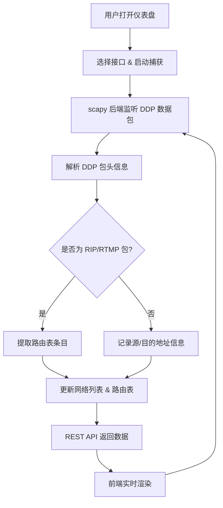

## 1. 产品概述

AppleTalk DDP 数据包捕获与可视化分析平台——基于 Python + scapy 后端捕获并解析 AppleTalk DDP 协议数据包（通过虚拟接口），前端实时展示网络节点列表和 RIP 路由表信息，帮助网络管理员直观了解 AppleTalk 网络拓扑和路由状态。

- 面向网络工程师和协议开发者，解决 AppleTalk 网络调试缺乏可视化工具的问题
- 提供实时数据包监控、网络拓扑感知与路由表分析能力

## 2. 核心功能

### 2.1 功能模块

1. **仪表盘页面**：实时数据包统计、网络概览、RIP 路由表、数据包日志

### 2.2 页面详情

| 页面名称 | 模块名称 | 功能描述 |
|---------|---------|---------|
| 仪表盘 | 数据包统计卡片 | 显示已捕获数据包总数、DDP 数据包数、RIP 数据包数、已发现网络数 |
| 仪表盘 | 网络列表 | 展示所有发现的 AppleTalk 网络及其节点信息（网络号、节点范围、节点数） |
| 仪表盘 | RIP 路由表 | 展示从 RTMP/RIP 数据包中解析出的路由条目（目的网络、下一跳、跳数、状态） |
| 仪表盘 | 数据包日志 | 实时滚动展示最近捕获的 DDP 数据包详情（时间戳、源/目的 网络.节点.套接字、协议类型） |
| 仪表盘 | 捕获控制 | 开始/停止捕获按钮，接口选择，过滤器设置 |

## 3. 核心流程

用户打开仪表盘 → 选择虚拟接口并启动捕获 → scapy 后端监听 DDP 数据包 → 解析后通过 REST API 推送到前端 → 前端实时更新网络列表、RIP 路由表和数据包日志

## 4. 用户界面设计

### 4.1 设计风格

- **主色调**：深蓝灰底色 (#0f172a) + 青绿色强调 (#22d3ee)，呈现网络监控工具的专业科技感
- **次色调**：琥珀色 (#f59e0b) 用于警告/高跳数路由，红色 (#ef4444) 用于不可达路由
- **按钮风格**：圆角微3D（bg-gradient + shadow），hover 时提升亮度
- **字体**：JetBrains Mono 作为数据展示字体，Noto Sans SC 作为界面字体
- **布局风格**：顶部导航 + 左侧控制面板 + 主区域多卡片网格
- **图标**：lucide-react 线性图标

### 4.2 页面设计概览

| 页面名称 | 模块名称 | UI 元素 |
|---------|---------|---------|
| 仪表盘 | 数据包统计卡片 | 4列网格卡片，深色底+发光数字，淡入动画 |
| 仪表盘 | 网络列表 | 表格，行悬停高亮，网络号列带色点标记 |
| 仪表盘 | RIP 路由表 | 表格，跳数列用颜色编码（绿/黄/红），状态列用徽章 |
| 仪表盘 | 数据包日志 | 深色终端风格滚动列表，自动滚动到底部，每行带时间戳 |
| 仪表盘 | 捕获控制 | 顶部工具栏：接口下拉、开始/停止按钮、过滤器输入框 |

### 4.3 响应式

桌面优先设计，大屏4列网格，中屏2列，小屏1列堆叠。表格在小屏下横向可滚动。
