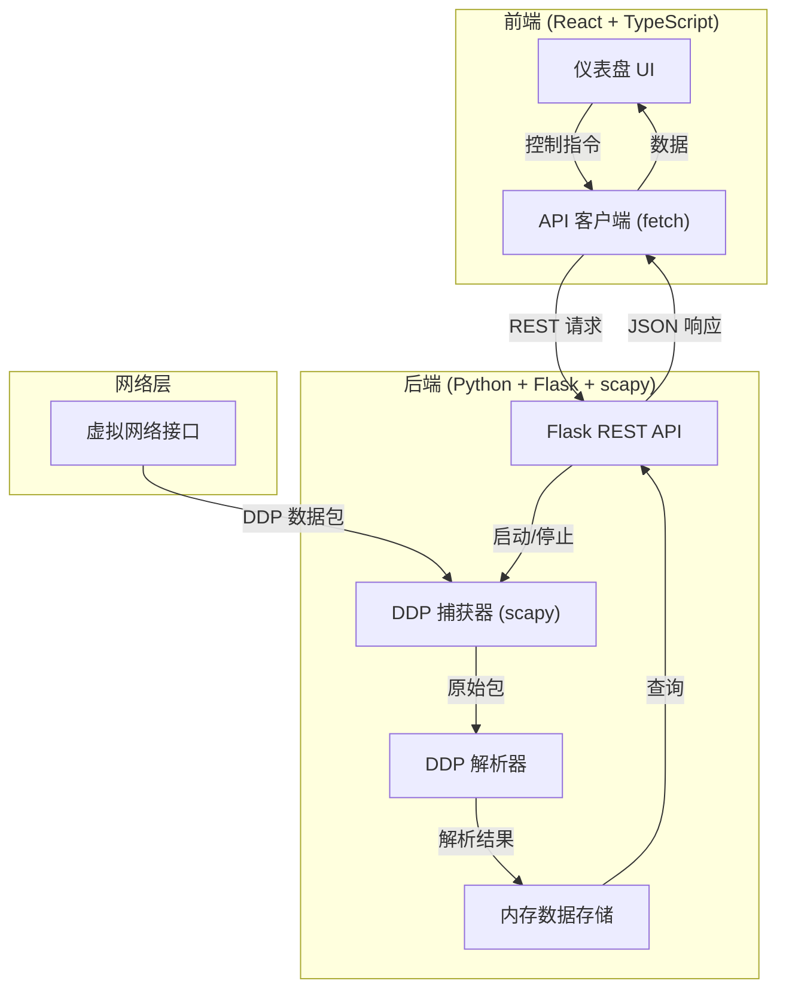
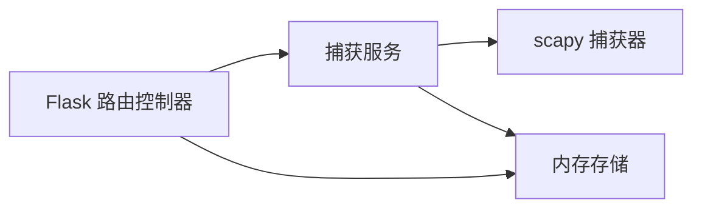
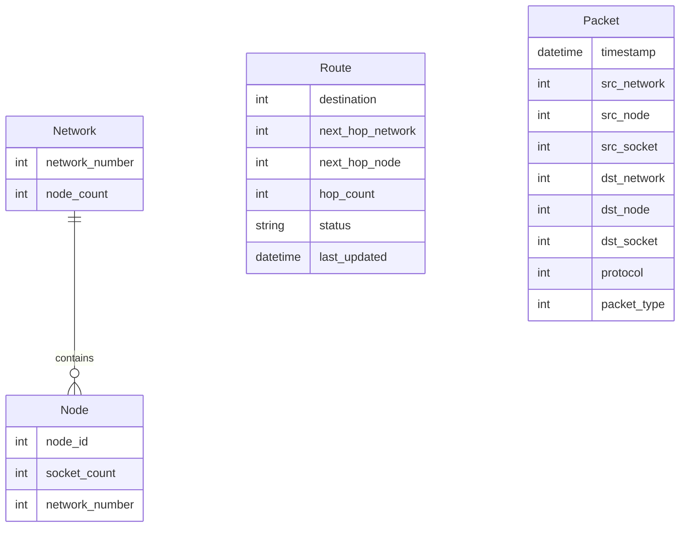

## 1. 架构设计

## 2. 技术说明

- **前端**：React@18 + TypeScript + Tailwind CSS@3 + Vite
- **初始化工具**：vite-init (react-ts 模板)
- **后端**：Python 3 + Flask + flask-cors + scapy
- **数据库**：无，使用内存数据结构存储实时捕获数据
- **通信方式**：前端轮询 REST API（间隔 2 秒）

## 3. 路由定义

| 路由 | 用途 |
|------|------|
| `/` | 仪表盘主页，展示所有监控数据 |

## 4. API 定义

### 4.1 后端 API（Python Flask，端口 5000）

**GET /api/status**
- 获取捕获状态
- 响应：`{ "capturing": boolean, "interface": string | null, "stats": { "total_packets": number, "ddp_packets": number, "rip_packets": number, "networks_count": number } }`

**POST /api/capture/start**
- 启动捕获
- 请求：`{ "interface": string }`
- 响应：`{ "success": boolean, "message": string }`

**POST /api/capture/stop**
- 停止捕获
- 响应：`{ "success": boolean, "message": string }`

**GET /api/networks**
- 获取已发现的网络列表
- 响应：`{ "networks": [{ "network_number": number, "node_count": number, "nodes": [{ "node_id": number, "socket_count": number }] }] }`

**GET /api/routes**
- 获取 RIP 路由表
- 响应：`{ "routes": [{ "destination": number, "next_hop_network": number, "next_hop_node": number, "hop_count": number, "status": string, "last_updated": string }] }`

**GET /api/packets**
- 获取最近的数据包日志（最近100条）
- 响应：`{ "packets": [{ "timestamp": string, "src_network": number, "src_node": number, "src_socket": number, "dst_network": number, "dst_node": number, "dst_socket": number, "protocol": number, "packet_type": number }] }`

**GET /api/interfaces**
- 获取可用网络接口列表
- 响应：`{ "interfaces": [string] }`

### 4.2 DDP 协议解析结构

AppleTalk DDP 包头字段：
- `dst_net`（目的网络号）：2 字节
- `src_net`（源网络号）：2 字节
- `dst_node`（目的节点号）：1 字节
- `src_node`（源节点号）：1 字节
- `dst_socket`（目的套接字）：1 字节
- `src_socket`（源套接字）：1 字节
- `type`（协议类型）：1 字节（1=RTMP，2=NBP，3=ATP，7=Echo，等）

RIP/RTMP 路由条目解析：
- 网络号范围起始：2 字节
- 跳数字段距离：1 字节（0xF0 高4位为版本，低4位+1为实际跳数）

## 5. 后端架构图

## 6. 数据模型

### 6.1 数据模型定义

### 6.2 数据定义

所有数据存储在内存中（Python 字典和列表），无需数据库 DDL。

关键数据结构：
- `networks: Dict[int, NetworkInfo]` — 以网络号为 key
- `routes: List[RouteEntry]` — 路由表条目列表
- `packets: deque[PacketEntry]` — 最近 100 条数据包（collections.deque）
- `stats: CaptureStats` — 统计信息
