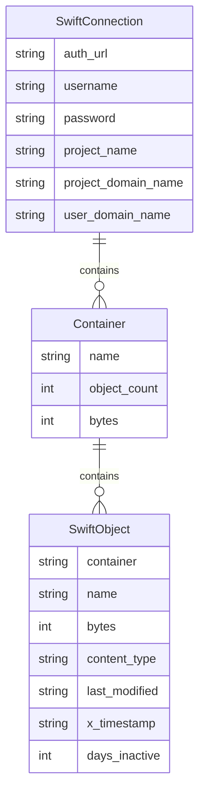

## 1. 架构设计

```mermaid
graph TB
    "Frontend[React 前端]" --> "Backend[Flask 后端 API]"
    "Backend" --> "SwiftClient[python-swiftclient]"
    "SwiftClient" --> "Swift[OpenStack Swift 存储]"
    "Frontend" -.-> "Vite Dev Proxy"
    "Vite Dev Proxy" -.-> "Backend"
```

## 2. 技术说明

- 前端：React@18 + TypeScript + TailwindCSS@3 + Vite
- 初始化工具：vite-init（react-ts 模板）
- 后端：Python 3 + Flask + python-swiftclient
- 数据库：无（实时查询 Swift 存储）
- 状态管理：Zustand

## 3. 路由定义

| 路由 | 用途 |
|------|------|
| / | 概览页：连接配置、存储统计、扫描控制 |
| /cleanup | 清理列表页：冷数据对象列表、筛选删除 |

## 4. API 定义

### 4.1 连接与配置

```
POST /api/connect
Request: { auth_url: string, username: string, password: string, project_name: string, project_domain_name: string, user_domain_name: string }
Response: { success: boolean, message: string }

GET /api/status
Response: { connected: boolean, auth_url: string, username: string }
```

### 4.2 扫描

```
POST /api/scan
Response: { task_id: string }

GET /api/scan/status
Response: { scanning: boolean, progress: number, total_containers: number, scanned_containers: number, total_objects: number, cold_objects: number }
```

### 4.3 数据查询

```
GET /api/containers
Response: { containers: Array<{ name: string, object_count: number, bytes: number }> }

GET /api/cold-objects?container=&sort_by=last_accessed&order=desc&page=1&page_size=50
Response: { objects: Array<ColdObject>, total: number, page: number, page_size: number }

ColdObject = {
  container: string,
  name: string,
  bytes: number,
  content_type: string,
  last_modified: string,
  x_timestamp: string,
  days_inactive: number
}
```

### 4.4 删除

```
DELETE /api/objects
Request: { objects: Array<{ container: string, name: string }> }
Response: { deleted: number, failed: number, errors: Array<string> }

DELETE /api/cleanup-all
Response: { deleted: number, failed: number, errors: Array<string> }
```

## 5. 服务器架构图

```mermaid
graph LR
    "Router[Flask Blueprint Router]" --> "ScanService[扫描服务]"
    "Router" --> "ObjectService[对象服务]"
    "Router" --> "ConnectService[连接服务]"
    "ScanService" --> "SwiftClient[swiftclient.Connection]"
    "ObjectService" --> "SwiftClient"
    "ConnectService" --> "SwiftClient"
```

## 6. 数据模型

### 6.1 数据模型定义

本项目无持久化数据库，所有数据实时从 Swift 存储查询。核心数据结构如下：



### 6.2 数据定义语言

无需 DDL，数据来源于 Swift API 实时查询
