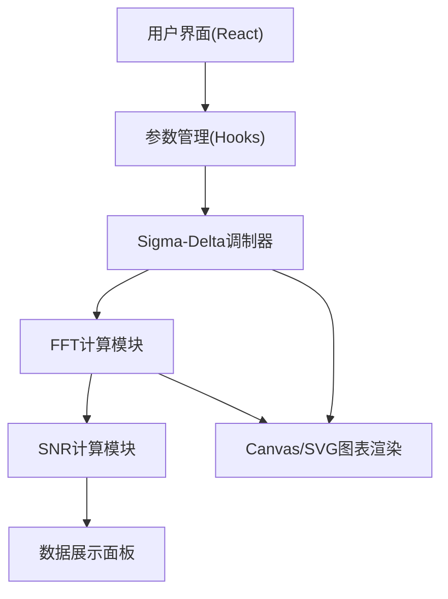

## 1. 架构设计
纯前端单页应用，无后端依赖，所有计算在浏览器端完成



## 2. 技术描述
- 前端：React@18 + TypeScript + Vite
- 样式：TailwindCSS 3
- 图表：自定义Canvas绘图（避免第三方图表库，保持轻量）
- 数学计算：内置FFT实现，纯JavaScript
- 状态管理：React Hooks (useState, useCallback, useMemo)

## 3. 路由定义
| Route | Purpose |
|-------|---------|
| / | 主仿真页面 |

## 4. 核心数据结构

### 4.1 仿真参数类型
```typescript
interface SimulationParams {
  signalFrequency: number;      // 正弦波频率 (Hz)
  signalAmplitude: number;      // 幅度 (0-1)
  sampleCount: number;          // 采样点数
  oversampleRatio: number;      // 过采样率 (默认64)
  sampleRate: number;           // 基础采样率
}
```

### 4.2 仿真结果类型
```typescript
interface SimulationResult {
  inputSignal: Float32Array;    // 输入正弦波
  outputBits: Int8Array;        // 调制器输出二进制流 (-1/1)
  quantizationNoise: Float32Array; // 量化噪声
  time: Float32Array;           // 时间轴
  fftMagnitude: Float32Array;   // FFT幅度谱
  fftFreq: Float32Array;        // FFT频率轴
  snr: number;                  // 信噪比 (dB)
}
```

## 5. 核心算法实现

### 5.1 一阶Sigma-Delta调制器
```
差分方程：
v[n] = x[n] - e[n-1]
e[n] = v[n] - y[n]
y[n] = sign(v[n]) * Vref
```

### 5.2 FFT算法
- 采用Cooley-Tukey快速傅里叶变换算法
- 输入长度为2的幂次
- 输出为单边谱（正频率部分）

### 5.3 SNR计算
- 信号功率：基频处的功率
- 噪声功率：信号带宽内除基频外的总功率
- SNR = 10 * log10(信号功率 / 噪声功率)
