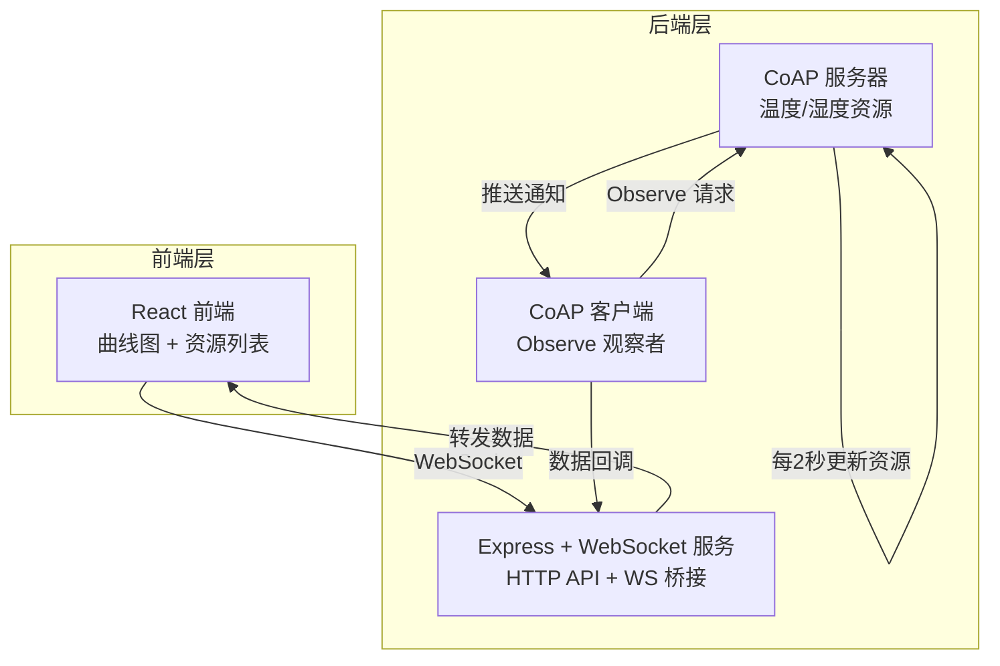
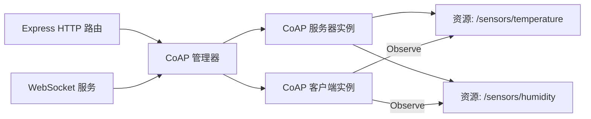
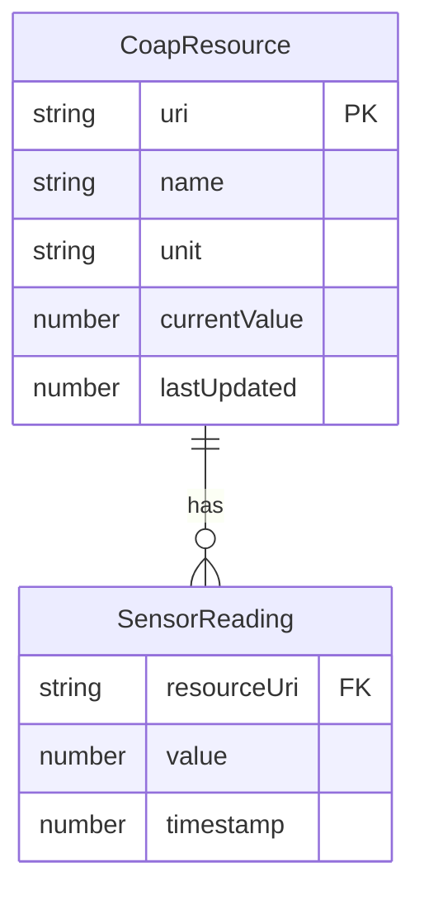

## 1. 架构设计



## 2. 技术说明

- 前端：React@18 + TailwindCSS@3 + Vite + Recharts（图表库）+ Zustand（状态管理）
- 初始化工具：vite-init（react-express-ts 模板）
- 后端：Express@4 + ws（WebSocket）+ node-coap（CoAP 协议库）
- 数据库：无，使用内存数据存储

## 3. 路由定义

| 路由 | 用途 |
|------|------|
| / | 仪表盘主页，显示资源列表和实时曲线图 |

## 4. API 定义

### 4.1 WebSocket 消息协议

**服务端 → 客户端**

```typescript
interface SensorData {
  type: "sensor_data"
  resource: string       // 资源 URI，如 "/sensors/temperature"
  value: number          // 传感器值
  unit: string           // 单位，如 "°C"、"%"
  timestamp: number      // Unix 时间戳
}

interface ConnectionStatus {
  type: "connection_status"
  coapServer: "online" | "offline"
  observer: "active" | "inactive"
}

interface ResourceList {
  type: "resource_list"
  resources: Array<{
    uri: string
    name: string
    unit: string
    icon: string
  }>
}
```

**客户端 → 服务端**

```typescript
interface ClientMessage {
  type: "subscribe" | "unsubscribe"
  resources: string[]    // 资源 URI 列表
}

interface HistoryRequest {
  type: "get_history"
  resource: string
  limit?: number
}
```

### 4.2 HTTP API

| 方法 | 路径 | 用途 |
|------|------|------|
| GET | /api/resources | 获取所有 CoAP 资源列表 |
| GET | /api/resources/:uri/history | 获取指定资源的历史数据 |

## 5. 服务器架构



## 6. 数据模型

### 6.1 数据模型定义



### 6.2 内存数据结构

```typescript
interface CoapResource {
  uri: string
  name: string
  unit: string
  currentValue: number
  lastUpdated: number
  history: SensorReading[]
  min: number
  max: number
  sum: number
  count: number
}

const resources: Map<string, CoapResource> = new Map()
```

初始化资源：
- `/sensors/temperature`：温度传感器，范围 18-32°C，初始值 25°C
- `/sensors/humidity`：湿度传感器，范围 30-80%，初始值 55%
