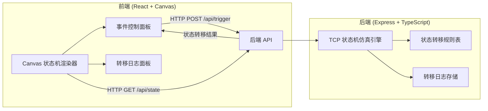

## 1. 架构设计



## 2. 技术说明

- 前端：React@18 + TailwindCSS@3 + Vite + Zustand
- 初始化工具：vite-init
- 后端：Express@4 + TypeScript (ESM)
- 数据库：无，状态保存在内存中

## 3. 路由定义

| 路由 | 用途 |
|------|------|
| / | 主页面，Canvas 状态机可视化 + 事件控制 + 日志 |

## 4. API 定义

### 4.1 获取当前状态

```
GET /api/state
Response: {
  currentState: TcpState
  availableEvents: TcpEvent[]
  history: TransitionRecord[]
}
```

### 4.2 触发事件

```
POST /api/trigger
Body: { event: TcpEvent }
Response: {
  previousState: TcpState
  currentState: TcpState
  event: TcpEvent
  timestamp: number
  error?: string
}
```

### 4.3 重置状态机

```
POST /api/reset
Response: {
  currentState: TcpState
  availableEvents: TcpEvent[]
}
```

### 4.4 获取状态机图数据

```
GET /api/graph
Response: {
  nodes: { id: TcpState; label: string; x: number; y: number; type: 'client' | 'server' }[]
  edges: { from: TcpState; to: TcpState; event: TcpEvent; label: string }[]
}
```

### 4.5 类型定义

```typescript
type TcpState =
  | 'CLOSED'
  | 'LISTEN'
  | 'SYN_SENT'
  | 'SYN_RCVD'
  | 'ESTABLISHED'
  | 'FIN_WAIT_1'
  | 'FIN_WAIT_2'
  | 'CLOSING'
  | 'TIME_WAIT'
  | 'CLOSE_WAIT'
  | 'LAST_ACK'

type TcpEvent =
  | 'ACTIVE_OPEN'
  | 'PASSIVE_OPEN'
  | 'SEND'
  | 'CLOSE'
  | 'SYN_RCVD'
  | 'SYN_ACK_RCVD'
  | 'ACK_RCVD'
  | 'FIN_RCVD'
  | 'FIN_ACK_RCVD'
  | 'RCV'
  | 'TIMEOUT'

interface TransitionRecord {
  from: TcpState
  to: TcpState
  event: TcpEvent
  timestamp: number
}
```

## 5. 状态转移规则表

| 当前状态 | 事件 | 目标状态 |
|----------|------|----------|
| CLOSED | PASSIVE_OPEN | LISTEN |
| CLOSED | ACTIVE_OPEN | SYN_SENT |
| LISTEN | SYN_RCVD | SYN_RCVD |
| LISTEN | CLOSE | CLOSED |
| SYN_SENT | SYN_ACK_RCVD | ESTABLISHED |
| SYN_SENT | CLOSE | CLOSED |
| SYN_RCVD | ACK_RCVD | ESTABLISHED |
| SYN_RCVD | CLOSE | FIN_WAIT_1 |
| ESTABLISHED | CLOSE | FIN_WAIT_1 |
| ESTABLISHED | FIN_RCVD | CLOSE_WAIT |
| ESTABLISHED | SEND | ESTABLISHED |
| ESTABLISHED | RCV | ESTABLISHED |
| FIN_WAIT_1 | ACK_RCVD | FIN_WAIT_2 |
| FIN_WAIT_1 | FIN_RCVD | CLOSING |
| FIN_WAIT_1 | FIN_ACK_RCVD | TIME_WAIT |
| FIN_WAIT_2 | FIN_RCVD | TIME_WAIT |
| CLOSING | ACK_RCVD | TIME_WAIT |
| CLOSE_WAIT | CLOSE | LAST_ACK |
| LAST_ACK | ACK_RCVD | CLOSED |
| TIME_WAIT | TIMEOUT | CLOSED |
