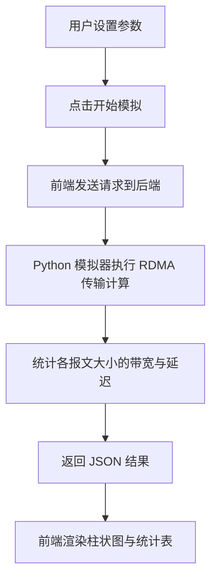

## 1. 产品概述

GPUDirect RDMA 模拟器是一个可视化工具，用于模拟 GPU 与网卡（NIC）之间通过 RDMA 协议进行零拷贝数据传输的过程，统计不同报文大小下的带宽和延迟，并通过交互式柱状图直观展示吞吐量对比。

- 目标用户：高性能计算（HPC）和 AI 基础设施开发者、研究人员
- 核心价值：无需真实 GPU/NIC 硬件，即可理解 GPUDirect RDMA 的性能特征与报文大小关系

## 2. 核心功能

### 2.1 功能模块

1. **仪表盘页面**：实时模拟控制、吞吐量柱状图、延迟统计、传输过程可视化

### 2.2 页面详情

| 页面名称 | 模块名称 | 功能描述 |
|----------|----------|----------|
| 仪表盘 | 模拟控制面板 | 选择报文大小范围、传输次数、启动/停止模拟 |
| 仪表盘 | 吞吐量柱状图 | 展示不同报文大小（64B~16MB）的吞吐量（GB/s）对比 |
| 仪表盘 | 延迟统计表 | 展示各报文大小的平均延迟、P50/P95/P99 延迟 |
| 仪表盘 | 传输过程动画 | GPU → NIC 数据传输路径的可视化动画 |
| 仪表盘 | RDMA vs 传统路径对比 | GPUDirect RDMA 与传统 CPU 中转路径的吞吐量对比 |

## 3. 核心流程

用户在仪表盘选择参数 → 点击"开始模拟" → 后端 Python 模拟器执行 RDMA 传输计算 → 返回各报文大小的带宽和延迟统计 → 前端实时更新柱状图和统计表

## 4. 用户界面设计

### 4.1 设计风格

- 主色调：深色科技风（深蓝灰 #0f172a 背景，霓虹绿 #22d3ee 强调色，电光蓝 #3b82f6 辅助色）
- 按钮风格：圆角 8px，悬停发光效果
- 字体：JetBrains Mono（数据展示）+ Noto Sans SC（中文）
- 布局风格：全屏仪表盘，左上控制面板，主区域图表，右侧统计表
- 图标风格：线性科技图标（lucide-react）

### 4.2 页面设计概览

| 页面名称 | 模块名称 | UI 元素 |
|----------|----------|---------|
| 仪表盘 | 模拟控制面板 | 深色卡片、滑块选择器、下拉菜单、发光按钮 |
| 仪表盘 | 吞吐量柱状图 | 柱状图（recharts）、霓虹渐变色柱体、网格线、悬浮提示 |
| 仪表盘 | 延迟统计表 | 深色表格、高亮 P99 行、渐变行背景 |
| 仪表盘 | 传输过程动画 | GPU/NIC 图标、数据流粒子动画、路径指示 |
| 仪表盘 | RDMA vs 传统对比 | 双柱对比图、颜色区分两条路径 |

### 4.3 响应式设计

- 桌面优先设计，大屏全量展示
- 平板端控制面板折叠为顶部栏
- 移动端图表纵向堆叠
