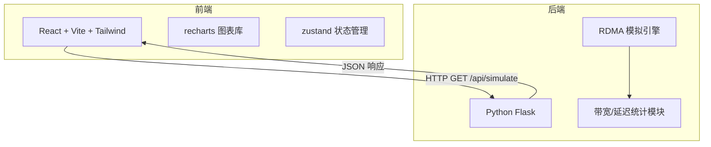
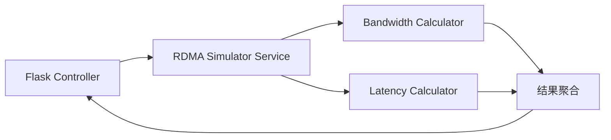

## 1. 架构设计



## 2. 技术说明

- 前端：React@18 + TypeScript + Tailwind CSS@3 + Vite
- 初始化工具：vite-init
- 后端：Python Flask（独立进程，端口 5001）
- 数据库：无（模拟器实时计算，不持久化）
- 图表库：recharts
- 状态管理：zustand

## 3. 路由定义

| 路由 | 用途 |
|------|------|
| / | 仪表盘主页，包含所有模拟控制和图表展示 |

## 4. API 定义

### 4.1 运行模拟

**GET /api/simulate**

查询参数：
| 参数 | 类型 | 默认值 | 说明 |
|------|------|--------|------|
| iterations | integer | 100 | 每种报文大小的传输迭代次数 |
| include_traditional | boolean | true | 是否包含传统 CPU 中转路径对比 |

响应：
```typescript
interface SimulateResponse {
  rdma_results: PacketResult[];
  traditional_results: PacketResult[];
  config: {
    iterations: number;
    packet_sizes: number[];
  };
}

interface PacketResult {
  packet_size: number;        // 字节
  avg_bandwidth_gbps: number; // 平均带宽 GB/s
  avg_latency_us: number;     // 平均延迟 μs
  p50_latency_us: number;     // P50 延迟
  p95_latency_us: number;     // P95 延迟
  p99_latency_us: number;     // P99 延迟
}
```

### 4.2 健康检查

**GET /api/health**

响应：
```typescript
interface HealthResponse {
  status: string;
  version: string;
}
```

## 5. 后端架构图



## 6. 数据模型

无需数据库，所有数据由模拟器实时计算生成。

### 6.1 模拟器核心参数

| 参数 | 值 | 说明 |
|------|----|------|
| PCIe Gen4 x16 理论带宽 | 256 Gbps | GPU 与 NIC 间 PCIe 通道 |
| RDMA 协议开销 | 2-5% | 取决于报文大小 |
| 传统路径额外开销 | 30-50% | CPU 中转 + 内存拷贝 |
| 最小报文大小 | 64 B | 典型 RDMA 最小报文 |
| 最大报文大小 | 16 MB | 大块传输场景 |
| 报文大小梯度 | 64B, 256B, 1KB, 4KB, 16KB, 64KB, 256KB, 1MB, 4MB, 16MB | 对数分布 |
