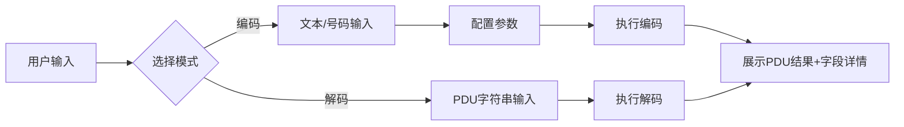

## 1. 产品概述

PDU（Protocol Data Unit）编解码器是一款纯前端Web工具，用于实现短信PDU格式的编码与解码功能。支持中文UCS2编码，可将普通文本转换为TPDU格式，或解析PDU数据并展示详细的消息结构信息。

- **主要用途**：为通信开发人员、测试人员提供便捷的PDU格式转换工具
- **解决问题**：简化PDU格式的手动编解码过程，减少错误，提高开发效率
- **目标用户**：通信工程师、短信应用开发者、技术测试人员
- **产品价值**：提供直观、专业的PDU编解码体验，支持中文等多语言字符

## 2. 核心功能

### 2.1 用户角色

| 角色 | 注册方式 | 核心权限 |
|------|---------|---------|
| 普通用户 | 无需注册，直接使用 | 使用全部编解码功能 |

### 2.2 功能模块

1. **主页面**：PDU编码器、PDU解码器、结果展示区
2. **编码功能**：文本转PDU，支持中文UCS2编码
3. **解码功能**：PDU转文本，解析并展示详细字段
4. **参数配置**：号码类型、编码方案、消息类型等参数设置

### 2.3 页面详情

| 页面名称 | 模块名称 | 功能描述 |
|---------|---------|---------|
| 主页面 | PDU编码器 | 输入文本、目标号码，配置参数，生成PDU数据 |
| 主页面 | PDU解码器 | 输入PDU字符串，解析并展示所有字段详情 |
| 主页面 | 结果展示区 | 展示消息头、用户数据长度、时间戳等详细信息 |
| 主页面 | 参数配置 | 设置SMSC号码、编码方式、消息类型等参数 |

## 3. 核心流程

用户在界面选择编码或解码模式：

**编码流程**：
1. 用户输入短信内容（支持中文）
2. 输入目标手机号码
3. 配置编码参数（UCS2/7-bit）
4. 点击"编码"按钮
5. 系统生成TPDU格式数据并展示各字段详情

**解码流程**：
1. 用户输入PDU字符串
2. 点击"解码"按钮
3. 系统解析PDU各字段
4. 展示短信内容、发件人、时间戳等信息

## 4. 用户界面设计

### 4.1 设计风格

- **主色调**：深科技蓝色 (#165DFF)，代表专业与技术感
- **辅助色**：深灰 (#1D2129)、中灰 (#4E5969)、浅灰 (#F2F3F5)
- **强调色**：成功绿 (#00B42A)、警示橙 (#FF7D00)
- **按钮风格**：圆角8px，悬停时有微妙阴影和颜色过渡
- **字体**：使用 JetBrains Mono 作为代码字体，Inter 作为界面字体
- **布局风格**：卡片式布局，左右分栏（编码区/解码区并列）
- **图标风格**：简洁线性图标，使用 emoji 增强功能区分度

### 4.2 页面设计概述

| 页面名称 | 模块名称 | UI 元素 |
|---------|---------|---------|
| 主页面 | 头部 | 应用标题、版本信息、快捷帮助按钮 |
| 主页面 | 编码器卡片 | 文本域（多行输入）、号码输入框、参数选择器、编码按钮 |
| 主页面 | 解码器卡片 | PDU输入框、解码按钮、实时验证提示 |
| 主页面 | 结果详情区 | 折叠面板展示：消息头、地址信息、用户数据、时间戳、十六进制转储 |

### 4.3 响应式设计

- **桌面端优先**：采用左右双栏布局，编码区和解码区并列展示
- **平板适配**：改为上下布局，结果详情全屏宽度展示
- **移动端**：单页滚动布局，卡片堆叠，优化触控区域大小
- **触控优化**：按钮最小高度44px，输入框适当内边距

### 4.4 视觉动效

- **页面加载**：卡片渐入动画，错开延迟创建层次感
- **按钮交互**：悬停放大1.02倍，点击时微缩反馈
- **结果展示**：字段高亮动画，解码成功时绿色闪烁提示
- **复制功能**：复制成功后的toast提示动画
