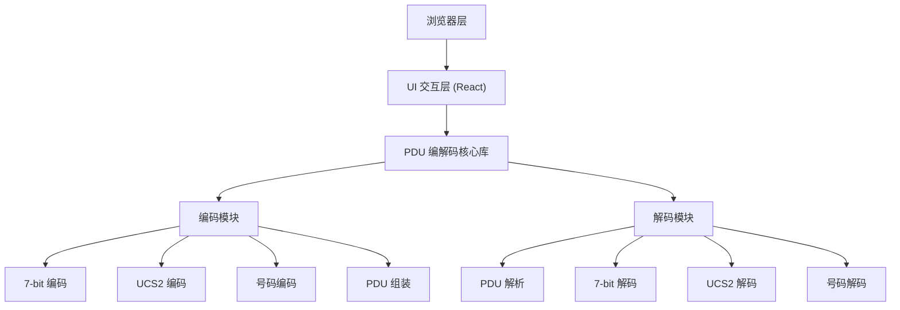

## 1. 架构设计



## 2. 技术描述

- **前端框架**：React@18 + TypeScript
- **构建工具**：Vite@5
- **样式方案**：TailwindCSS@3
- **状态管理**：React Hooks (useState, useCallback)
- **纯前端**：无后端依赖，所有运算在浏览器端完成
- **核心能力**：自主实现PDU编解码算法

## 3. 技术选型理由

| 技术 | 选择理由 |
|------|---------|
| React@18 | 组件化开发，便于维护和扩展，hooks管理状态简单高效 |
| TypeScript | 强类型保证编解码逻辑正确性，提升代码质量 |
| Vite | 极速开发体验，构建快速，支持热更新 |
| TailwindCSS | 快速构建专业UI，响应式设计简单实现 |
| 纯前端实现 | 无需服务器，部署简单，保护用户隐私 |

## 4. 核心数据结构

### 4.1 PDU 编码参数

```typescript
interface EncodeParams {
  smscNumber?: string;      // SMSC 号码
  destinationNumber: string; // 目标号码
  messageText: string;       // 消息内容
  encoding: '7bit' | 'ucs2'; // 编码方式
  messageType: 'submit' | 'deliver'; // 消息类型
  validityPeriod?: number;   // 有效期（小时）
  requestStatusReport?: boolean; // 请求状态报告
}
```

### 4.2 PDU 解码结果

```typescript
interface DecodeResult {
  smsc: {
    length: number;
    type: number;
    number: string;
  };
  pduType: string;
  mr?: number;               // 消息参考号
  oa?: {                     // 发起方地址 (Deliver)
    length: number;
    type: number;
    number: string;
  };
  da?: {                     // 目标地址 (Submit)
    length: number;
    type: number;
    number: string;
  };
  pid: number;               // 协议标识
  dcs: number;               // 数据编码方案
  encoding: '7bit' | 'ucs2';
  scts?: string;             // 服务中心时间戳
  vp?: string;               // 有效期
  udl: number;               // 用户数据长度
  ud: {
    hex: string;
    text: string;
    length: number;
  };
  rawPdu: string;            // 原始PDU字符串
}
```

### 4.3 编码结果

```typescript
interface EncodeResult {
  success: boolean;
  pdu: string;
  pduLength: number;
  parts: PduPart[];
  error?: string;
}

interface PduPart {
  name: string;
  hex: string;
  description: string;
  offset: [number, number];
}
```

## 5. 目录结构

```
.
├── src/
│   ├── components/
│   │   ├── Encoder.tsx         # 编码器组件
│   │   ├── Decoder.tsx         # 解码器组件
│   │   ├── ResultDisplay.tsx   # 结果展示组件
│   │   ├── FieldDetail.tsx     # 字段详情组件
│   │   └── HexDump.tsx         # 十六进制转储组件
│   ├── core/
│   │   ├── pduEncoder.ts       # PDU编码核心逻辑
│   │   ├── pduDecoder.ts       # PDU解码核心逻辑
│   │   ├── encoding7bit.ts     # 7-bit编解码
│   │   ├── encodingUcs2.ts     # UCS2编解码
│   │   └── utils.ts            # 工具函数
│   ├── types/
│   │   └── pdu.ts              # 类型定义
│   ├── App.tsx                 # 主应用组件
│   ├── main.tsx                # 入口文件
│   └── index.css               # 全局样式
├── index.html
├── package.json
├── tsconfig.json
├── vite.config.ts
└── tailwind.config.js
```

## 6. 核心算法说明

### 6.1 7-bit 编码算法

GSM 7-bit 默认字母表包含128个字符，采用压缩编码方式：
- 每个字符7位
- 8个字符打包成7个字节（56位）
- 支持扩展字符集（通过ESC转义）

### 6.2 UCS2 编码算法

中文等非Latin字符使用UCS2编码：
- 每个字符16位（2字节）
- Big-endian 字节序
- 直接Unicode码点映射

### 6.3 号码编码算法

电话号码采用半字节交换编码（Semi-octet）：
- 每个数字占4位
- 奇数字符串末尾补F
- 号码类型字段（TON/NPI）标识号码格式

### 6.4 时间戳编码

SCTS（Service Center Time Stamp）格式：
- 7个字节
- 年/月/日/时/分/秒/时区
- 每个字段BCD编码，半字节交换
