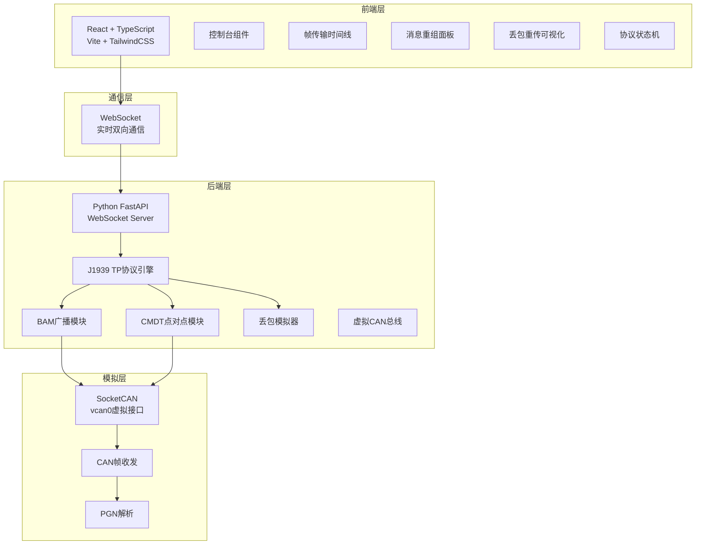
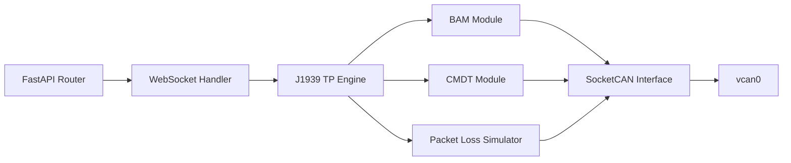

## 1. 架构设计



## 2. 技术说明

- **前端**：React@18 + TypeScript + TailwindCSS@3 + Vite + Zustand（状态管理）
- **前端初始化工具**：vite-init（react-ts模板）
- **后端**：Python 3.11+ / FastAPI + uvicorn + python-can（socketcan支持）
- **通信协议**：WebSocket（实时帧传输推送）
- **CAN模拟**：python-can库 + vcan虚拟接口（无需真实硬件）
- **无数据库**：所有模拟数据实时生成，不持久化存储

## 3. 路由定义

| 路由 | 用途 |
|------|------|
| `/` | 主页面，包含控制台与协议可视化（单页应用） |

## 4. API定义

### 4.1 WebSocket消息格式

#### 客户端 → 服务器

```typescript
interface WsClientMessage {
  type: "start_simulation" | "stop_simulation" | "reset_simulation" | "update_config";
  payload?: SimulationConfig;
}

interface SimulationConfig {
  mode: "bam" | "cmdt";
  messageSize: number;        // 字节数（9-1785）
  sourceAddress: number;      // 源地址 0-253
  destinationAddress: number; // 目标地址 0-253（CMDT模式）
  packetLossRate: number;     // 丢包率 0.0-1.0
  frameInterval: number;      // 帧间隔 ms（BAM模式默认50ms）
  ctsWindowSize: number;      // CTS窗口大小（CMDT模式，默认255帧）
}
```

#### 服务器 → 客户端

```typescript
interface WsServerMessage {
  type: "frame_sent" | "frame_received" | "frame_lost" | "frame_retransmit" |
        "cts_sent" | "rts_sent" | "bam_announce" | "eom_ack" |
        "reassembly_progress" | "simulation_complete" | "state_change" | "error";
  payload: FrameEvent | ProgressEvent | StateEvent | ErrorEvent;
}

interface FrameEvent {
  timestamp: number;          // 毫秒时间戳
  pgn: number;                // 参数组编号
  sourceAddress: number;
  destinationAddress: number;
  sequenceNumber: number;     // 数据帧序号
  data: number[];             // 帧数据字节
  totalPackets: number;       // 总包数
  isRetransmit: boolean;      // 是否为重传帧
}

interface ProgressEvent {
  messageId: string;
  totalPackets: number;
  receivedPackets: number;
  missingSequences: number[];
  complete: boolean;
  reassembledData?: number[];
}

interface StateEvent {
  from: string;               // 前一状态
  to: string;                 // 当前状态
  details?: string;
}

interface ErrorEvent {
  code: string;
  message: string;
}
```

### 4.2 REST API

| 方法 | 路径 | 用途 |
|------|------|------|
| GET | `/api/config` | 获取默认配置 |
| POST | `/api/vcan/setup` | 创建vcan虚拟接口 |
| GET | `/api/status` | 获取模拟器状态 |

## 5. 服务器架构



## 6. J1939 TP协议实现细节

### 6.1 关键PGN定义

| PGN | 名称 | 用途 |
|-----|------|------|
| 0xEC00 | TP.CM | 连接管理（RTS/CTS/BAM/Abort/Ack） |
| 0xEB00 | TP.DT | 数据传输帧 |

### 6.2 TP.CM字节定义

| 控制字节 | 名称 | 说明 |
|----------|------|------|
| 16 | BAM | 广播公告消息 |
| 16 | RTS | 请求发送 |
| 17 | CTS | 清除发送 |
| 19 | EndOfMsgAck | 消息结束确认 |
| 255 | Abort | 连接中止 |

### 6.3 BAM帧格式

- 控制字节=16, 总消息大小(2字节), 总包数(1字节), 保留(1字节), PGN(3字节)

### 6.4 RTS帧格式

- 控制字节=16, 总消息大小(2字节), 总包数(1字节), 可发送包数(1字节), PGN(3字节)

### 6.5 CTS帧格式

- 控制字节=17, 可发送包数(1字节), 下一包序号(1字节), 保留(2字节), PGN(3字节)

### 6.6 TP.DT帧格式

- 序列号(1字节), 数据(7字节), 填充(不足7字节时)
